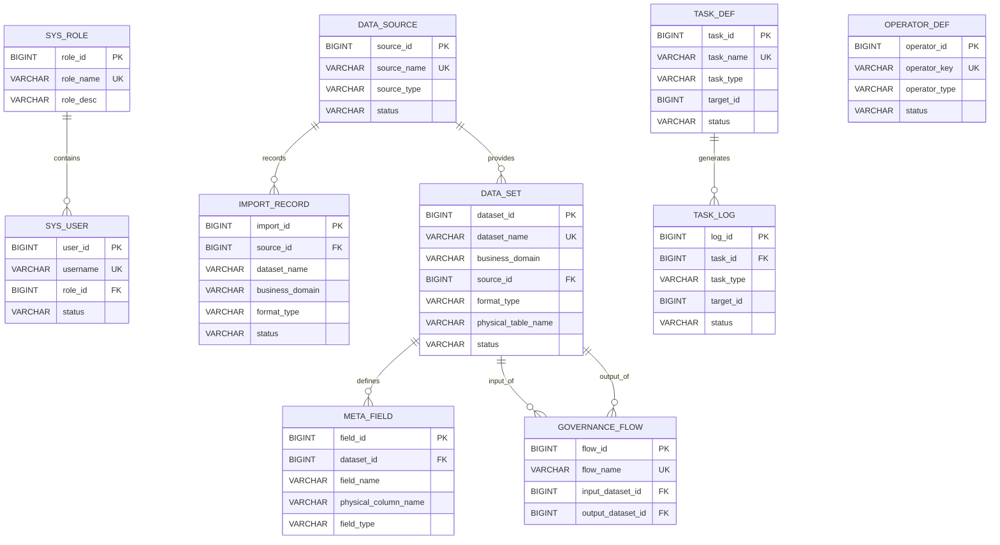

**电商数据湖管理平台**

**数据库设计文档**

Database Design Specification

项目名称：电商数据湖管理平台（Web 端）

摘要：本文档依据当前仓库冻结版本的实际实现，对电商数据湖管理平台的数据库设计进行说明。文档重点覆盖权限、数据接入、数据集资产、数据治理、任务调度和日志监控等核心对象，既说明固定关系表结构，也说明运行时动态生成的数据集物理表设计，可用于课程项目报告、系统答辩、教师审阅和后续维护参考。

相关文档：

1. 《电商数据湖管理平台-产品功能设计文档-V3》
2. 《电商数据湖管理平台-用户故事文档-V2》
3. 《电商数据湖管理平台-迭代规划》
4. `docs/db-schema-catalog.md`
5. `database/schema.sql`
6. `backend/src/main/resources/schema.sql`
7. `docs/module-map.md`
8. `docs/freeze-release-note.md`

版权所有：除特别允许外，仅供项目组内部教学、课程开发和课程报告使用。

**修改记录：**

| 日期 | 版本 | 说明 | 作者 |
| --- | --- | --- | --- |
| 2026/04/05 | V1.0 | 依据教师模板并结合当前冻结代码实现，新增数据库设计文档 | 肖溢丹 |

# 目录

| 章节 | 内容 |
| --- | --- |
| 第1章 | 简介 |
| 第2章 | 数据库设计 |
| 第3章 | 数据库表 |

# 1 简介

## 1.1 目的

本文档用于说明电商数据湖管理平台当前版本的数据库设计方案，重点回答以下问题：

1. 系统当前实际使用了哪些数据库表。
2. 各表分别承担什么业务职责。
3. 表之间的主键、唯一约束、外键和逻辑关联如何设计。
4. 数据集导入后生成的运行时物理表如何命名和组织。
5. 哪些字段由数据库直接约束，哪些规则由应用层负责控制。

本文档面向课程项目报告场景，强调“与代码实现一致”，不对未实现的业务表、数仓分层或分布式数据库方案进行额外设计。

## 1.2 范围

当前数据库设计覆盖以下六类对象：

1. 权限对象：角色、用户。
2. 接入对象：数据源、导入记录。
3. 资产对象：数据集、元数据字段。
4. 治理对象：治理算子、治理流程。
5. 调度对象：任务定义。
6. 监控对象：任务日志。

除以上固定核心表外，系统还会在数据导入、数据集成或治理输出时，按数据集动态创建运行时业务物理表。该类表不写在固定 `schema.sql` 中，但属于当前系统真实使用的数据库对象，因此本文档一并说明。

# 2 数据库设计

## 2.1 概念模型

系统数据库可以分为权限域、接入与资产域、治理域、调度与日志域四个部分。其核心实体关系如下：

补充说明如下：

1. `operator_def` 与 `governance_flow` 之间没有关系型外键，治理流程通过 `operator_chain` JSON 文本按顺序保存算子键和参数。
2. `task_def.target_id` 与 `task_log.target_id` 都是按执行上下文解释的业务对象 ID，不直接建立外键。
3. 每个 `data_set` 会映射到一张运行时物理表，表名保存在 `data_set.physical_table_name` 中。

## 2.2 逻辑模型

### 2.2.1 实际外键关系

当前数据库中真实存在的外键关系如下：

| 来源表 | 来源字段 | 目标表 | 目标字段 | 关系说明 |
| --- | --- | --- | --- | --- |
| `sys_user` | `role_id` | `sys_role` | `role_id` | 一个角色可关联多个用户 |
| `import_record` | `source_id` | `data_source` | `source_id` | 一个数据源可对应多条导入记录 |
| `data_set` | `source_id` | `data_source` | `source_id` | 一个数据源可生成多个数据集 |
| `meta_field` | `dataset_id` | `data_set` | `dataset_id` | 一个数据集包含多个元数据字段 |
| `governance_flow` | `input_dataset_id` | `data_set` | `dataset_id` | 一个数据集可作为多个治理流程输入 |
| `governance_flow` | `output_dataset_id` | `data_set` | `dataset_id` | 一个数据集可作为治理流程输出结果 |
| `task_log` | `task_id` | `task_def` | `task_id` | 一个任务定义可产生多条执行日志 |

### 2.2.2 逻辑关联与实现边界

除以上外键外，系统还存在以下由应用层维护的逻辑关联：

| 业务字段 | 逻辑目标 | 当前实现方式 |
| --- | --- | --- |
| `task_def.target_id` | `import_record.import_id` 或 `governance_flow.flow_id` | 根据 `task_type` 判断目标对象，不建数据库外键 |
| `task_log.target_id` | `import_record.import_id`、`governance_flow.flow_id` 或手动治理时的 `data_set.dataset_id` | 由执行来源决定目标对象，用于日志回放和详情展示 |
| `governance_flow.operator_chain` | `operator_def.operator_key` | 以 JSON 文本保存算子链，不拆分步骤子表 |
| `sys_role.menu_permissions` | 菜单标识集合 | 以逗号分隔字符串保存 |
| `sys_role.action_permissions` | 操作权限标识集合 | 以逗号分隔字符串保存 |
| `create_user / creator / operator_user` | `sys_user.user_id` | 仅保存用户 ID 作为审计信息，不建外键 |

上述设计体现了当前课程项目的实现取舍：固定关系尽量通过外键维护，界面权限、调度目标、治理步骤等更灵活的结构交由应用层解释和校验。

### 2.2.3 唯一约束

当前核心唯一约束如下：

| 表名 | 唯一字段 | 说明 |
| --- | --- | --- |
| `sys_role` | `role_name` | 角色名称唯一 |
| `sys_user` | `username` | 登录用户名唯一 |
| `data_source` | `source_name` | 数据源名称唯一 |
| `data_set` | `dataset_name` | 数据集名称唯一 |
| `operator_def` | `operator_key` | 治理算子键唯一 |
| `governance_flow` | `flow_name` | 治理流程名称唯一 |
| `task_def` | `task_name` | 任务名称唯一 |

### 2.2.4 默认值与枚举控制

数据库层为部分字段定义了默认值，但多数枚举边界仍由应用层控制。关键约定如下：

| 字段 | 默认值或可选值 | 说明 |
| --- | --- | --- |
| `sys_user.status` | `ENABLED` | 用户默认启用 |
| `data_source.status` | `ENABLED` | 数据源默认启用 |
| `import_record.business_domain` | `TRADE` | 默认业务域为订单交易 |
| `import_record.record_count` | `0` | 默认导入条数为 0 |
| `data_set.business_domain` | `TRADE` | 默认业务域为订单交易 |
| `data_set.record_count` | `0` | 默认记录数为 0 |
| `data_set.field_count` | `0` | 默认字段数为 0 |
| `data_set.status` | `READY` | 数据集生成后默认可用 |
| `meta_field.nullable` | `TRUE` | 元数据默认可为空 |
| `meta_field.field_order` | `0` | 默认字段顺序为 0 |
| `operator_def.status` | `ENABLED` | 治理算子默认启用 |
| `task_def.status` | `ENABLED` | 任务默认启用 |
| `task_def.retry_policy` | `1` | 默认失败重试一次 |
| `task_log.duration` | `0` | 默认耗时为 0 秒 |

需要说明的是，像 `business_domain`、`task_type`、`source_type`、`status` 这类枚举字段，当前没有在数据库层通过 `CHECK` 约束限制，主要由后端服务进行规范化和校验。

## 2.3 物理模型

### 2.3.1 固定核心表

当前项目的固定核心表共 `10` 张，分别如下：

| 分组 | 表名 | 作用 |
| --- | --- | --- |
| 权限域 | `sys_role` | 保存角色和权限配置 |
| 权限域 | `sys_user` | 保存登录用户信息 |
| 接入域 | `data_source` | 保存文件源和数据库源配置 |
| 接入域 | `import_record` | 保存导入历史和结果 |
| 资产域 | `data_set` | 保存数据集主信息 |
| 资产域 | `meta_field` | 保存数据集字段元信息 |
| 治理域 | `operator_def` | 保存治理算子定义 |
| 治理域 | `governance_flow` | 保存治理流程配置 |
| 调度域 | `task_def` | 保存调度任务定义 |
| 日志域 | `task_log` | 保存任务执行日志 |

这些表全部定义在 `database/schema.sql` 与 `backend/src/main/resources/schema.sql` 中，两份脚本当前保持一致。

### 2.3.2 运行时数据集物理表

固定核心表只保存“数据的描述信息”和“平台管理信息”。真正承载业务记录的数据表由系统运行时动态生成，具体规则如下：

1. 当文件导入、数据库表导入、查询分析结果保存或治理执行输出新数据集时，系统会先新增一条 `data_set` 记录。
2. 插入 `data_set` 时会暂存 `physical_table_name = pending_table_name`。
3. 拿到 `dataset_id` 后，系统将物理表名更新为 `dl_dataset_<datasetId>`。
4. 随后根据 `meta_field` 中的字段定义创建真实业务表，并写入数据行。

运行时数据集物理表的通用结构如下：

| 字段 | 类型 | 说明 |
| --- | --- | --- |
| `row_id` | `BIGINT AUTO_INCREMENT PRIMARY KEY` | 运行时记录主键 |
| 业务字段列 | `BIGINT / DOUBLE / BOOLEAN / VARCHAR(1024)` | 按 `meta_field.physical_column_name` 和字段类型动态生成 |

当前实现中的类型映射规则如下：

| 元数据字段类型 | 物理列类型 |
| --- | --- |
| `BIGINT` | `BIGINT` |
| `DOUBLE` | `DOUBLE` |
| `BOOLEAN` | `BOOLEAN` |
| 其他类型 | `VARCHAR(1024)` |

需要特别说明：

1. 当前实现不会把 `meta_field.nullable` 直接下推为物理表 `NOT NULL` 约束，字段可空性主要记录在元数据表中。
2. 运行时物理表不是固定脚本预建表，因此本文档不虚构订单表、商品表等静态业务表。
3. 删除数据集时，系统会先检查治理流程和日志依赖，再删除对应动态物理表和元数据。

### 2.3.3 文件路径与本地存储

系统采用“数据库保存元信息，文件系统保存原始文件”的方式组织导入数据：

1. `import_record.file_path` 保存导入文件或数据库表快照路径。
2. `data_set.storage_path` 保存数据集来源路径或集成结果标识。
3. 默认本地存储根目录为 `../storage`，属于当前课程项目的文件系统存储方案。

因此，当前系统并未采用 BLOB 二进制大对象入库，而是保存路径引用。这一方案更适合课程项目的实现复杂度和演示场景。

### 2.3.4 初始化与兼容补齐

系统启动时会执行初始化逻辑，主要包括两类动作：

1. 兼容性补齐：
   - 为 `sys_role` 补齐 `menu_permissions`、`action_permissions`
   - 为 `data_set` 补齐 `business_domain`
   - 为 `import_record` 补齐 `business_domain`
   - 为 `task_log` 补齐 `input_params`、`execution_steps`、`failure_reason`
2. 基础数据初始化：
   - 初始化 `ADMIN`、`OPERATOR` 两个角色
   - 初始化 `admin`、`operator` 两个示例用户
   - 初始化 `9` 个内置治理算子

其中示例用户密码会先经过密码编码器加密后再写入数据库，不以明文形式存储。

## 2.4 数据库类型

当前项目采用关系型数据库方案，并支持两种运行环境：

| 数据库类型 | 当前用途 | 说明 |
| --- | --- | --- |
| `H2` | 开发演示、快速启动 | 以内存模式运行，并开启 MySQL 兼容模式 |
| `MySQL` | 持久化测试、课程展示 | 使用与 H2 一致的核心 schema |

本项目当前不涉及以下内容，因此本文档不展开设计：

1. 分库分表
2. 读写分离
3. 主从复制
4. 审计归档分库
5. 实时数仓或流式存储

# 3 数据库表

## 3.1 角色表（`sys_role`）

### 3.1.1 表说明

`sys_role` 用于保存系统角色及其权限配置，是用户登录和前端菜单渲染的基础表。当前系统默认包含 `ADMIN` 和 `OPERATOR` 两类角色。

### 3.1.2 表结构

| 字段名 | 数据类型 | 是否为空 | 约束/默认值 | 说明 |
| --- | --- | --- | --- | --- |
| `role_id` | `BIGINT` | 否 | 主键，自增 | 角色主键 |
| `role_name` | `VARCHAR(64)` | 否 | 唯一 | 角色名称，如 `ADMIN`、`OPERATOR` |
| `role_desc` | `VARCHAR(255)` | 是 | 无 | 角色描述 |
| `menu_permissions` | `VARCHAR(2000)` | 是 | 无 | 菜单权限串，逗号分隔 |
| `action_permissions` | `VARCHAR(2000)` | 是 | 无 | 操作权限串，逗号分隔 |
| `create_time` | `TIMESTAMP` | 是 | 默认 `CURRENT_TIMESTAMP` | 创建时间 |

### 3.1.3 表约束

1. 主键：`role_id`
2. 唯一约束：`role_name`
3. 当前未建立角色权限子表，菜单权限和操作权限直接序列化保存在本表中。

## 3.2 用户表（`sys_user`）

### 3.2.1 表说明

`sys_user` 用于保存登录账号、密码摘要、角色归属和状态信息。系统通过该表完成登录认证、角色识别和权限控制。

### 3.2.2 表结构

| 字段名 | 数据类型 | 是否为空 | 约束/默认值 | 说明 |
| --- | --- | --- | --- | --- |
| `user_id` | `BIGINT` | 否 | 主键，自增 | 用户主键 |
| `username` | `VARCHAR(64)` | 否 | 唯一 | 登录用户名 |
| `password` | `VARCHAR(255)` | 否 | 无 | 加密后的密码摘要 |
| `role_id` | `BIGINT` | 否 | 外键 | 角色 ID |
| `status` | `VARCHAR(32)` | 否 | 默认 `ENABLED` | 用户状态 |
| `create_time` | `TIMESTAMP` | 是 | 默认 `CURRENT_TIMESTAMP` | 创建时间 |
| `update_time` | `TIMESTAMP` | 是 | 默认 `CURRENT_TIMESTAMP` | 更新时间 |

### 3.2.3 表约束

1. 主键：`user_id`
2. 唯一约束：`username`
3. 外键：`role_id -> sys_role.role_id`
4. 当前系统默认初始化 `admin` 和 `operator` 两个用户账号。

## 3.3 数据源表（`data_source`）

### 3.3.1 表说明

`data_source` 用于保存平台可用的数据源配置。当前实现支持两类数据源：

1. `FILE`：文件型数据源，主要用于上传导入。
2. `MYSQL`：数据库型数据源，用于自动识别 `Schema / Database` 和表导入。

### 3.3.2 表结构

| 字段名 | 数据类型 | 是否为空 | 约束/默认值 | 说明 |
| --- | --- | --- | --- | --- |
| `source_id` | `BIGINT` | 否 | 主键，自增 | 数据源主键 |
| `source_name` | `VARCHAR(128)` | 否 | 唯一 | 数据源名称 |
| `source_type` | `VARCHAR(32)` | 否 | 无 | 数据源类型，当前为 `FILE / MYSQL` |
| `host` | `VARCHAR(128)` | 是 | 无 | 数据库主机地址 |
| `port` | `INT` | 是 | 无 | 数据库端口 |
| `db_name` | `VARCHAR(128)` | 是 | 无 | 数据库名称 |
| `username` | `VARCHAR(64)` | 是 | 无 | 数据库用户名 |
| `password` | `VARCHAR(255)` | 是 | 无 | 数据库密码 |
| `status` | `VARCHAR(32)` | 否 | 默认 `ENABLED` | 数据源状态 |
| `description` | `VARCHAR(255)` | 是 | 无 | 数据源说明 |
| `create_user` | `BIGINT` | 是 | 无 | 创建人 ID |
| `create_time` | `TIMESTAMP` | 是 | 默认 `CURRENT_TIMESTAMP` | 创建时间 |
| `update_time` | `TIMESTAMP` | 是 | 默认 `CURRENT_TIMESTAMP` | 更新时间 |

### 3.3.3 表约束

1. 主键：`source_id`
2. 唯一约束：`source_name`
3. 当前未对 `create_user` 建立外键，创建人以用户 ID 形式记录。
4. 数据源重复连接策略属于应用层行为，不额外增加数据库字段。

## 3.4 导入记录表（`import_record`）

### 3.4.1 表说明

`import_record` 用于保存文件导入和数据库表导入的历史记录，便于查看导入结果、导入参数和失败原因。它既是导入历史表，也是 `IMPORT` 任务类型的业务目标对象。

### 3.4.2 表结构

| 字段名 | 数据类型 | 是否为空 | 约束/默认值 | 说明 |
| --- | --- | --- | --- | --- |
| `import_id` | `BIGINT` | 否 | 主键，自增 | 导入记录主键 |
| `source_id` | `BIGINT` | 是 | 外键 | 来源数据源 ID |
| `dataset_name` | `VARCHAR(128)` | 否 | 无 | 导入后生成的数据集名称 |
| `business_domain` | `VARCHAR(32)` | 否 | 默认 `TRADE` | 业务域 |
| `format_type` | `VARCHAR(32)` | 否 | 无 | 导入格式，如 `CSV / JSON / EXCEL / MYSQL_TABLE` |
| `original_file_name` | `VARCHAR(255)` | 否 | 无 | 原始文件名或表名快照标识 |
| `file_path` | `VARCHAR(512)` | 否 | 无 | 文件存储路径或数据库快照路径 |
| `status` | `VARCHAR(32)` | 否 | 无 | 导入状态，常见值为 `SUCCESS / FAILED` |
| `record_count` | `BIGINT` | 是 | 默认 `0` | 导入记录数 |
| `error_message` | `VARCHAR(1000)` | 是 | 无 | 失败原因 |
| `create_user` | `BIGINT` | 是 | 无 | 操作人 ID |
| `create_time` | `TIMESTAMP` | 是 | 默认 `CURRENT_TIMESTAMP` | 创建时间 |

### 3.4.3 表约束

1. 主键：`import_id`
2. 外键：`source_id -> data_source.source_id`
3. `business_domain` 当前支持 `USER / PRODUCT / TRADE / PAYMENT / INVENTORY / REVIEW / BEHAVIOR_LOG`
4. `create_user` 为审计字段，不建立用户外键。

## 3.5 数据集表（`data_set`）

### 3.5.1 表说明

`data_set` 是平台最核心的资产主表，用于记录数据集名称、业务域、来源、记录数、字段数、物理表名和状态信息。文件导入、数据库表导入、查询分析结果保存和治理输出都会生成新的数据集记录。

### 3.5.2 表结构

| 字段名 | 数据类型 | 是否为空 | 约束/默认值 | 说明 |
| --- | --- | --- | --- | --- |
| `dataset_id` | `BIGINT` | 否 | 主键，自增 | 数据集主键 |
| `dataset_name` | `VARCHAR(128)` | 否 | 唯一 | 数据集名称 |
| `business_domain` | `VARCHAR(32)` | 否 | 默认 `TRADE` | 业务域 |
| `source_id` | `BIGINT` | 是 | 外键 | 来源数据源 ID |
| `format_type` | `VARCHAR(32)` | 否 | 无 | 数据集来源类型，如 `CSV / JSON / EXCEL / MYSQL_TABLE / INTEGRATION_JOIN / INTEGRATION_UNION` |
| `record_count` | `BIGINT` | 是 | 默认 `0` | 记录数 |
| `field_count` | `INT` | 是 | 默认 `0` | 字段数 |
| `storage_path` | `VARCHAR(512)` | 是 | 无 | 数据来源路径或集成标识 |
| `physical_table_name` | `VARCHAR(128)` | 是 | 无 | 对应运行时物理表名 |
| `description` | `VARCHAR(255)` | 是 | 无 | 数据集说明 |
| `creator` | `BIGINT` | 是 | 无 | 创建人 ID |
| `status` | `VARCHAR(32)` | 否 | 默认 `READY` | 数据集状态 |
| `create_time` | `TIMESTAMP` | 是 | 默认 `CURRENT_TIMESTAMP` | 创建时间 |
| `update_time` | `TIMESTAMP` | 是 | 默认 `CURRENT_TIMESTAMP` | 更新时间 |

### 3.5.3 表约束

1. 主键：`dataset_id`
2. 唯一约束：`dataset_name`
3. 外键：`source_id -> data_source.source_id`
4. `physical_table_name` 指向运行时动态物理表，具体表名一般为 `dl_dataset_<datasetId>`
5. `creator` 为审计字段，不建立用户外键。

## 3.6 元数据字段表（`meta_field`）

### 3.6.1 表说明

`meta_field` 用于保存数据集字段定义，是数据预览、条件查询、SQL 查询、导出和动态建表的直接依据。每个字段同时保存展示名称和物理列名。

### 3.6.2 表结构

| 字段名 | 数据类型 | 是否为空 | 约束/默认值 | 说明 |
| --- | --- | --- | --- | --- |
| `field_id` | `BIGINT` | 否 | 主键，自增 | 字段主键 |
| `dataset_id` | `BIGINT` | 否 | 外键 | 所属数据集 ID |
| `field_name` | `VARCHAR(128)` | 否 | 无 | 前端展示字段名 |
| `physical_column_name` | `VARCHAR(128)` | 否 | 无 | 运行时物理列名 |
| `field_type` | `VARCHAR(64)` | 否 | 无 | 字段类型 |
| `nullable` | `BOOLEAN` | 是 | 默认 `TRUE` | 是否允许为空 |
| `sample_value` | `VARCHAR(255)` | 是 | 无 | 样例值 |
| `field_order` | `INT` | 是 | 默认 `0` | 字段顺序 |
| `create_time` | `TIMESTAMP` | 是 | 默认 `CURRENT_TIMESTAMP` | 创建时间 |

### 3.6.3 表约束

1. 主键：`field_id`
2. 外键：`dataset_id -> data_set.dataset_id`
3. 当前未对 `physical_column_name` 建立全局唯一约束，唯一性由单个数据集内部和动态建表逻辑保证。
4. `nullable` 主要用于元数据展示和治理逻辑，不直接生成物理表 `NOT NULL` 约束。

## 3.7 治理算子定义表（`operator_def`）

### 3.7.1 表说明

`operator_def` 用于保存系统可用的治理算子定义，包括算子名称、算子键、算子类型、参数结构说明和状态。当前系统内置 `9` 个治理算子：

| 算子名称 | 算子键 |
| --- | --- |
| 空值填充 | `NULL_FILL` |
| 重复数据清理 | `DEDUPLICATE` |
| 字段转换 | `FIELD_CONVERT` |
| 条件过滤 | `FILTER_KEEP` |
| 订单去重 | `ORDER_DEDUP` |
| 金额标准化 | `AMOUNT_NORMALIZE` |
| 时间标准化 | `TIME_NORMALIZE` |
| 商品分类标准化 | `CATEGORY_NORMALIZE` |
| 状态标准化 | `STATUS_NORMALIZE` |

### 3.7.2 表结构

| 字段名 | 数据类型 | 是否为空 | 约束/默认值 | 说明 |
| --- | --- | --- | --- | --- |
| `operator_id` | `BIGINT` | 否 | 主键，自增 | 算子主键 |
| `operator_name` | `VARCHAR(128)` | 否 | 无 | 算子名称 |
| `operator_key` | `VARCHAR(64)` | 否 | 唯一 | 算子唯一标识 |
| `operator_type` | `VARCHAR(32)` | 否 | 无 | 算子分类，如 `CLEAN / DEDUP / TRANSFORM / FILTER` |
| `config_schema` | `VARCHAR(2000)` | 是 | 无 | 参数结构说明，采用 JSON 文本表示 |
| `description` | `VARCHAR(255)` | 是 | 无 | 算子说明 |
| `status` | `VARCHAR(32)` | 否 | 默认 `ENABLED` | 算子状态 |
| `create_time` | `TIMESTAMP` | 是 | 默认 `CURRENT_TIMESTAMP` | 创建时间 |

### 3.7.3 表约束

1. 主键：`operator_id`
2. 唯一约束：`operator_key`
3. 算子启停依赖 `status` 字段控制，当前不拆分更多状态表。

## 3.8 治理流程表（`governance_flow`）

### 3.8.1 表说明

`governance_flow` 用于保存治理流程定义。一个治理流程包含输入数据集、治理算子链、可选输出数据集和创建人信息。治理执行成功后，输出结果会形成新的数据集，并将其 ID 回写到 `output_dataset_id`。

### 3.8.2 表结构

| 字段名 | 数据类型 | 是否为空 | 约束/默认值 | 说明 |
| --- | --- | --- | --- | --- |
| `flow_id` | `BIGINT` | 否 | 主键，自增 | 流程主键 |
| `flow_name` | `VARCHAR(128)` | 否 | 唯一 | 流程名称 |
| `input_dataset_id` | `BIGINT` | 否 | 外键 | 输入数据集 ID |
| `operator_chain` | `VARCHAR(4000)` | 否 | 无 | 算子链 JSON 文本 |
| `output_dataset_id` | `BIGINT` | 是 | 外键 | 输出数据集 ID |
| `creator` | `BIGINT` | 是 | 无 | 创建人 ID |
| `create_time` | `TIMESTAMP` | 是 | 默认 `CURRENT_TIMESTAMP` | 创建时间 |
| `update_time` | `TIMESTAMP` | 是 | 默认 `CURRENT_TIMESTAMP` | 更新时间 |

### 3.8.3 表约束

1. 主键：`flow_id`
2. 唯一约束：`flow_name`
3. 外键：
   - `input_dataset_id -> data_set.dataset_id`
   - `output_dataset_id -> data_set.dataset_id`
4. `operator_chain` 中保存的是按顺序排列的算子键和参数 JSON，不建立治理步骤明细表。
5. `creator` 为审计字段，不建立用户外键。

## 3.9 任务定义表（`task_def`）

### 3.9.1 表说明

`task_def` 用于保存定时任务定义。当前系统仅支持两类任务：

1. `IMPORT`：针对导入记录的调度任务。
2. `GOVERNANCE`：针对治理流程的调度任务。

任务创建后，系统可根据 `cron_expr` 自动轮询触发，也支持手动立即执行。

### 3.9.2 表结构

| 字段名 | 数据类型 | 是否为空 | 约束/默认值 | 说明 |
| --- | --- | --- | --- | --- |
| `task_id` | `BIGINT` | 否 | 主键，自增 | 任务主键 |
| `task_name` | `VARCHAR(128)` | 否 | 唯一 | 任务名称 |
| `task_type` | `VARCHAR(32)` | 否 | 无 | 任务类型，当前为 `IMPORT / GOVERNANCE` |
| `target_id` | `BIGINT` | 否 | 无 | 任务目标对象 ID |
| `cron_expr` | `VARCHAR(64)` | 否 | 无 | Cron 表达式 |
| `status` | `VARCHAR(32)` | 否 | 默认 `ENABLED` | 任务状态，当前主要为 `ENABLED / PAUSED` |
| `retry_policy` | `INT` | 是 | 默认 `1` | 失败重试次数 |
| `create_user` | `BIGINT` | 是 | 无 | 创建人 ID |
| `payload` | `VARCHAR(4000)` | 是 | 无 | 扩展参数 |
| `description` | `VARCHAR(255)` | 是 | 无 | 任务说明 |
| `next_run_time` | `TIMESTAMP` | 是 | 无 | 下次执行时间 |
| `last_run_time` | `TIMESTAMP` | 是 | 无 | 最近执行时间 |
| `create_time` | `TIMESTAMP` | 是 | 默认 `CURRENT_TIMESTAMP` | 创建时间 |
| `update_time` | `TIMESTAMP` | 是 | 默认 `CURRENT_TIMESTAMP` | 更新时间 |

### 3.9.3 表约束

1. 主键：`task_id`
2. 唯一约束：`task_name`
3. `target_id` 不建立外键，由 `task_type` 决定其业务含义：
   - `IMPORT` 时对应 `import_record.import_id`
   - `GOVERNANCE` 时对应 `governance_flow.flow_id`
4. `create_user` 为审计字段，不建立用户外键。

## 3.10 任务日志表（`task_log`）

### 3.10.1 表说明

`task_log` 用于保存导入任务、治理任务以及手动执行所产生的日志记录。该表既保存简要执行结果，也保存结构化输入参数、执行步骤和失败原因，支持日志详情查看和失败回放。

### 3.10.2 表结构

| 字段名 | 数据类型 | 是否为空 | 约束/默认值 | 说明 |
| --- | --- | --- | --- | --- |
| `log_id` | `BIGINT` | 否 | 主键，自增 | 日志主键 |
| `task_id` | `BIGINT` | 是 | 外键 | 来源任务 ID，手动执行时可为空 |
| `task_type` | `VARCHAR(32)` | 是 | 无 | 任务类型 |
| `target_id` | `BIGINT` | 是 | 无 | 对应任务目标对象 ID，或手动治理时的输入数据集 ID |
| `start_time` | `TIMESTAMP` | 否 | 无 | 开始时间 |
| `end_time` | `TIMESTAMP` | 是 | 无 | 结束时间 |
| `status` | `VARCHAR(32)` | 否 | 无 | 执行状态，如 `SUCCESS / FAILED` |
| `execution_summary` | `VARCHAR(1000)` | 是 | 无 | 执行摘要 |
| `error_message` | `VARCHAR(1000)` | 是 | 无 | 错误信息 |
| `input_params` | `VARCHAR(4000)` | 是 | 无 | 输入参数 JSON 文本 |
| `execution_steps` | `VARCHAR(4000)` | 是 | 无 | 执行步骤 JSON 文本 |
| `failure_reason` | `VARCHAR(4000)` | 是 | 无 | 结构化失败原因 JSON 文本 |
| `duration` | `BIGINT` | 是 | 默认 `0` | 执行耗时，单位为秒 |
| `operator_user` | `BIGINT` | 是 | 无 | 操作人 ID |
| `create_time` | `TIMESTAMP` | 是 | 默认 `CURRENT_TIMESTAMP` | 创建时间 |

### 3.10.3 表约束

1. 主键：`log_id`
2. 外键：`task_id -> task_def.task_id`
3. `task_id` 允许为空，用于兼容手动触发的治理执行或手工运行日志。
4. `target_id` 不建立外键，其业务含义由执行来源决定：
   - 定时导入任务时一般对应 `import_record.import_id`
   - 定时治理任务时一般对应 `governance_flow.flow_id`
   - 手动治理执行时一般对应输入数据集 `data_set.dataset_id`
5. `input_params`、`execution_steps`、`failure_reason` 当前均以 JSON 字符串形式保存。
6. `operator_user` 为审计字段，不建立用户外键。

## 3.11 运行时数据集物理表（`dl_dataset_<datasetId>`）

### 3.11.1 表说明

该类表不是固定脚本中的预定义表，而是系统在生成数据集时动态创建的业务数据承载表。它是平台真正存放订单、商品、库存、支付、评价等记录的地方。

其设计目标是：

1. 让不同来源、不同字段结构的数据都能以统一方式接入平台。
2. 让数据集的展示结构由 `meta_field` 描述，物理表结构由运行时生成。
3. 让查询、预览、集成、治理和导出直接基于当前数据集对应的物理表操作。

### 3.11.2 表结构

这类表的结构不是固定字段集合，而是遵循统一生成规则：

| 字段名 | 数据类型 | 是否为空 | 约束/默认值 | 说明 |
| --- | --- | --- | --- | --- |
| `row_id` | `BIGINT` | 否 | 主键，自增 | 运行时行主键 |
| `<physical_column_name_1>` | 动态 | 是 | 无 | 由 `meta_field` 生成的业务字段 |
| `<physical_column_name_2>` | 动态 | 是 | 无 | 由 `meta_field` 生成的业务字段 |
| `...` | `...` | `...` | `...` | 按数据集字段数量扩展 |

动态字段的数据类型映射如下：

| `meta_field.field_type` | 物理列类型 |
| --- | --- |
| `BIGINT` | `BIGINT` |
| `DOUBLE` | `DOUBLE` |
| `BOOLEAN` | `BOOLEAN` |
| 其他字段类型 | `VARCHAR(1024)` |

### 3.11.3 表约束

1. 主键：`row_id`
2. 表名来源：`data_set.physical_table_name`
3. 列名来源：`meta_field.physical_column_name`
4. 当前不为动态字段额外创建唯一约束、外键或二级索引。
5. 当前不把 `meta_field.nullable` 下推为物理层 `NOT NULL`。
6. 删除数据集时，系统会删除对应运行时物理表。

# 结语

以上数据库设计文档以当前项目冻结代码为依据，完整说明了固定核心表、逻辑关联、运行时动态物理表和初始化数据策略。对于课程项目而言，这一设计既保证了功能闭环，也保持了实现规模适中，能够支撑系统演示、课程答辩和文档提交。
