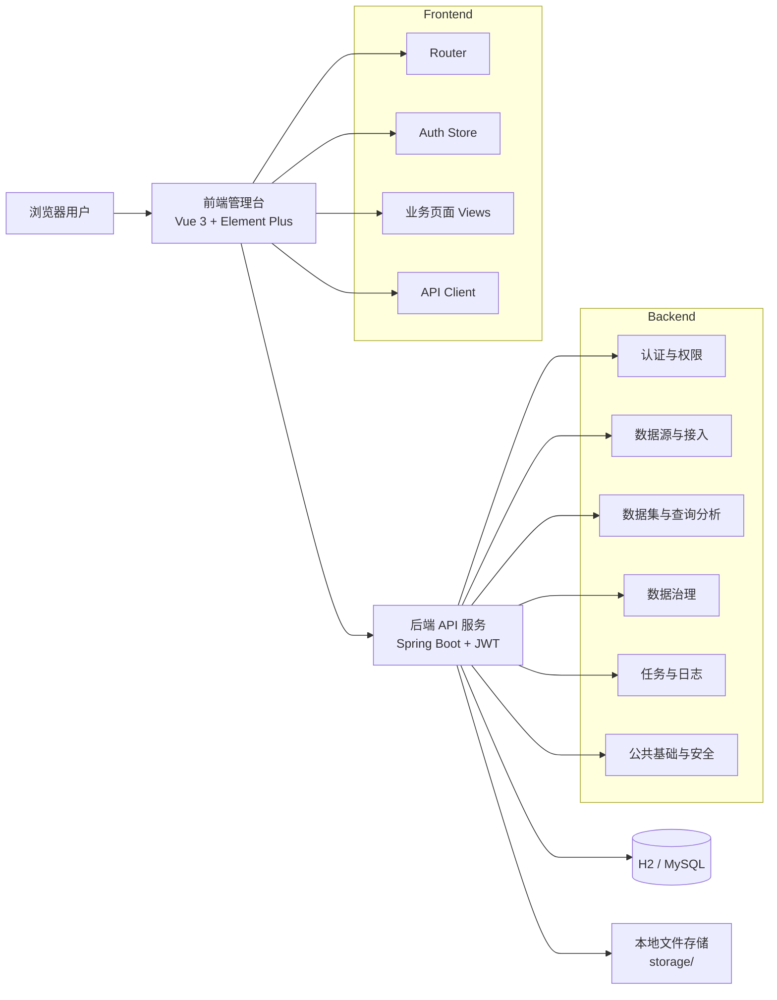
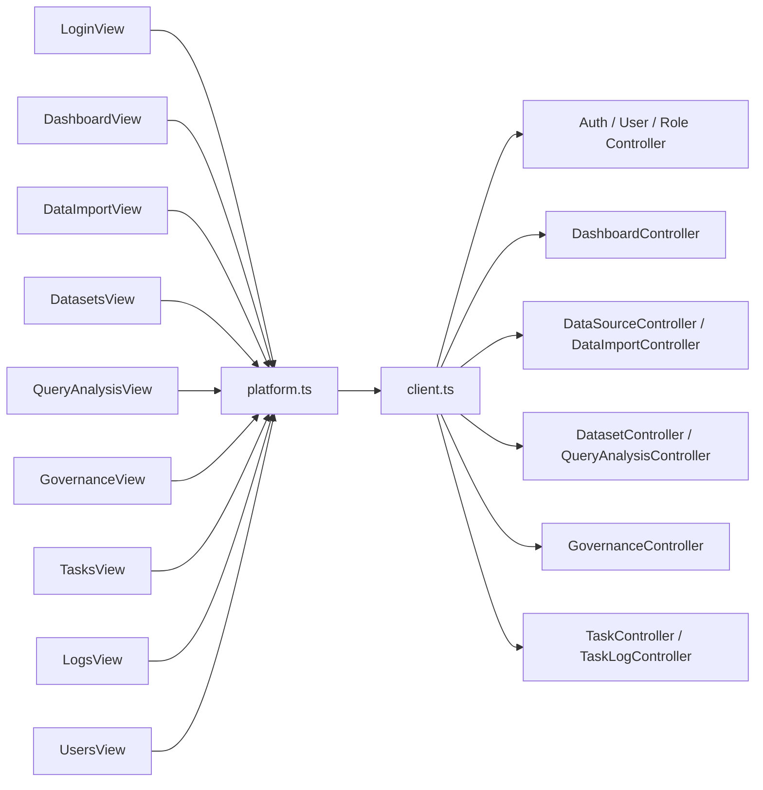
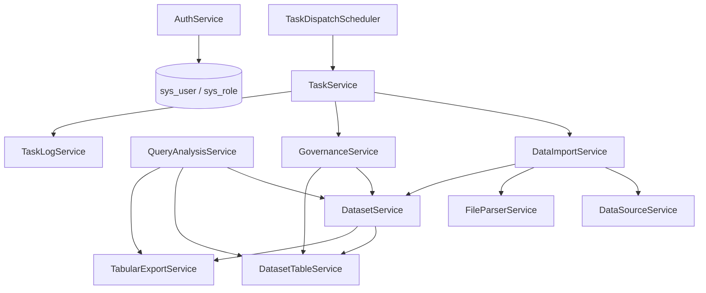
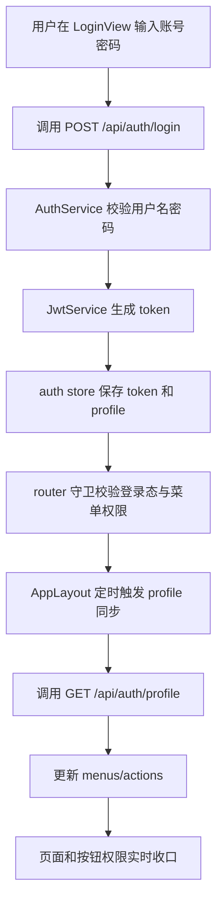
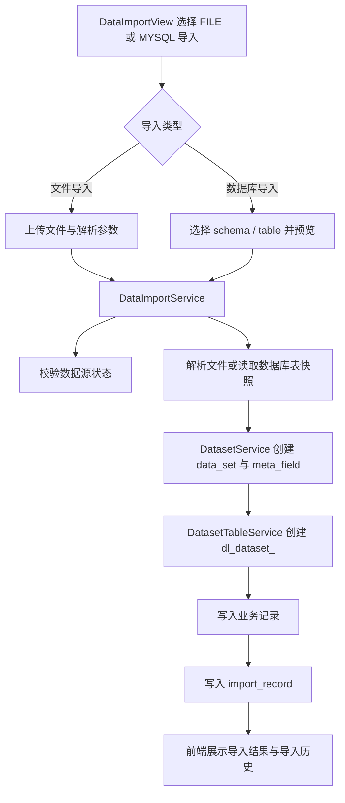
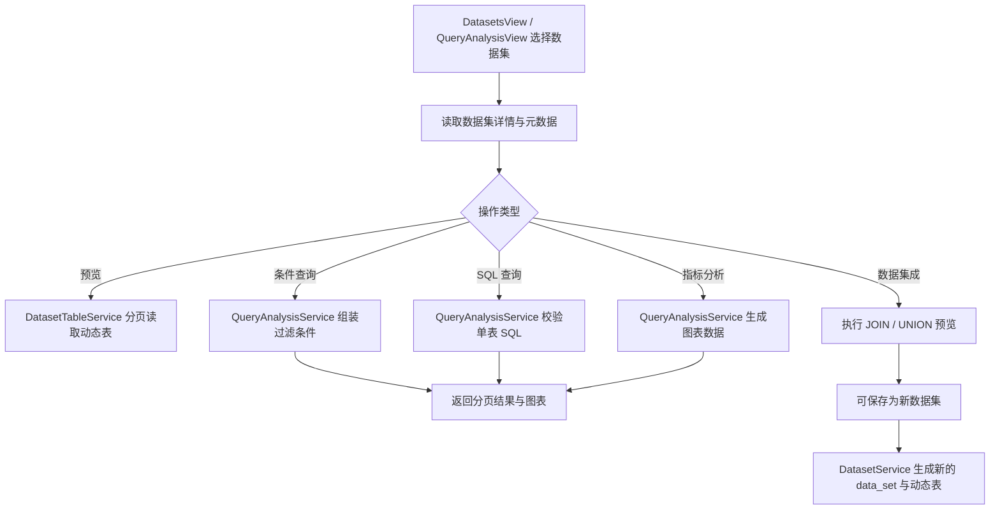
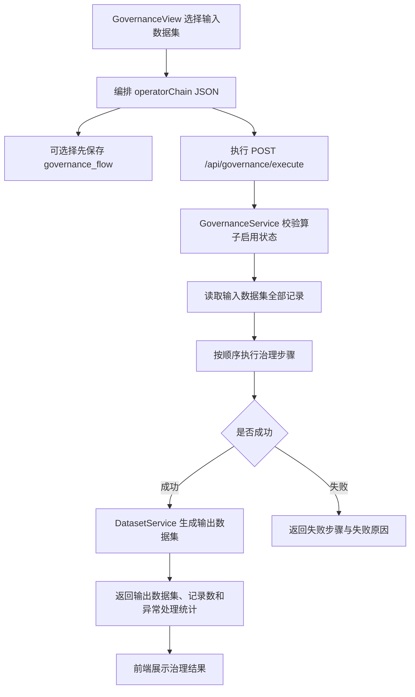

**电商数据湖管理平台**

**模块设计文档**

Modules Design Specification

项目名称：电商数据湖管理平台（Web 端）

摘要：本文档依据当前仓库冻结版本的实际实现，对电商数据湖管理平台的模块划分、模块职责、模块调用关系和主流程设计进行说明。文档面向课程项目报告、系统答辩和后续维护场景，重点覆盖系统总体架构、前端模块、后端模块、关键业务流程和核心模块设计边界，所有内容均以当前代码实现为准，不扩写未实现能力。

相关文档：

1. 《电商数据湖管理平台-产品功能设计文档-V3》
2. 《电商数据湖管理平台-用户故事文档-V2》
3. 《电商数据湖管理平台-接口设计文档》
4. 《电商数据湖管理平台-数据库设计文档》
5. `docs/module-map.md`
6. `docs/architecture.md`
7. `docs/freeze-release-note.md`
8. `README.md`

版权所有：除特别允许外，仅供项目组内部教学、课程开发和课程报告使用。

**修改记录：**

| 日期 | 版本 | 说明 | 作者 |
| --- | --- | --- | --- |
| 2026/04/05 | V1.0 | 依据教师模板并结合当前冻结代码实现，新增模块设计文档 | 肖溢丹 |

# 目录

| 章节 | 内容 |
| --- | --- |
| 第1章 | 简介 |
| 第2章 | 系统总体架构设计 |
| 第3章 | 前端模块设计 |
| 第4章 | 后端模块设计 |
| 第5章 | 模块调用关系设计 |
| 第6章 | 主流程设计 |
| 第7章 | 关键模块设计说明 |
| 第8章 | 结语 |

# 1 简介

## 1.1 目的

本文档用于说明电商数据湖管理平台当前版本的模块设计方案，重点回答以下问题：

1. 系统当前实际由哪些前后端模块组成。
2. 各模块分别承担什么职责，输入输出是什么。
3. 模块之间如何调用，主链路如何形成闭环。
4. 哪些模块负责权限、接入、查询、治理、调度和日志能力。
5. 当前实现边界在哪里，哪些能力不属于本期已实现范围。

本文档以课程项目交付为目标，强调“与代码实现一致”，不对未落地的独立系统设置、独立数据集成菜单、Quartz 调度集群、多租户配置中心或其他规划性模块进行虚构设计。

## 1.2 范围

当前模块设计覆盖以下内容：

1. 系统总体架构与技术分层。
2. 前端基础支撑模块与业务页面模块。
3. 后端认证、接入、资产、查询、治理、调度和日志模块。
4. 前后端之间、后端内部之间的调用关系。
5. 登录、接入、查询、治理、调度与日志五条核心业务流程。
6. 登录权限、数据接入、数据集与查询分析、数据治理、任务与日志五个关键模块的设计说明。

模块事实源优先级如下：

1. 前端 `router / stores / api / views` 与后端 `Controller / Service / Scheduler / Security`
2. `docs/module-map.md`
3. `docs/architecture.md`
4. `docs/freeze-release-note.md`

# 2 系统总体架构设计

## 2.1 总体架构概述

当前系统采用前后端分离的 Web 应用架构，整体由前端管理台、后端 API 服务、关系型数据库和本地文件存储四部分组成。

系统技术栈如下：

| 层次 | 当前实现 |
| --- | --- |
| 前端 | `Vue 3`、`Element Plus`、`Pinia`、`Vue Router`、`ECharts` |
| 后端 | `Spring Boot`、`Spring Security`、`JWT`、`JdbcTemplate` |
| 数据库 | `H2 / MySQL` |
| 文件存储 | 本地 `storage/` 目录 |

系统围绕“电商数据接入 → 数据集管理 → 查询分析 / 数据集成 → 数据治理 → 任务调度 → 日志监控”的主链路进行模块划分，登录权限模块和公共基础模块为整个平台提供统一支撑。

## 2.2 架构分层

当前实现可划分为以下五层：

| 层级 | 主要内容 | 当前实现说明 |
| --- | --- | --- |
| 表示层 | 页面、布局、图表、交互 | 前端 `views`、`layouts`、`router` |
| 接口层 | HTTP 路由与参数接收 | 后端各 `Controller` |
| 业务服务层 | 认证、导入、查询、治理、调度、日志处理 | 后端各 `Service` 与 `TaskDispatchScheduler` |
| 数据访问层 | SQL 执行、动态表操作、统一返回结构 | `JdbcTemplate`、`DatasetTableService`、`common.web` |
| 存储层 | 关系表、动态数据表、原始文件 | `schema.sql`、`dl_dataset_<datasetId>`、本地 `storage/` |

## 2.3 总体架构图



## 2.4 当前系统边界说明

为保证课程项目边界清晰，当前模块设计明确以下事实：

1. 系统没有独立“系统设置”模块。
2. 数据集成属于“电商查询分析”页中的子标签能力，不是独立菜单或独立后端域。
3. 调度能力由 `TaskDispatchScheduler` 通过固定周期轮询实现，不是 Quartz 集群调度。
4. 业务记录表不是固定脚本预建表，而是按数据集运行时动态创建 `dl_dataset_<datasetId>`。
5. 日志页支持筛选、详情、回放和前端侧导出当前筛选结果，但后端没有独立日志导出 API 模块。

# 3 前端模块设计

## 3.1 前端模块总览

前端代码位于 `frontend/src`，当前真实模块划分如下：

| 模块类别 | 模块名称 | 主要文件 |
| --- | --- | --- |
| 基础支撑 | 路由模块 | `router/index.ts` |
| 基础支撑 | 会话权限模块 | `stores/auth.ts` |
| 基础支撑 | API 访问模块 | `api/client.ts`、`api/platform.ts` |
| 基础支撑 | 布局模块 | `layouts/AppLayout.vue` |
| 业务页面 | 登录权限模块 | `views/LoginView.vue` |
| 业务页面 | 仪表盘模块 | `views/DashboardView.vue` |
| 业务页面 | 数据源管理模块 | `views/DataSourcesView.vue` |
| 业务页面 | 数据接入模块 | `views/DataImportView.vue` |
| 业务页面 | 数据集管理模块 | `views/DatasetsView.vue` |
| 业务页面 | 查询分析模块 | `views/QueryAnalysisView.vue` |
| 业务页面 | 数据治理模块 | `views/GovernanceView.vue` |
| 业务页面 | 任务调度模块 | `views/TasksView.vue` |
| 业务页面 | 日志监控模块 | `views/LogsView.vue` |
| 业务页面 | 用户与权限模块 | `views/UsersView.vue` |

## 3.2 基础支撑模块

### 3.2.1 路由模块

- 模块职责：
  负责页面注册、登录拦截、菜单权限跳转、页面标题设置和登录后默认入口收口。
- 主要功能：
  当前注册 `login / dashboard / data-sources / imports / datasets / queries / governance / tasks / logs / users` 共 10 个页面入口，并通过 `meta.menuKey` 控制菜单访问。
- 调用后端接口：
  不直接调用业务接口，但会触发会话权限模块的 `syncProfile`。
- 输入输出：
  输入为目标路由、当前登录状态和 `allowedMenus`；输出为允许访问、重定向到登录页或重定向到首个有权限菜单。

### 3.2.2 会话权限模块

- 模块职责：
  负责保存 JWT、本地用户 profile、菜单权限、操作权限和会话同步状态。
- 主要功能：
  提供 `login`、`logout`、`syncProfile`、`hasAction` 等能力；支持从 `localStorage` 恢复登录态，并定时同步 profile。
- 调用后端接口：
  `POST /api/auth/login`、`GET /api/auth/profile`
- 输入输出：
  输入为用户名密码或当前 token；输出为 `token`、`username`、`role`、`displayName`、`menus`、`actions` 等会话信息。

### 3.2.3 API 访问模块

- 模块职责：
  负责统一封装前端 HTTP 请求、认证头注入、统一错误处理、文件下载和类型定义。
- 主要功能：
  `client.ts` 提供 `apiGet / apiPost / apiPut / apiDelete / apiUpload / apiDownload / apiDownloadPost`；
  `platform.ts` 对外暴露各业务模块的接口函数和类型。
- 调用后端接口：
  覆盖全站已实现业务接口。
- 输入输出：
  输入为页面层的请求参数；输出为业务类型对象、分页对象或下载文件对象。

### 3.2.4 布局模块

- 模块职责：
  负责侧边菜单、顶部栏、用户身份展示和页面主体承载。
- 主要功能：
  根据 `allowedMenus` 动态渲染侧边栏；展示当前用户 `displayName` 与角色；定时触发 profile 同步；在权限变化后自动跳转到仍可访问的页面。
- 调用后端接口：
  不直接封装接口，但会调用会话权限模块的 `syncProfile`，进而访问 `GET /api/auth/profile`。
- 输入输出：
  输入为当前路由和会话权限状态；输出为动态导航结构和受控页面容器。

## 3.3 业务页面模块

### 3.3.1 登录权限模块

- 模块职责：
  提供账号密码登录入口，并把登录结果写入会话权限模块。
- 主要页面功能：
  输入用户名和密码、登录失败提示、登录成功后跳转有权限的首个菜单。
- 调用后端接口：
  `POST /api/auth/login`
- 输入输出：
  输入为 `username / password`；输出为登录结果 `LoginResult`。

### 3.3.2 仪表盘模块

- 模块职责：
  负责聚合展示数据源、数据集、任务和电商核心指标，并提供主流程快捷跳转。
- 主要页面功能：
  展示统计卡片、近 7 天订单量趋势、近 7 天销售额趋势、热销商品、低库存统计、最近任务和最近日志，并每 15 秒自动刷新。
- 调用后端接口：
  `GET /api/dashboard/overview`
  `GET /api/dashboard/ecommerce`
  `GET /api/dashboard/recent-tasks`
  `GET /api/task-logs`
- 输入输出：
  输入为当前用户菜单权限；输出为首页统计结果、图表数据、最近任务与最近日志列表。

### 3.3.3 数据源管理模块

- 模块职责：
  管理 `FILE / MYSQL` 两类数据源。
- 主要页面功能：
  数据源新增、编辑、删除、连接测试、启停切换和重复连接策略处理。
- 调用后端接口：
  `GET /api/data-sources`
  `POST /api/data-sources`
  `PUT /api/data-sources/{sourceId}`
  `DELETE /api/data-sources/{sourceId}`
  `POST /api/data-sources/{sourceId}/test`
  `POST /api/data-sources/{sourceId}/status`
- 输入输出：
  输入为数据源表单；输出为数据源列表、连接测试结果和状态更新结果。

### 3.3.4 数据接入模块

- 模块职责：
  负责文件导入、数据库表导入、导入历史查看和导入详情展示。
- 主要页面功能：
  文件导入支持格式自动识别、编码方式和首行为表头；数据库导入支持 `Schema / Database` 识别、表列表选择和样例预览；历史区支持按业务域、状态和时间筛选。
- 调用后端接口：
  `GET /api/data-sources`
  `POST /api/imports/file`
  `POST /api/imports/database`
  `GET /api/imports/database/schemas`
  `GET /api/imports/database/tables`
  `GET /api/imports/database/preview`
  `GET /api/imports/history`
  `GET /api/imports/{importId}`
- 输入输出：
  输入为上传文件、数据库表选择和导入筛选条件；输出为导入结果、导入历史、导入详情和数据库表预览。

### 3.3.5 数据集管理模块

- 模块职责：
  管理数据集主信息、元数据和分页预览，并承担数据集导出和删除入口。
- 主要页面功能：
  数据集列表筛选、数据集详情查看、元数据展示、分页预览、字段关键字筛选、导出和删除校验。
- 调用后端接口：
  `GET /api/datasets`
  `GET /api/datasets/{datasetId}`
  `GET /api/metadata/{datasetId}`
  `GET /api/preview/{datasetId}`
  `GET /api/datasets/{datasetId}/export`
  `DELETE /api/datasets/{datasetId}`
- 输入输出：
  输入为数据集筛选条件、预览字段与关键字；输出为数据集列表、数据集详情、元数据、分页预览结果和导出文件。

### 3.3.6 查询分析模块

- 模块职责：
  提供条件查询、单表 SQL 查询、电商指标分析和数据集成四类能力，是查询与分析的统一入口。
- 主要页面功能：
  基础分析子页支持多条件组合、分页、排序、分布图和导出；
  电商指标子页支持订单量趋势、销售额趋势、热销商品、分类占比和低库存分析；
  数据集成子页支持 `JOIN / UNION` 预览和保存新数据集。
- 调用后端接口：
  `GET /api/datasets`
  `GET /api/metadata/{datasetId}`
  `POST /api/queries/filter`
  `POST /api/queries/sql/page`
  `POST /api/queries/filter/export`
  `POST /api/queries/sql/export`
  `GET /api/analysis/{datasetId}/summary`
  `POST /api/analysis/charts`
  `POST /api/queries/ecommerce-metric`
  `POST /api/queries/integration`
  `POST /api/queries/integration/save`
- 输入输出：
  输入为数据集选择、查询条件、SQL、指标字段配置、集成模式和关联字段；输出为查询分页结果、图表数据、指标表格、集成预览结果和新数据集结果。

### 3.3.7 数据治理模块

- 模块职责：
  提供治理算子查看与启停、治理流程保存、治理执行和结果反馈。
- 主要页面功能：
  选择输入数据集、编排算子步骤、上移下移步骤、编辑 JSON 参数、套用电商治理模板、保存流程、执行治理并查看输出数据集和异常处理统计。
- 调用后端接口：
  `GET /api/datasets`
  `GET /api/governance/operators`
  `POST /api/governance/operators/{operatorKey}/status`
  `GET /api/governance/flows`
  `POST /api/governance/flows`
  `POST /api/governance/execute`
- 输入输出：
  输入为 `datasetId`、`flowName`、`executionName` 和 `operatorChain`；输出为流程列表、算子列表和治理执行结果 `GovernanceExecutionResult`。

### 3.3.8 任务调度模块

- 模块职责：
  管理 `IMPORT / GOVERNANCE` 两类任务，并提供任务模板、筛选视图和自动刷新。
- 主要页面功能：
  任务新建、编辑、删除、立即执行、暂停、恢复、任务筛选、最近日志联动、保存常用筛选视图和自动刷新。
- 调用后端接口：
  `GET /api/tasks`
  `POST /api/tasks`
  `PUT /api/tasks/{taskId}`
  `DELETE /api/tasks/{taskId}`
  `POST /api/tasks/{taskId}/trigger`
  `POST /api/tasks/{taskId}/pause`
  `POST /api/tasks/{taskId}/resume`
  `GET /api/governance/flows`
  `GET /api/imports/history`
  `GET /api/task-logs`
- 输入输出：
  输入为任务表单、筛选条件和目标对象选择；输出为任务列表、任务状态更新结果和最近执行日志。

### 3.3.9 日志监控模块

- 模块职责：
  提供日志列表、详情查看、失败分析、回放和前端侧筛选结果导出。
- 主要页面功能：
  服务端筛选日志、查看结构化详情、跳转关联任务、失败日志一键回放、按当前筛选结果导出 `CSV / JSON`。
- 调用后端接口：
  `GET /api/task-logs`
  `GET /api/task-logs/{logId}`
  `POST /api/task-logs/{logId}/replay`
- 输入输出：
  输入为日志筛选条件、选中日志 ID；输出为日志摘要列表、日志详情、回放结果；日志导出文件由前端基于已加载结果生成，不依赖独立后端导出接口。

### 3.3.10 用户与权限模块

- 模块职责：
  负责用户管理和角色权限配置。
- 主要页面功能：
  用户新增、编辑、删除、启停；角色描述编辑；菜单权限和操作权限分组配置；管理员与普通角色权限边界收口。
- 调用后端接口：
  `GET /api/users`
  `POST /api/users`
  `PUT /api/users/{userId}`
  `DELETE /api/users/{userId}`
  `GET /api/roles`
  `PUT /api/roles/{roleId}`
- 输入输出：
  输入为用户表单、角色描述、菜单权限集合和操作权限集合；输出为用户列表、角色列表和权限更新结果。

# 4 后端模块设计

## 4.1 后端模块总览

后端代码位于 `backend/src/main/java/com/datalake/platform`，当前真实模块如下：

| 模块 | 主要包 | 说明 |
| --- | --- | --- |
| 认证与权限模块 | `auth` | 登录、用户、角色、权限解析 |
| 公共基础模块 | `common` | 安全配置、JWT、统一返回、工具类 |
| 启动初始化模块 | `bootstrap` | 默认数据与兼容字段初始化 |
| 仪表盘模块 | `dashboard` | 首页聚合指标 |
| 数据源与接入模块 | `datasource` | 数据源管理、文件导入、数据库表导入 |
| 数据集与查询分析模块 | `dataset` | 数据集、元数据、动态表、查询、集成、导出 |
| 数据治理模块 | `governance` | 算子管理、流程管理、治理执行 |
| 任务与日志模块 | `task` | 任务管理、轮询调度、执行日志、回放 |

## 4.2 认证与权限模块（`auth`）

- 模块职责：
  负责登录认证、用户管理、角色管理、菜单权限和操作权限解析。
- 核心类组成：
  `AuthController`、`AuthService`、`RoleController`、`UserController`、`RoleMenuCatalog`
- 关键数据对象：
  `sys_user`、`sys_role`、`LoginRequest`、`LoginResponse`
- 对外提供能力：
  登录、登出、获取当前用户 profile、查询角色、更新角色、查询用户、新增用户、编辑用户、删除用户。
- 依赖模块：
  依赖 `common.security` 提供 JWT 服务与认证上下文，依赖数据库中的用户和角色表。

## 4.3 公共基础模块（`common`）

- 模块职责：
  为全站提供安全配置、JWT 过滤、统一响应、统一分页、业务域规范化和通用工具能力。
- 核心类组成：
  `common.config.SecurityConfig`
  `common.security.JwtService`
  `common.security.JwtAuthenticationFilter`
  `common.security.AuthUser`
  `common.web.ApiResponse`
  `common.web.PageResponse`
- 关键数据对象：
  JWT `token`、认证用户对象、统一响应结构、统一分页结构、业务域枚举规范。
- 对外提供能力：
  认证拦截、`Bearer Token` 解析、未登录/无权限响应、密码加密、统一 JSON 响应与分页返回。
- 依赖模块：
  被 `auth`、`datasource`、`dataset`、`governance`、`task` 等全部业务模块依赖。

## 4.4 启动初始化模块（`bootstrap`）

- 模块职责：
  在系统启动时补齐兼容字段，并初始化默认角色、示例用户和治理算子。
- 核心类组成：
  `DataBootstrapRunner`
- 关键数据对象：
  `sys_role`、`sys_user`、`operator_def`、`data_set`、`import_record`、`task_log`
- 对外提供能力：
  字段兼容补齐、`ADMIN / OPERATOR` 角色初始化、`admin / operator` 用户初始化、9 个内置治理算子初始化。
- 依赖模块：
  依赖 `JdbcTemplate` 和密码编码器；调用 `RoleMenuCatalog` 生成默认权限集合。

## 4.5 仪表盘模块（`dashboard`）

- 模块职责：
  负责统计数据源、数据集、任务、日志和电商指标，并向首页输出聚合结果。
- 核心类组成：
  `DashboardController`、`DashboardService`
- 关键数据对象：
  首页概览对象、电商概览对象、最近任务列表、任务趋势数据。
- 对外提供能力：
  首页概览、任务趋势、最近任务、电商指标概览。
- 依赖模块：
  依赖 `data_set`、`data_source`、`task_def`、`task_log` 以及运行时数据集表。

## 4.6 数据源与接入模块（`datasource`）

- 模块职责：
  负责数据源管理、文件导入、数据库表导入、导入历史和导入详情。
- 核心类组成：
  `DataSourceController`、`DataSourceService`
  `DataImportController`、`DataImportService`
  `FileParserService`
- 关键数据对象：
  `data_source`、`import_record`、上传文件、数据库表快照、解析后的列定义和记录行。
- 对外提供能力：
  数据源增删改查、连接测试、启停、文件导入、数据库表导入、schema 列表、表列表、样例预览、导入历史、导入详情。
- 依赖模块：
  依赖 `DatasetService` 创建数据集，依赖 `FileParserService` 解析文件，依赖 `JdbcTemplate` 和 `storage/` 文件目录。

## 4.7 数据集与查询分析模块（`dataset`）

- 模块职责：
  负责数据集主信息、元数据、动态物理表、预览、查询分析、数据集成和导出。
- 核心类组成：
  `DatasetController`、`DatasetService`
  `QueryAnalysisController`、`QueryAnalysisService`
  `DatasetTableService`
  `TabularExportService`
- 关键数据对象：
  `data_set`、`meta_field`、运行时 `dl_dataset_<datasetId>` 表、条件查询请求、SQL 查询请求、数据集成请求。
- 对外提供能力：
  数据集列表、详情、删除、元数据、预览、数据集导出、条件查询、单表 SQL 查询、SQL 分页、图表分析、电商指标、数据集成预览、数据集成保存。
- 依赖模块：
  依赖 `JdbcTemplate` 读写动态表，依赖 `TabularExportService` 导出文件；被 `datasource` 和 `governance` 模块复用。

## 4.8 数据治理模块（`governance`）

- 模块职责：
  负责治理算子管理、治理流程保存和治理执行。
- 核心类组成：
  `GovernanceController`、`GovernanceService`
- 关键数据对象：
  `operator_def`、`governance_flow`、`operator_chain` JSON、治理执行结果。
- 对外提供能力：
  查询算子列表、启停算子、查询流程列表、保存治理流程、执行治理流程、执行已保存流程。
- 依赖模块：
  依赖 `DatasetService` 获取输入和创建输出数据集，依赖 `DatasetTableService` 读取数据行并执行结果写入。

## 4.9 任务与日志模块（`task`）

- 模块职责：
  负责任务定义、定时轮询、任务执行、任务日志记录、日志详情和失败回放。
- 核心类组成：
  `TaskController`
  `TaskService`
  `TaskDispatchScheduler`
  `TaskLogController`
  `TaskLogService`
- 关键数据对象：
  `task_def`、`task_log`、任务执行输入参数、执行步骤、结构化失败原因。
- 对外提供能力：
  任务列表、新建、编辑、删除、立即执行、暂停、恢复、日志列表、日志详情、失败回放。
- 依赖模块：
  `TaskService` 依赖 `DataImportService` 和 `GovernanceService` 执行具体任务，依赖 `TaskLogService` 记录日志；`TaskDispatchScheduler` 依赖 `TaskService` 定期扫描并执行到期任务。

## 4.10 后端实现边界

后端模块当前明确遵循以下边界：

1. 任务类型仅支持 `IMPORT / GOVERNANCE`。
2. 治理输出必须保存为新数据集，不直接覆盖输入数据集。
3. SQL 查询仅允许访问当前数据集对应的单表。
4. 日志模块当前支持列表、详情和回放，没有独立日志导出 API。
5. 调度通过 `@Scheduled(fixedDelay)` 轮询执行，不依赖 Quartz 或独立调度中心。

# 5 模块调用关系设计

## 5.1 前端到后端调用链

前端调用链遵循统一模式：

页面模块 → `platform.ts` 接口函数 → `client.ts` 请求封装 → 后端 `Controller` → `Service` → 数据库/文件存储



## 5.2 后端内部调用关系



## 5.3 模块依赖表

| 调用方 | 被调用方 | 调用目的 | 主要输出 |
| --- | --- | --- | --- |
| `AuthService` | `sys_user / sys_role` | 完成登录认证和权限装载 | 登录结果、菜单权限、操作权限 |
| `DataImportService` | `DataSourceService` | 校验数据源状态和连接能力 | 可用数据源上下文 |
| `DataImportService` | `FileParserService` | 解析上传文件 | 字段列表与数据行 |
| `DataImportService` | `DatasetService` | 创建导入后的数据集 | `datasetId`、物理表、元数据 |
| `DatasetService` | `DatasetTableService` | 创建动态表、写入数据、预览、删除 | 动态数据表与分页数据 |
| `DatasetService` | `TabularExportService` | 导出数据集内容 | `csv / json / xlsx` 文件 |
| `QueryAnalysisService` | `DatasetService` | 获取数据集详情和元数据 | 数据集上下文 |
| `QueryAnalysisService` | `DatasetTableService` | 执行过滤、SQL、集成操作 | 表格结果、分页结果 |
| `QueryAnalysisService` | `TabularExportService` | 导出过滤结果或 SQL 结果 | 导出文件 |
| `GovernanceService` | `DatasetService` | 读取输入数据集并生成输出数据集 | 新输出数据集 |
| `GovernanceService` | `DatasetTableService` | 获取记录行并写入治理结果 | 治理后记录 |
| `TaskService` | `DataImportService` | 执行或重跑导入类任务 | 新导入结果 |
| `TaskService` | `GovernanceService` | 执行治理类任务 | 治理输出结果 |
| `TaskService` | `TaskLogService` | 写入结构化任务日志 | `task_log` 记录 |
| `TaskDispatchScheduler` | `TaskService` | 轮询执行到期任务 | 任务执行与日志落库 |

## 5.4 调用关系说明

1. 前端页面本身不直接拼接底层 HTTP 细节，统一通过 `platform.ts` 调用接口。
2. 后端 `Controller` 主要负责参数接收和权限约束，核心逻辑集中在 `Service`。
3. `dataset` 模块是平台中枢模块，既服务于导入，也服务于查询、治理和导出。
4. `task` 模块不自己实现导入和治理逻辑，而是编排已有业务服务并统一记录日志。

# 6 主流程设计

## 6.1 登录与权限同步流程



流程说明：

1. 用户在登录页提交用户名和密码。
2. 后端完成用户认证、角色装载和 token 生成。
3. 前端保存 token 与 profile，并依据 `menus/actions` 控制导航与按钮可见性。
4. 路由守卫和布局层会持续同步 profile，从而在角色权限变化后实时更新可见范围。

## 6.2 文件/数据库表数据接入流程



流程说明：

1. 文件导入支持 `CSV / JSON / Excel`，数据库导入支持 `MYSQL` 数据源的 schema、表和样例预览。
2. 导入服务统一把外部数据转换为数据集、元数据和动态物理表。
3. 导入完成后写入 `import_record`，用于历史查看、详情展示和后续 `IMPORT` 任务重跑。

## 6.3 数据集管理与查询分析流程



流程说明：

1. 数据集管理页主要负责查看和导出，查询分析页负责计算和组合。
2. 条件查询、SQL 查询和图表分析都基于当前数据集元数据驱动。
3. 数据集成仅通过查询分析页子标签提供，支持 `JOIN / UNION` 预览和保存新数据集。

## 6.4 数据治理执行并生成新数据集流程



流程说明：

1. 治理页可以直接执行临时编排的算子链，也可以先保存为治理流程。
2. 算子链通过 JSON 存储，不拆分为单独步骤子表。
3. 治理结果始终输出为新数据集，不覆盖原始输入数据集。

## 6.5 任务调度、日志记录与失败回放流程

```mermaid
flowchart TD
    A[TasksView 创建 IMPORT / GOVERNANCE 任务] --> B[写入 task_def]
    B --> C[TaskDispatchScheduler 固定周期轮询]
    C --> D[TaskService 执行到期任务]
    D --> E{任务类型}
    E -->|IMPORT| F[调用 DataImportService.rerunImport]
    E -->|GOVERNANCE| G[调用 GovernanceService.executeSavedFlow]
    F --> H[TaskLogService 写入成功或失败日志]
    G --> H
    H --> I[LogsView 查询日志列表和详情]
    I --> J{失败日志是否可回放}
    J -->|是| K[POST /api/task-logs/{logId}/replay]
    K --> D
```

流程说明：

1. 任务调度模块统一编排导入任务和治理任务。
2. 到期任务通过应用内轮询执行，并自动写入结构化日志。
3. 日志模块支持查看输入参数、执行步骤、结构化失败原因，并对可回放日志再次触发任务执行。

# 7 关键模块设计说明

## 7.1 登录权限模块

### 7.1.1 设计目标

在课程项目规模内完成统一认证、菜单控制、按钮控制和会话同步，保证系统访问入口和关键操作都受权限约束。

### 7.1.2 内部组成

1. 前端：`LoginView`、`stores/auth.ts`、`router/index.ts`、`AppLayout.vue`
2. 后端：`AuthController`、`AuthService`、`RoleController`、`UserController`
3. 安全基础：`SecurityConfig`、`JwtService`、`JwtAuthenticationFilter`

### 7.1.3 核心处理逻辑

1. 用户登录后，后端校验用户名密码并生成 JWT。
2. 前端保存 token 与 profile，并把 `menus` 和 `actions` 作为页面和按钮权限判断依据。
3. 所有请求通过 `client.ts` 自动注入 `Authorization: Bearer <token>`。
4. 路由守卫检查登录状态和菜单权限，布局模块定时同步 profile，保证权限变化可以自动收口。

### 7.1.4 输入输出

| 类型 | 内容 |
| --- | --- |
| 输入 | `username`、`password`、当前 token |
| 输出 | `LoginResult`、当前用户 profile、`allowedMenus`、`allowedActions` |

### 7.1.5 当前实现边界

1. 当前只支持账号密码登录。
2. 当前没有注册、刷新 token、邮箱验证和多组织租户能力。
3. 登出为无状态会话清理，不涉及服务端复杂会话管理。

## 7.2 数据接入模块

### 7.2.1 设计目标

把文件和数据库表两类电商数据统一转化为平台内部可管理的数据集。

### 7.2.2 内部组成

1. 前端：`DataImportView`
2. 后端：`DataSourceService`、`DataImportService`、`FileParserService`、`DatasetService`
3. 数据对象：`data_source`、`import_record`、`data_set`、`meta_field`、动态物理表

### 7.2.3 核心处理逻辑

1. 校验数据源是否启用。
2. 文件导入时把源文件写入本地 `storage/`，随后解析列与数据行。
3. 数据库导入时从 `MYSQL` 数据源读取 schema、表结构和样例行，并生成表快照。
4. 统一调用 `DatasetService` 创建数据集主记录、元数据字段和动态物理表。
5. 写入导入历史，供后续查询和任务重跑使用。

### 7.2.4 输入输出

| 类型 | 内容 |
| --- | --- |
| 输入 | 上传文件、编码方式、首行为表头、`sourceId`、`schemaName`、`tableName`、`datasetName`、`businessDomain` |
| 输出 | `ImportResult`、导入历史、导入详情、数据库表预览 |

### 7.2.5 当前实现边界

1. 当前文件导入支持 `CSV / JSON / Excel`。
2. 当前数据库导入仅支持 `MYSQL` 数据源和 `Schema / Database + 表` 方式。
3. 当前不支持自定义 SQL 导入数据库表。
4. 文件内容不以 BLOB 入库，而是保存文件路径和数据集结果。

## 7.3 数据集与查询分析模块

### 7.3.1 设计目标

围绕数据集、元数据和动态物理表构建统一的管理、查询、分析和导出能力。

### 7.3.2 内部组成

1. 前端：`DatasetsView`、`QueryAnalysisView`
2. 后端：`DatasetService`、`DatasetTableService`、`QueryAnalysisService`、`TabularExportService`
3. 数据对象：`data_set`、`meta_field`、`dl_dataset_<datasetId>`

### 7.3.3 核心处理逻辑

1. `DatasetService` 负责维护数据集主记录和元数据，并创建动态物理表。
2. `DatasetTableService` 负责动态表建表、插入、分页预览、过滤查询、SQL 执行和删表。
3. `QueryAnalysisService` 负责条件查询、SQL 校验、电商指标、分布图和数据集成。
4. `TabularExportService` 负责把数据集、过滤结果和 SQL 结果导出为文件。

### 7.3.4 输入输出

| 类型 | 内容 |
| --- | --- |
| 输入 | 数据集筛选条件、预览字段、查询条件、SQL 语句、图表字段、集成参数 |
| 输出 | 数据集列表、详情、元数据、分页结果、图表数据、集成结果、导出文件 |

### 7.3.5 当前实现边界

1. SQL 查询仅允许当前数据集单表。
2. 数据集成只支持 `JOIN / UNION` 两种基础模式。
3. 数据集成位于查询分析页子标签中，不单独拆出模块菜单。
4. 图表分析围绕订单量、销售额、热销商品、分类占比和库存预警等固定指标展开。

## 7.4 数据治理模块

### 7.4.1 设计目标

通过可编排的治理算子链，完成电商数据的基础清洗、标准化和去重处理。

### 7.4.2 内部组成

1. 前端：`GovernanceView`
2. 后端：`GovernanceService`
3. 数据对象：`operator_def`、`governance_flow`、输出数据集、治理结果对象

### 7.4.3 核心处理逻辑

1. 系统内置 `NULL_FILL`、`DEDUPLICATE`、`FIELD_CONVERT`、`FILTER_KEEP`、`ORDER_DEDUP`、`AMOUNT_NORMALIZE`、`TIME_NORMALIZE`、`CATEGORY_NORMALIZE`、`STATUS_NORMALIZE` 共 9 个算子。
2. 前端通过 JSON 文本维护每个步骤参数，后端统一校验算子是否存在且为启用状态。
3. 治理执行时逐步处理输入数据集的记录，并累计异常处理条数。
4. 执行成功后生成新数据集，执行失败时返回失败步骤和失败原因。

### 7.4.4 输入输出

| 类型 | 内容 |
| --- | --- |
| 输入 | `datasetId`、`flowName`、`executionName`、`operatorChain` |
| 输出 | 算子列表、流程列表、保存结果、治理执行结果 |

### 7.4.5 当前实现边界

1. 流程当前支持列表、保存和执行，不提供独立删除接口。
2. 算子参数当前为 JSON 文本，不是可视化字段映射向导。
3. 治理执行结果固定输出为新数据集。

## 7.5 任务与日志模块

### 7.5.1 设计目标

实现任务配置、定时执行、失败重试、执行留痕和日志回放，形成自动化处理闭环。

### 7.5.2 内部组成

1. 前端：`TasksView`、`LogsView`
2. 后端：`TaskService`、`TaskDispatchScheduler`、`TaskLogService`
3. 数据对象：`task_def`、`task_log`、输入参数、执行步骤、失败原因

### 7.5.3 核心处理逻辑

1. 任务页负责配置 `IMPORT / GOVERNANCE` 两类任务，并保存 Cron 表达式、状态和重试策略。
2. 调度器按固定周期扫描到期任务，并交由 `TaskService` 统一执行。
3. `TaskService` 根据任务类型分别调用重跑导入或执行治理流程。
4. `TaskLogService` 写入结构化日志，包括输入参数、执行步骤、失败原因和执行摘要。
5. 日志页支持按筛选条件查看和回放失败日志；页面导出基于当前已加载日志结果由前端直接生成文件。

### 7.5.4 输入输出

| 类型 | 内容 |
| --- | --- |
| 输入 | 任务表单、Cron 表达式、重试次数、日志筛选条件、待回放日志 ID |
| 输出 | 任务列表、任务动作结果、日志列表、日志详情、回放结果 |

### 7.5.5 当前实现边界

1. 当前任务类型只有 `IMPORT / GOVERNANCE`。
2. 调度为应用内轮询，不是分布式调度中心。
3. 后端当前没有独立日志导出接口，日志页导出由前端对当前筛选结果执行本地生成。

# 8 结语

以上模块设计文档以当前冻结代码实现为依据，对电商数据湖管理平台的总体架构、前端模块、后端模块、模块调用关系、核心业务流程和关键模块设计边界进行了完整说明。对于课程项目而言，该设计既能支撑系统演示与答辩，也能帮助教师和项目组成员理解平台从登录、接入、查询、治理到调度和日志的完整实现链路。
