**电商数据湖管理平台**

**软件架构设计**

Software Architecture Document

项目名称：电商数据湖管理平台（Web 端）

摘要：本文档依据当前仓库冻结版本的实际实现，对电商数据湖管理平台的软件架构进行综合说明。文档重点从系统分层、核心类设计、关键用例实现链路和部署方式四个方面描述当前系统的架构决策，作为课程项目的设计说明、教师审阅和课堂答辩材料。文档中所有内容均以当前已实现的前后端代码、数据库结构和冻结交付边界为准，不扩写未实现能力。

相关文档：

1. 《电商数据湖管理平台-软件需求规约》
2. 《电商数据湖管理平台-产品功能设计文档-V3》
3. 《电商数据湖管理平台-模块设计文档》
4. 《电商数据湖管理平台-接口设计文档》
5. 《电商数据湖管理平台-数据库设计文档》
6. 《电商数据湖管理平台-软件使用说明》
7. `README.md`
8. `docs/module-map.md`
9. `docs/architecture.md`
10. `docs/freeze-release-note.md`

版权所有：除特别允许否则只在项目组内部教学、课程开发和课程报告使用。

**修改记录：**

| 日期 | 版本 | 说明 | 作者 |
| --- | --- | --- | --- |
| 2026/04/06 | V1.0 | 依据教师模板并结合当前冻结代码实现新增软件架构设计文档 | 肖溢丹 |

# 目录

- 1 简介
  - 1.1 目的
  - 1.2 定义、首字母缩写词和缩略语
- 2 系统构架
  - 2.1 AuthService
  - 2.2 DataSourceService
  - 2.3 DataImportService
  - 2.4 DatasetService
  - 2.5 DatasetTableService
  - 2.6 QueryAnalysisService
  - 2.7 GovernanceService
  - 2.8 TaskService
  - 2.9 TaskLogService
  - 2.10 DashboardService
- 3 用例活动图
  - 3.1 登录与权限同步实现
    - 3.1.1 用户登录
    - 3.1.2 权限变更后的会话同步
  - 3.2 数据接入实现
    - 3.2.1 文件导入
    - 3.2.2 数据库表导入
  - 3.3 查询分析与集成实现
    - 3.3.1 条件查询与图表联动
    - 3.3.2 数据集成保存
  - 3.4 治理与调度实现
    - 3.4.1 治理执行并生成新数据集
    - 3.4.2 调度执行与日志记录
  - 3.5 日志监控实现
    - 3.5.1 失败日志回放
- 4 部署视图
  - 4.1 开发演示部署
  - 4.2 MySQL 持久化部署
  - 4.3 进程与物理节点映射

# 1 简介

软件架构文档提供软件系统架构的综合概述。本文档面向课程项目报告、教师审阅和答辩场景，通过系统构架、核心类设计、关键用例实现和部署视图，对当前电商数据湖管理平台的架构进行统一说明。本文档重点记录系统在当前冻结版本中已经形成的架构决策，用于支撑项目成员之间的协作、后续测试与课程交付说明。

## 1.1 目的

本文档的目的在于：

1. 从架构角度对电商数据湖管理平台进行综合概述。
2. 说明当前系统采用的主要技术、分层结构和关键设计模式。
3. 说明当前系统关键业务链路如何通过前端、接口、服务和存储层协同实现。
4. 为课程项目答辩、设计审阅、后续维护和文档交付提供统一依据。

## 1.2 定义、首字母缩写词和缩略语

| 名称 | 说明 |
| --- | --- |
| JWT | JSON Web Token，当前系统用于登录鉴权和会话身份识别 |
| CSV | 逗号分隔文本文件格式，当前系统支持导入与导出 |
| JSON | JavaScript Object Notation，当前系统支持文件导入与结果导出 |
| Excel / XLSX | 电子表格文件格式，当前系统支持文件导入与结果导出 |
| SQL | Structured Query Language，当前系统支持当前数据集单表查询 |
| IMPORT | 导入类任务类型 |
| GOVERNANCE | 治理类任务类型 |
| JOIN | 数据集成中的关联模式 |
| UNION | 数据集成中的合并模式 |
| H2 | 当前默认开发演示数据库 |
| MySQL | 当前持久化环境与数据库表导入支持的数据库类型 |

# 2 系统构架

当前系统采用前后端分离的 Web 架构。前端基于 `Vue 3 + Element Plus + Pinia + ECharts + Vue Router` 实现页面、权限展示和交互流程；后端基于 `Spring Boot + Spring Security + JWT + JdbcTemplate` 实现认证、数据接入、查询分析、治理、调度和日志处理；底层存储由 `H2 / MySQL` 与本地 `storage/` 文件目录共同组成。

从分层角度看，系统可划分为表示层、接口层、业务服务层、数据访问层和存储层。当前主要架构模式包括：

1. 前后端分离架构。
2. Controller-Service 分层结构。
3. 元数据驱动的动态数据表设计。
4. 基于算子链的治理流程执行模式。
5. 基于应用内轮询的任务调度模式。

当前系统总体架构图如下：

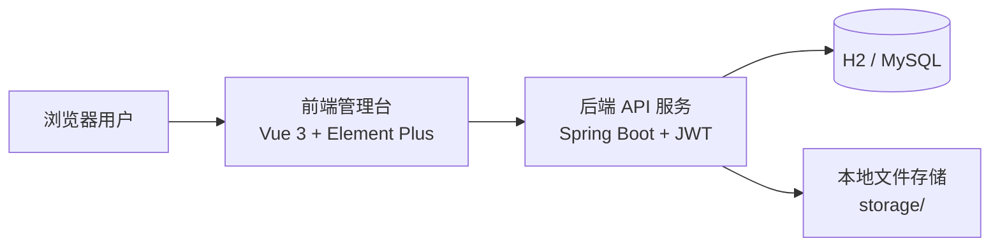

当前系统边界说明如下：

1. 数据集成属于查询分析模块内子能力，不是独立菜单或独立任务域。
2. 当前任务类型只保留 `IMPORT / GOVERNANCE`。
3. 动态业务数据表统一命名为 `dl_dataset_<datasetId>`。
4. 当前核心持久化实现以 `JdbcTemplate + 动态数据表` 为主，不将 `mybatis-plus` 历史依赖写成实际主架构。
5. Swagger UI 与 H2 Console 仅作为开发辅助入口，不属于业务架构核心模块。

## 2.1 AuthService

类描述：`AuthService` 是认证与权限模块的核心业务类，负责登录认证、当前用户信息加载、角色权限装载、用户管理和角色管理。

属性：

1. `JdbcTemplate`：用于访问 `sys_user`、`sys_role` 等表。
2. `PasswordEncoder`：用于密码校验与密码加密。
3. `JwtService`：用于生成 JWT token。

方法：

1. `login`：校验用户名和密码，生成登录结果。
2. `listUsers`：查询用户列表。
3. `listRoles`：查询角色列表。
4. `updateRole`：更新角色说明、菜单权限和操作权限。
5. `currentProfile`：加载当前登录用户资料。
6. `authenticateSession`：根据当前用户信息重新校验会话并装载权限。
7. `createUser`：新增用户。
8. `updateUser`：编辑用户信息和状态。
9. `deleteUser`：删除用户。

## 2.2 DataSourceService

类描述：`DataSourceService` 是数据源管理模块的核心业务类，负责数据源增删改查、连接测试、状态切换和数据库连接上下文提供。

属性：

1. `JdbcTemplate`：用于访问 `data_source` 表。

方法：

1. `list`：查询数据源列表。
2. `create`：新增数据源。
3. `update`：更新数据源。
4. `updateStatus`：启用或停用数据源。
5. `delete`：删除数据源。
6. `test`：测试数据源连接。
7. `connectionInfo`：读取数据源连接信息。
8. `openConnection`：打开数据库连接。

## 2.3 DataImportService

类描述：`DataImportService` 是数据接入模块的核心业务类，负责文件导入、数据库表导入、导入历史、导入详情和导入重跑。

属性：

1. `JdbcTemplate`：用于访问导入记录和辅助元数据。
2. `DataSourceService`：用于校验数据源状态和连接上下文。
3. `FileParserService`：用于解析 `CSV / JSON / Excel` 文件。
4. `DatasetService`：用于创建导入后的数据集和元数据。

方法：

1. `importFile`：导入文件数据。
2. `importDatabaseTable`：导入数据库表数据。
3. `rerunImport`：按导入记录重跑导入。
4. `listDatabaseTables`：列出数据库表。
5. `listDatabaseSchemas`：列出数据库 Schema。
6. `previewDatabaseTable`：预览数据库表结构和样例数据。
7. `history`：查询导入历史。
8. `detail`：查询导入详情。

## 2.4 DatasetService

类描述：`DatasetService` 是数据集模块的核心业务类，负责数据集主记录、元数据、预览入口和删除校验。

属性：

1. `JdbcTemplate`：用于访问 `data_set`、`meta_field` 等表。
2. `DatasetTableService`：用于操作动态物理表。

方法：

1. `createImportedDataset`：为导入场景创建数据集。
2. `createDatasetFromRows`：从记录集合创建数据集。
3. `list`：查询数据集列表。
4. `detail`：查询数据集详情。
5. `metadata`：查询元数据字段列表。
6. `preview`：分页预览数据集。
7. `delete`：删除数据集。

## 2.5 DatasetTableService

类描述：`DatasetTableService` 是动态表操作核心类，负责运行时物理表创建、数据写入、预览、过滤查询、SQL 执行与物理表删除。

属性：

1. `JdbcTemplate`：用于执行动态 SQL 和数据操作。

方法：

1. `createPhysicalTable`：创建动态数据表。
2. `insertRows`：插入动态数据表记录。
3. `preview`：分页预览表数据。
4. `filter`：按条件查询表数据。
5. `executeSql`：执行 SQL 查询。
6. `executeSqlWithColumns`：执行 SQL 并返回列结构。
7. `fetchAll`：提取全部记录。
8. `dropTable`：删除动态物理表。

## 2.6 QueryAnalysisService

类描述：`QueryAnalysisService` 是查询分析模块的核心业务类，负责条件查询、SQL 查询、电商指标、图表聚合和数据集成。

属性：

1. `DatasetService`：提供数据集详情与元数据上下文。
2. `DatasetTableService`：执行动态表查询与集成。
3. `TabularExportService`：负责查询结果导出。

方法：

1. `filter`：执行条件查询。
2. `sql`：执行 SQL 查询。
3. `sqlPage`：执行 SQL 分页查询。
4. `summary`：返回数据摘要。
5. `charts`：返回分布图或聚合图表数据。
6. `ecommerceMetric`：返回电商指标分析结果。
7. `integration`：执行 `JOIN / UNION` 预览。
8. `saveIntegrationResult`：保存集成结果为新数据集。

## 2.7 GovernanceService

类描述：`GovernanceService` 是数据治理模块的核心业务类，负责治理算子管理、治理流程管理和治理执行。

属性：

1. `JdbcTemplate`：用于访问算子、流程和治理辅助数据。
2. `DatasetService`：用于读取输入数据集和创建输出数据集。
3. `DatasetTableService`：用于读取输入记录并写入治理结果。

方法：

1. `operators`：查询算子列表。
2. `updateOperatorStatus`：启用或停用算子。
3. `flows`：查询治理流程列表。
4. `createFlow`：保存治理流程。
5. `execute`：执行临时治理流程。
6. `executeSavedFlow`：执行已保存流程。
7. `flow`：查询单个治理流程。

## 2.8 TaskService

类描述：`TaskService` 是任务调度模块的核心业务类，负责任务定义维护、手动触发、自动轮询执行和失败回放入口。

属性：

1. `JdbcTemplate`：用于访问任务定义。
2. `GovernanceService`：用于执行治理类任务。
3. `DataImportService`：用于执行导入类任务。
4. `TaskLogService`：用于记录执行日志。
5. `runningTasks`：用于避免任务重复并发执行。

方法：

1. `list`：查询任务列表。
2. `create`：新增任务。
3. `update`：更新任务。
4. `pause`：暂停任务。
5. `resume`：恢复任务。
6. `delete`：删除任务。
7. `trigger`：立即执行任务。
8. `replayFromLog`：根据失败日志重放任务。
9. `executeDueTasks`：执行到期任务。
10. `detail`：查询任务详情。

## 2.9 TaskLogService

类描述：`TaskLogService` 是日志监控模块的核心业务类，负责任务日志记录、列表筛选和详情解析。

属性：

1. `JdbcTemplate`：用于访问 `task_log` 表及其关联信息。

方法：

1. `list`：查询日志列表。
2. `detail`：查询日志详情。
3. `record`：写入日志记录。

## 2.10 DashboardService

类描述：`DashboardService` 是首页仪表盘模块的核心业务类，负责聚合统计数据、趋势数据和最近任务信息。

属性：

1. `JdbcTemplate`：用于查询首页所需统计数据。

方法：

1. `overview`：返回首页总览统计。
2. `ecommerce`：返回电商概览指标。
3. `taskTrend`：返回任务趋势数据。
4. `recentTasks`：返回最近任务列表。

# 3 用例活动图

本章通过几个精选用例来说明系统的实际工作方式，并解释不同的设计模型元素如何促成其功能实现。每个用例均以当前真实页面、控制器、服务类和数据库/存储链路为依据。

## 3.1 登录与权限同步实现

### 3.1.1 用户登录

用户登录用例主要用来解决用户身份认证、菜单权限装载和前端会话初始化问题。

#### 活动图

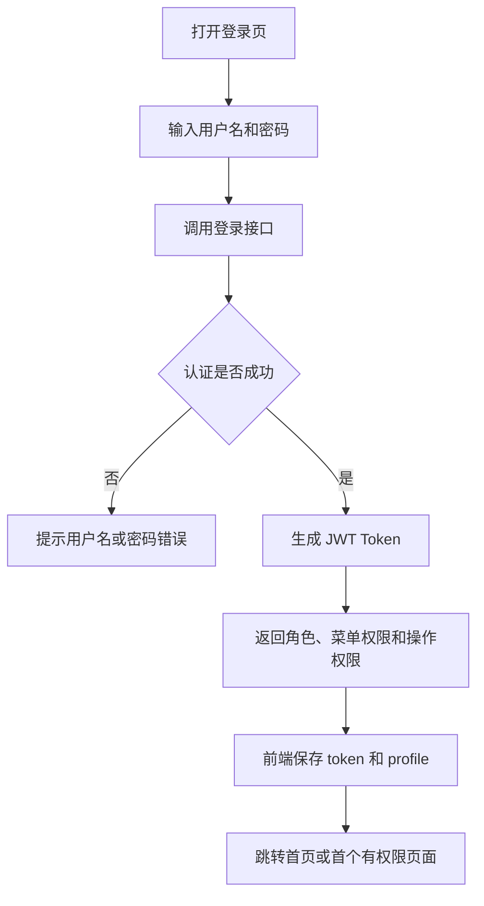

#### 序列图

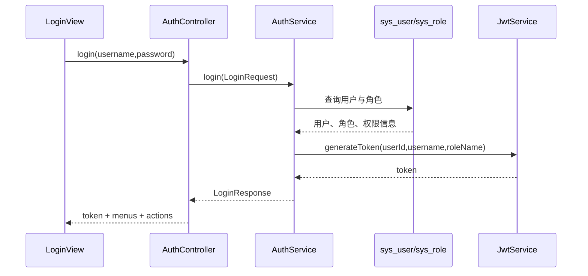

#### 过程

1. 启动登录功能。
   `LoginView` 收集 `username` 和 `password`，调用 `AuthController.login`。
2. 执行登录认证。
   `AuthController` 将参数封装为 `LoginRequest`，传入 `AuthService.login`。
3. 查询账号信息。
   `AuthService.login` 使用 `JdbcTemplate` 查询 `sys_user`、`sys_role`，校验用户状态与密码。
4. 生成会话令牌。
   认证成功后调用 `JwtService.generateToken(userId, username, roleName)`，生成 JWT token。
5. 返回登录结果。
   系统返回 `token`、`role`、`menus`、`actions`、`displayName` 等信息，前端保存到会话状态中。

### 3.1.2 权限变更后的会话同步

该用例主要用来解决用户角色、菜单权限或操作权限发生变化后，当前前端会话如何自动同步的问题。

#### 活动图

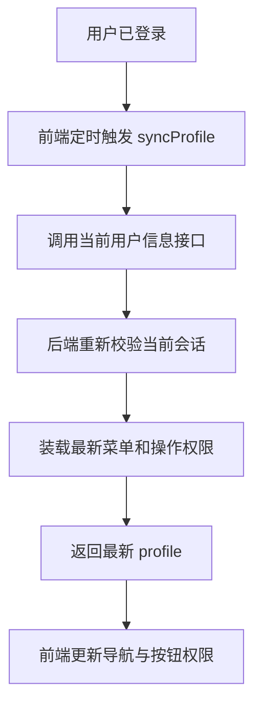

#### 序列图

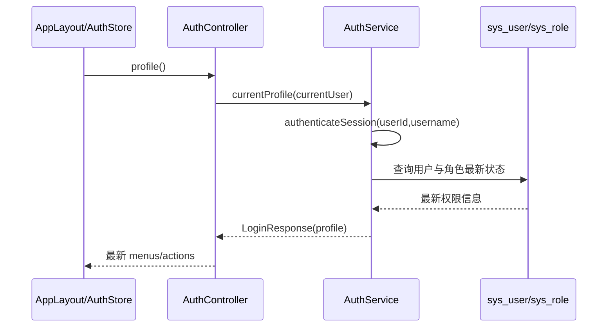

#### 过程

1. 启动 profile 同步。
   `AppLayout` 或 `AuthStore` 定时调用当前用户资料接口。
2. 调用当前用户信息接口。
   前端访问 `AuthController.profile`。
3. 后端重新校验会话。
   `AuthService.currentProfile` 调用 `AuthService.authenticateSession(userId, username)`，重新加载账号状态和权限信息。
4. 更新前端会话。
   前端根据最新 `menus` 和 `actions` 更新导航与按钮可见性；若权限被移除，则自动收口。

## 3.2 数据接入实现

### 3.2.1 文件导入

文件导入用例主要用来解决外部文件数据如何转换为内部数据集的问题。

#### 活动图

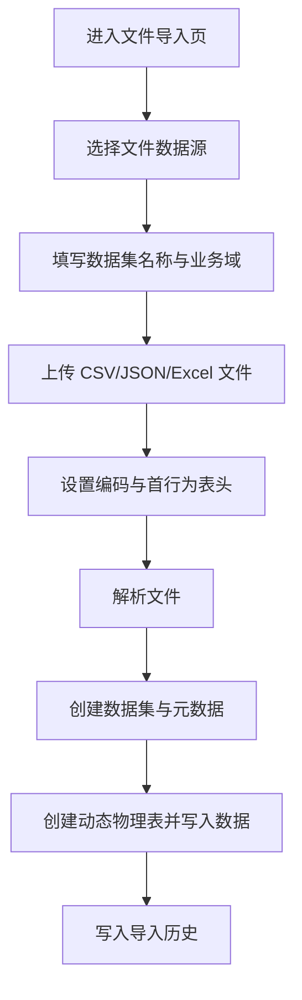

#### 序列图

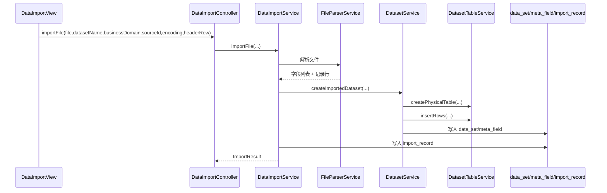

#### 过程

1. 启动文件导入功能。
   `DataImportView` 收集 `sourceId`、`datasetName`、`businessDomain`、`encoding`、`headerRow` 和上传文件。
2. 提交文件导入请求。
   `DataImportController` 调用 `DataImportService.importFile(...)`。
3. 解析文件。
   `DataImportService.importFile` 调用 `FileParserService` 解析 `CSV / JSON / Excel`，得到字段定义和数据行。
4. 创建数据集。
   `DatasetService.createImportedDataset` 创建 `data_set` 与 `meta_field` 记录。
5. 创建并写入动态表。
   `DatasetTableService.createPhysicalTable` 创建 `dl_dataset_<datasetId>`，再由 `insertRows` 写入数据。
6. 写入导入历史。
   `DataImportService` 记录 `import_record`，返回导入结果。

### 3.2.2 数据库表导入

该用例主要用来解决从 `MYSQL` 数据源读取业务表并生成数据集的问题。

#### 活动图

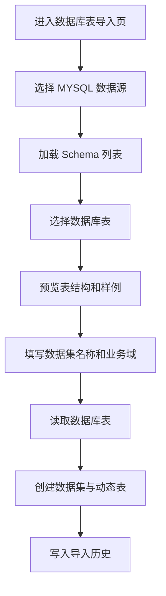

#### 序列图

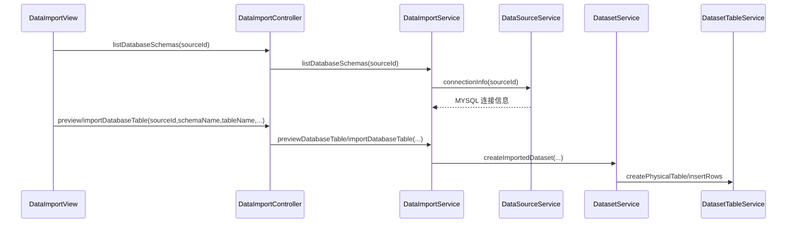

#### 过程

1. 选择 `MYSQL` 数据源。
   前端调用 `DataImportService.listDatabaseSchemas(sourceId)` 和 `listDatabaseTables(sourceId, schemaName)`。
2. 预览数据库表。
   `DataImportService.previewDatabaseTable(sourceId, schemaName, tableName, limit)` 返回字段与样例记录。
3. 执行导入。
   `DataImportService.importDatabaseTable(sourceId, schemaName, tableName, datasetName, businessDomain, description, userId)` 读取表数据。
4. 创建数据集和动态表。
   `DatasetService.createImportedDataset` 创建元数据与动态表记录。
5. 写入导入历史。
   `DataImportService` 保存数据库表导入历史，用于后续详情查看和任务重跑。

## 3.3 查询分析与集成实现

### 3.3.1 条件查询与图表联动

该用例主要用来解决数据集条件筛选、电商指标图表和结果联动展示的问题。

#### 活动图

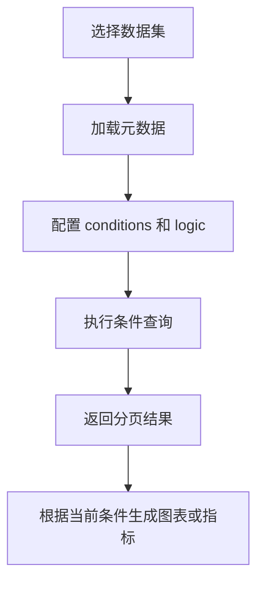

#### 序列图

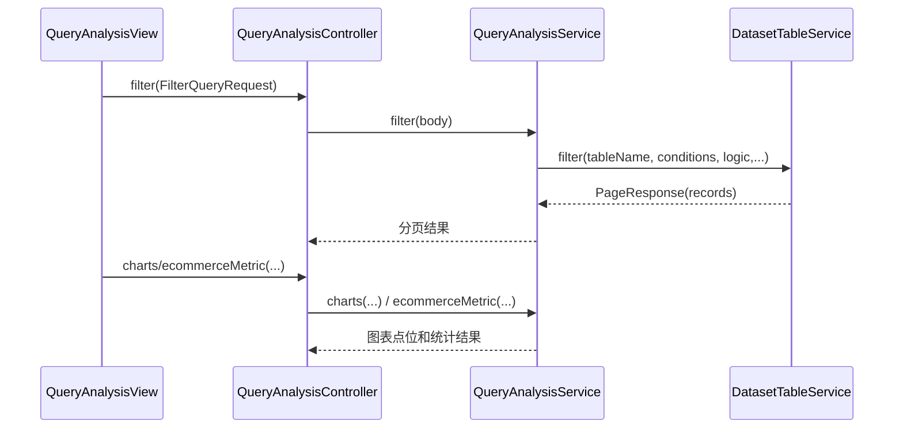

#### 过程

1. 选择目标数据集。
   页面调用元数据接口，加载可用字段。
2. 配置查询条件。
   用户填写 `conditions`、`logic`、`sortField`、`sortOrder`、`pageNum`、`pageSize`。
3. 执行条件查询。
   `QueryAnalysisController.filter` 调用 `QueryAnalysisService.filter(FilterQueryRequest body)`。
4. 动态表查询。
   `QueryAnalysisService.filter` 调用 `DatasetTableService.filter(...)` 返回分页记录。
5. 图表联动。
   在相同数据集或当前筛选上下文下，页面继续调用 `charts` 或 `ecommerceMetric` 返回趋势图、排行图和占比图结果。

### 3.3.2 数据集成保存

该用例主要用来解决对两个数据集执行 `JOIN / UNION` 预览并保存结果的问题。

#### 活动图

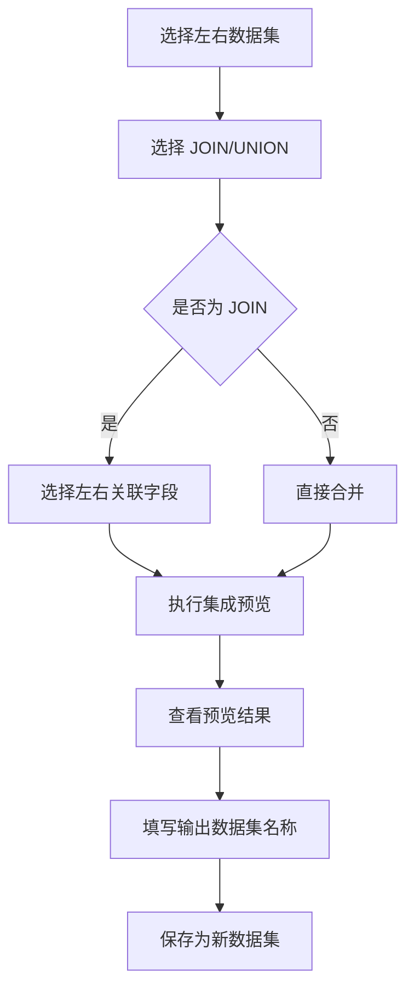

#### 序列图

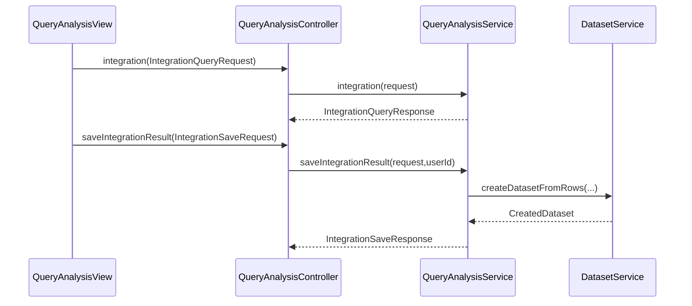

#### 过程

1. 预览集成结果。
   `QueryAnalysisController.integration` 调用 `QueryAnalysisService.integration(IntegrationQueryRequest request)`。
2. 执行 `JOIN / UNION`。
   `QueryAnalysisService.integration` 根据 `mode`、`leftDatasetId`、`rightDatasetId`、`leftField`、`rightField` 计算预览结果。
3. 保存新数据集。
   用户填写 `outputDatasetName` 和 `outputBusinessDomain`，调用 `saveIntegrationResult`。
4. 创建数据集。
   `QueryAnalysisService.saveIntegrationResult` 调用 `DatasetService.createDatasetFromRows(...)` 生成新的数据集、元数据和动态表。

## 3.4 治理与调度实现

### 3.4.1 治理执行并生成新数据集

该用例主要用来解决输入数据集如何通过治理算子链执行并输出新数据集的问题。

#### 活动图

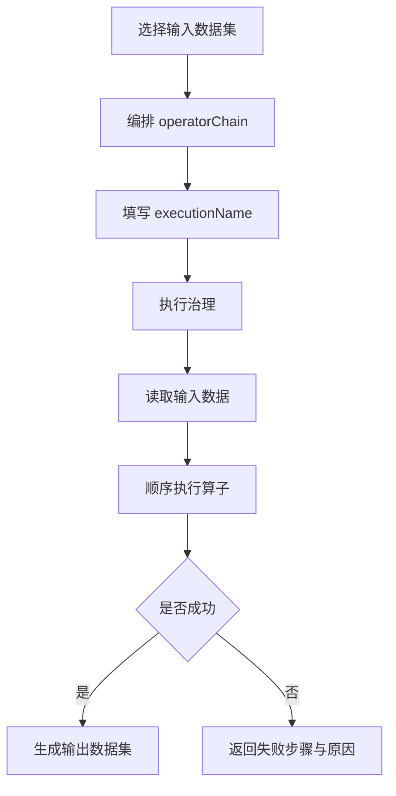

#### 序列图

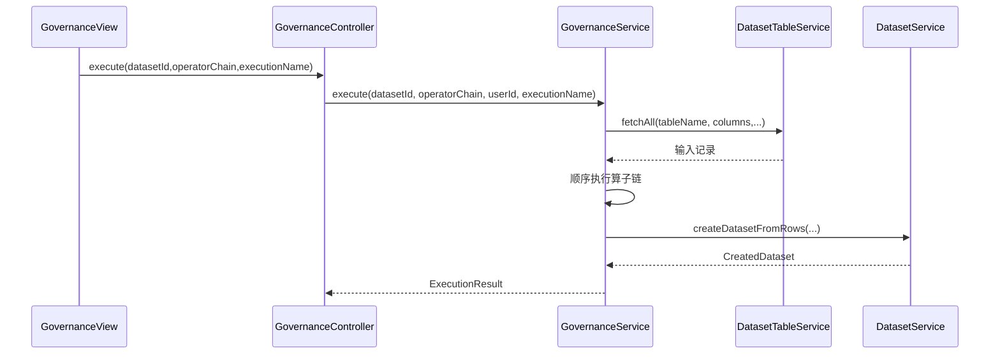

#### 过程

1. 编排治理链。
   页面收集 `datasetId`、`operatorChain`、`executionName`。
2. 提交治理执行请求。
   `GovernanceController.execute` 调用 `GovernanceService.execute(Long datasetId, List<OperatorStep> operatorChain, Long userId, String executionName)`。
3. 读取输入记录。
   `GovernanceService.execute` 调用 `DatasetTableService.fetchAll(...)` 获取全部输入数据。
4. 顺序执行算子。
   系统按 `operatorChain` 顺序调用内置算子，如 `ORDER_DEDUP`、`AMOUNT_NORMALIZE`、`TIME_NORMALIZE`。
5. 生成输出数据集。
   执行成功后调用 `DatasetService.createDatasetFromRows(...)` 生成新的输出数据集。
6. 返回执行结果。
   系统返回输入记录数、输出记录数、异常处理条数、输出数据集信息或失败步骤。

### 3.4.2 调度执行与日志记录

该用例主要用来解决任务如何被轮询调度触发，并在执行后形成日志的问题。

#### 活动图

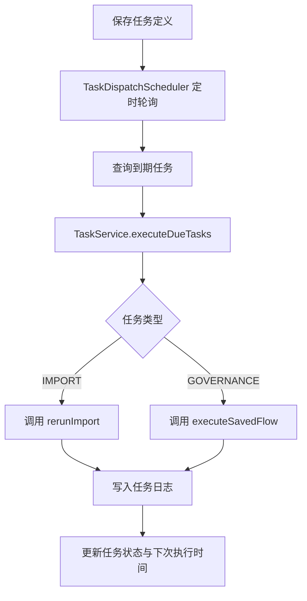

#### 序列图

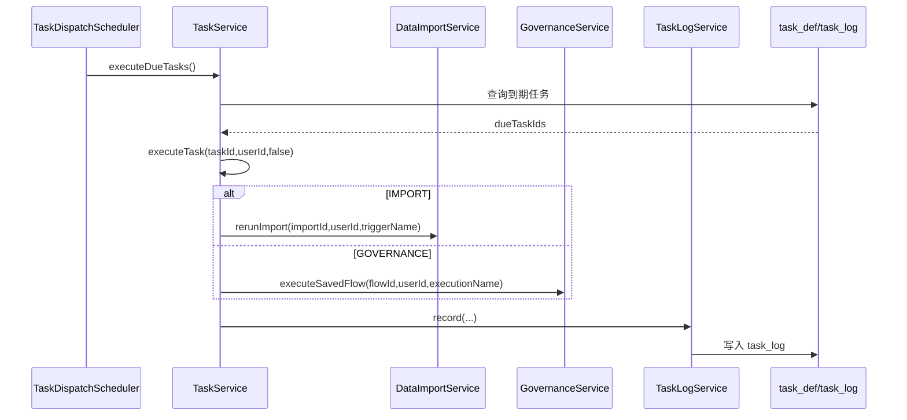

#### 过程

1. 定时轮询启动。
   `TaskDispatchScheduler` 按固定间隔触发 `TaskService.executeDueTasks()`。
2. 查询到期任务。
   `TaskService.executeDueTasks` 从 `task_def` 中查找状态为 `ENABLED` 且到期的任务。
3. 执行任务。
   `TaskService.executeTask` 根据 `taskType` 分支执行：
   - `IMPORT` 调用 `DataImportService.rerunImport(importId, userId, triggerName)`
   - `GOVERNANCE` 调用 `GovernanceService.executeSavedFlow(flowId, userId, executionName)`
4. 写入日志。
   任务执行完成后调用 `TaskLogService.record(...)` 写入结构化日志。
5. 更新任务状态。
   系统更新 `last_run_time`、`next_run_time` 和执行状态。

## 3.5 日志监控实现

### 3.5.1 失败日志回放

该用例主要用来解决失败日志如何回放的问题。

#### 活动图

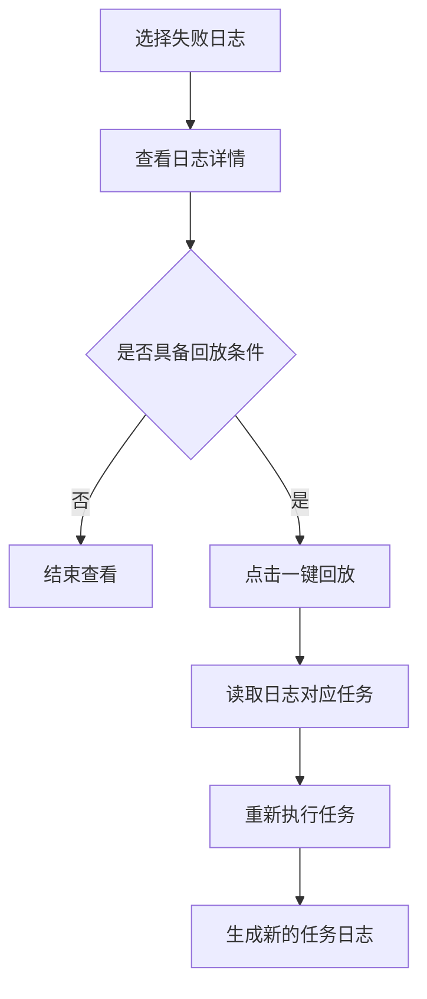

#### 序列图

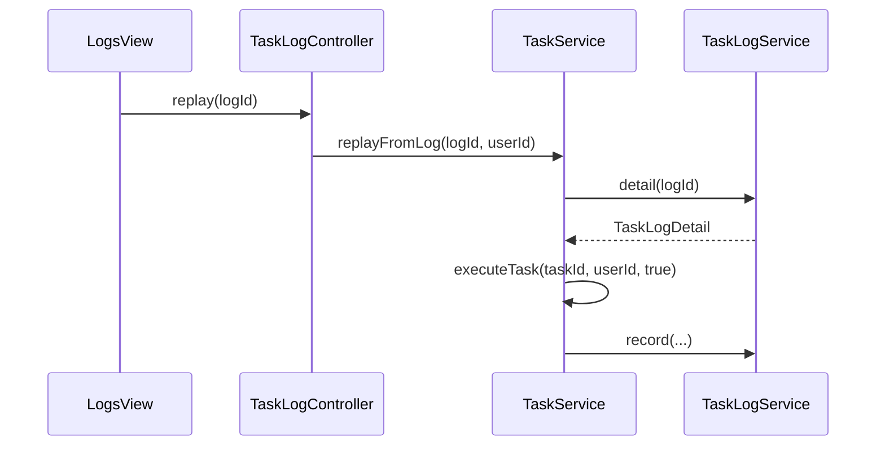

#### 过程

1. 选择失败日志。
   用户在日志页选中一条失败日志，并点击回放。
2. 读取日志详情。
   `TaskLogController.replay` 调用 `TaskService.replayFromLog(logId, userId)`。
3. 校验回放条件。
   `TaskService.replayFromLog` 调用 `TaskLogService.detail(logId)`，判断日志是否来自调度任务。
4. 重新执行任务。
   若满足条件，则复用 `executeTask(taskId, userId, true)` 执行原任务。
5. 生成新日志。
   回放完成后再次写入新的日志记录，供页面查看。

# 4 部署视图

本章说明电商数据湖管理平台当前用于部署和运行软件的一种或多种物理配置，并给出系统进程到物理节点的映射关系。

## 4.1 开发演示部署

当前默认开发演示部署方式如下：

1. 用户通过浏览器访问前端管理台。
2. 前端通过 `VITE_API_BASE_URL` 或默认 `http://localhost:8080/api` 访问后端接口。
3. 后端 Spring Boot 默认运行在 `8080` 端口。
4. 数据库存储默认使用 H2 内存库。
5. 文件存储根目录默认使用 `${APP_STORAGE_ROOT:../storage}`。
6. 调度轮询间隔默认使用 `${APP_TASK_POLL_DELAY_MS:15000}`。

开发演示部署图如下：

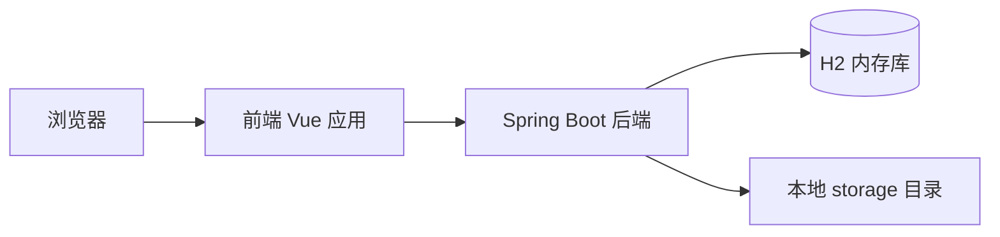

## 4.2 MySQL 持久化部署

当前系统支持切换到 MySQL 持久化部署方式，主要用于课程联调与数据库表导入演示。其特点如下：

1. 前端与后端应用结构不变。
2. 后端启动时切换到 MySQL 配置。
3. 数据库表导入依赖真实可用的 `MYSQL` 数据源连接。
4. 文件导入和导入重跑仍依赖稳定的 `APP_STORAGE_ROOT`。
5. 调度与日志依然运行在同一个后端进程中，不拆分独立节点。

MySQL 持久化部署图如下：

```mermaid
flowchart LR
    B[浏览器] --> FE[前端 Vue 应用]
    FE --> BE[Spring Boot 后端]
    BE --> MYSQL[(MySQL 数据库)]
    BE --> FS[本地 storage 目录]
```

## 4.3 进程与物理节点映射

当前系统的进程与物理节点映射关系如下：

| 物理节点 | 主要进程/组件 | 说明 |
| --- | --- | --- |
| 客户端浏览器节点 | Vue 页面渲染、交互逻辑 | 用户访问和操作入口 |
| 前端应用节点 | 前端开发服务或构建产物 | 提供页面、路由和接口调用 |
| 后端应用节点 | Spring Boot API、`TaskDispatchScheduler` | 提供认证、接入、查询、治理、调度和日志能力 |
| 数据库节点 | H2 或 MySQL | 存储核心表与动态数据表 |
| 本地文件节点 | `storage/` | 存储上传原文件和导入依赖文件 |

当前部署视图总览如下：

```mermaid
flowchart TD
    Browser[客户端浏览器]
    Frontend[前端应用节点]
    Backend[Spring Boot 后端节点]
    Database[(H2 / MySQL 数据库节点)]
    Storage[本地文件存储节点]

    Browser --> Frontend
    Frontend --> Backend
    Backend --> Database
    Backend --> Storage
```

补充说明如下：

1. `TaskDispatchScheduler` 运行在后端进程内部，不单独部署。
2. H2 Console 与 Swagger UI 仅为开发辅助入口，不作为课程系统业务部署节点。
3. 当前系统不涉及分布式部署、消息队列、中间件集群或独立调度中心。
