**电商数据湖管理平台**

**软件需求规约**

Software Requirements Specification

项目名称：电商数据湖管理平台（Web 端）

摘要：本文档依据当前仓库冻结版本的实际实现，对电商数据湖管理平台的开发背景、软件需求、设计约束、交付内容和时间安排进行规约说明。文档面向课程项目报告、教师审阅与课程答辩场景，重点说明系统如何围绕电商数据接入、数据资产管理、查询分析、数据治理、任务调度和日志监控形成完整闭环，并作为后续设计、测试、验收和文档交付的统一依据。

相关文档：

1. 《电商数据湖管理平台-产品功能设计文档-V3》
2. 《电商数据湖管理平台-用户故事文档-V2》
3. 《电商数据湖管理平台-模块设计文档》
4. 《电商数据湖管理平台-接口设计文档》
5. 《电商数据湖管理平台-数据库设计文档》
6. 《电商数据湖管理平台-软件使用说明》
7. 《电商数据湖管理平台-迭代总结》
8. `README.md`
9. `docs/freeze-release-note.md`

版权所有：除特别允许否则只在项目组内部教学、课程开发和课程报告使用。

**修改记录：**

| 日期 | 版本 | 说明 | 作者 |
| --- | --- | --- | --- |
| 2026/04/06 | V1.0 | 依据教师模板并结合当前冻结代码实现新增软件需求规约文档 | 肖溢丹 |

# 目录

- 1 简介
  - 1.1 目的
  - 1.2 范围
  - 1.3 定义、首字母缩写词和缩略语
  - 1.4 参考资料
- 2 电商数据湖管理平台开发背景
  - 2.1 通用数据湖平台骨架局限
  - 2.2 初始方案与旧口径局限
  - 2.3 假设与依赖关系
- 3 软件具体需求
  - 3.1 登录与权限管理
  - 3.2 首页仪表盘与公共导航
  - 3.3 数据源管理
  - 3.4 数据接入
  - 3.5 数据集管理
  - 3.6 查询分析
  - 3.7 数据集成
  - 3.8 数据治理
  - 3.9 任务调度
  - 3.10 日志监控
  - 3.11 用户与权限
  - 3.12 数据导出
- 4 设计约束
  - 4.1 实现平台约束
  - 4.2 技术实现约束
  - 4.3 程序注释约束
  - 4.4 文档模板约束
  - 4.5 软件文档编写约束
  - 4.6 时间约束
- 5 交付技术内容
- 6 时间安排

# 1 简介

## 1.1 目的

本文档主要规定《电商数据湖管理平台》在设计和开发过程中涉及的软件需求、设计约束与交付边界，并作为课程项目后续设计、测试、验收和课程答辩的统一依据。本文档强调“以当前冻结实现为准”，不将未实现能力写成系统现状。

## 1.2 范围

本文档面向当前冻结版本的电商数据湖管理平台，覆盖以下内容：

1. 项目从通用数据湖平台骨架演化为电商数据湖管理平台的开发背景。
2. 登录与权限、数据接入、数据集管理、查询分析、数据治理、任务调度、日志监控、数据导出和用户权限管理等核心需求。
3. 当前项目的设计约束、课程文档约束和交付边界。
4. 当前课程项目的交付资产与时间安排。

当前系统主链路为：

登录与权限 → 数据接入 → 数据集管理 → 查询分析 → 数据治理 → 任务调度 → 日志监控 → 导出与结果留档。

## 1.3 定义、首字母缩写词和缩略语

| 名称 | 说明 |
| --- | --- |
| JWT | JSON Web Token，当前系统用于登录鉴权和会话身份识别 |
| CSV | 逗号分隔文本文件格式，当前系统支持导入与导出 |
| JSON | JavaScript Object Notation，当前系统支持文件导入与结果导出 |
| Excel / XLSX | 电子表格文件格式，当前系统支持导入与导出 |
| SQL | Structured Query Language，当前系统支持当前数据集单表查询 |
| IMPORT | 导入类任务类型 |
| GOVERNANCE | 治理类任务类型 |
| JOIN | 数据集成中的关联模式 |
| UNION | 数据集成中的合并模式 |
| H2 | 当前默认开发演示数据库 |
| MySQL | 当前持久化环境与数据库表导入支持的数据源类型 |

## 1.4 参考资料

1. 《电商数据湖管理平台-产品功能设计文档-V3》
2. 《电商数据湖管理平台-用户故事文档-V2》
3. 《电商数据湖管理平台-模块设计文档》
4. 《电商数据湖管理平台-接口设计文档》
5. 《电商数据湖管理平台-数据库设计文档》
6. 《电商数据湖管理平台-软件使用说明》
7. 《电商数据湖管理平台-迭代总结》
8. `README.md`
9. `docs/freeze-release-note.md`

# 2 电商数据湖管理平台开发背景

电商数据湖管理平台是在通用数据湖平台骨架基础上完成电商化改造的课程项目。项目目标不是实现大型企业级数据平台，而是在课程规模内完成“可接入、可管理、可查询、可治理、可调度、可观测”的电商数据处理闭环，并形成可冻结、可答辩、可提交的课程交付资产。

## 2.1 通用数据湖平台骨架局限

早期的通用数据湖平台骨架主要提供了抽象的数据接入、数据集管理和权限管理思路，但存在以下局限：

1. 业务表达偏通用，难以直接体现订单、商品、库存等电商业务域。
2. 查询分析能力不够具体，无法直接支撑订单量趋势、销售额趋势、热销商品排行等电商分析场景。
3. 治理、调度和日志链路在通用语义下较为抽象，缺少电商课程项目演示所需的业务闭环。
4. 若继续沿用通用命名和菜单结构，容易导致课程文档与系统实现之间出现口径不统一的问题。

因此，项目需要在保留通用骨架可复用部分的同时，重新收口为面向电商场景的管理平台。

## 2.2 初始方案与旧口径局限

在项目推进早期，部分规划与旧文档曾出现以下问题：

1. 把数据集成写成独立一级菜单，与当前实现不一致。
2. 把数据库导入写成支持自定义 SQL 导入，但实际冻结版本仅支持 `MYSQL + Schema / Database + 表`。
3. 把调度能力写成独立调度平台或 Quartz 方案，而当前实现为应用内轮询。
4. 把日志导出写成独立后端接口，但实际实现为日志页基于当前筛选结果的前端本地导出。
5. 对部分未来增强能力描述过满，容易让课程交付材料偏离当前真实实现。

在冻结阶段，上述旧口径均已统一收口到当前电商项目的真实实现边界。

## 2.3 假设与依赖关系

当前项目基于以下假设与依赖关系进行实现：

1. 前端采用 Vue 3 管理台，负责菜单、页面、权限交互和图表展示。
2. 后端采用 Spring Boot API，负责认证、接入、资产、查询、治理、调度和日志处理。
3. 数据库存储支持 H2 与 MySQL，两者共享当前核心 schema。
4. 原始文件和运行时数据依赖本地 `storage/` 目录进行持久化或暂存。
5. 数据库表导入当前依赖本机或演示环境中真实可用的 `MYSQL` 数据源连接。
6. 系统权限依赖 JWT、角色菜单权限和操作权限配置生效。
7. 当前课程提交口径以 `2026-04-04` 冻结版为准，所有需求描述均以该版本实现为事实源。

# 3 软件具体需求

本章主要从系统需要达到什么功能、什么作用的角度，对电商数据湖管理平台的具体需求进行说明。各模块均围绕当前代码已实现能力展开，不写规划态能力。

## 3.1 登录与权限管理

### 3.1.1 模块概述

登录与权限管理模块负责完成用户身份认证、菜单权限控制、操作权限控制以及当前会话的权限同步。系统当前区分管理员与普通用户两类典型角色，并通过角色配置决定页面导航与关键按钮是否可见、是否可执行。

### 3.1.2 业务实施过程：登录并加载权限

#### （1）活动图

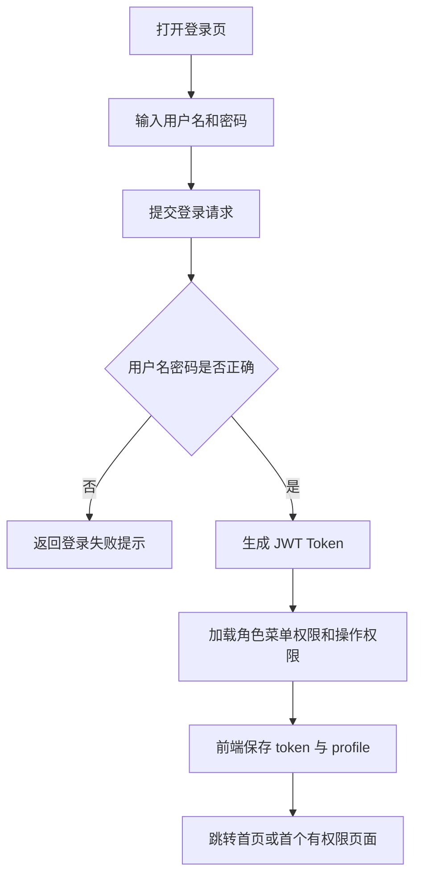

#### （2）业务步骤

1. 用户打开登录页。
2. 输入用户名和密码。
3. 系统校验用户名密码是否正确。
4. 校验通过后生成 JWT token，并返回当前用户资料、角色、菜单权限和操作权限。
5. 前端保存 token 和 profile，并跳转到首页或首个有权限页面。
6. 后续会话中，系统会定时同步 profile，自动感知权限变化。

#### （3）数据字典

| 数据项 | 含义 | 来源/去向 |
| --- | --- | --- |
| `username` | 登录用户名 | 登录表单输入 |
| `password` | 登录密码 | 登录表单输入 |
| `token` | JWT 凭证 | 后端返回，前端保存 |
| `role` | 当前角色标识 | 后端返回 |
| `menus` | 菜单权限集合 | 后端返回，用于左侧导航收口 |
| `actions` | 操作权限集合 | 后端返回，用于按钮授权 |

### 3.1.3 关键业务规则

1. 系统当前仅支持账号密码登录。
2. 默认管理员账号为 `admin / admin123`，普通用户账号为 `operator / operator123`。
3. 登录成功后返回菜单权限和操作权限，页面导航与按钮按权限进行收口。
4. 当前会话会定时同步 profile，角色权限调整后前端可自动感知并收口。
5. 当前没有注册、刷新 token、邮箱验证和多租户能力。

## 3.2 首页仪表盘与公共导航

### 3.2.1 模块概述

首页仪表盘与公共导航用于展示平台总体运行概况、近期任务与日志情况，并为用户提供模块级快捷入口。该模块体现系统主链路入口和课程演示总览。

### 3.2.2 业务实施过程：首页查看与模块跳转

#### （1）活动图

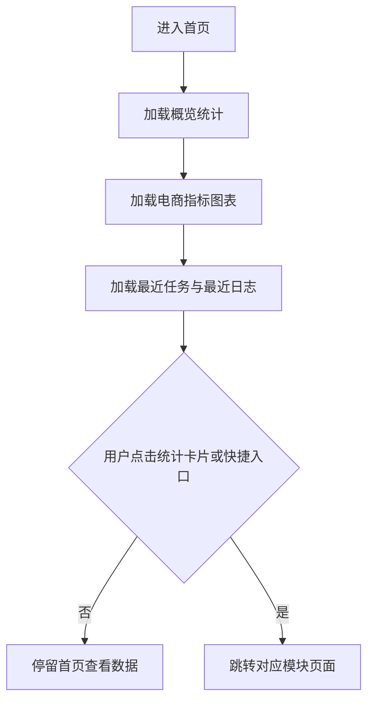

#### （2）业务步骤

1. 用户登录后进入首页。
2. 系统加载数据集总数、数据源总数、任务数和最近失败任务数。
3. 系统加载近 7 天订单量趋势、销售额趋势、热销商品 Top5 和低库存统计。
4. 页面展示最近任务和最近执行日志。
5. 用户可通过统计卡片、核心图表或快捷入口跳转到对应模块页面。

#### （3）数据字典

| 数据项 | 含义 | 来源/去向 |
| --- | --- | --- |
| `datasetCount` | 数据集总数 | 仪表盘概览接口 |
| `sourceCount` | 数据源总数 | 仪表盘概览接口 |
| `taskCount` | 调度任务数 | 仪表盘概览接口 |
| `recentFailureCount` | 最近失败任务数 | 仪表盘概览接口 |
| `orderTrend` | 订单量趋势点位 | 电商概览接口 |
| `salesTrend` | 销售额趋势点位 | 电商概览接口 |

### 3.2.3 关键业务规则

1. 首页内容按角色菜单权限动态收口。
2. 首页当前支持模块级跳转，不支持图表点位级条件透传。
3. 最近任务和最近日志用于展示近期执行结果和系统状态。

## 3.3 数据源管理

### 3.3.1 模块概述

数据源管理模块负责配置系统可用的数据源，是后续数据接入的基础。当前仅支持 `FILE` 与 `MYSQL` 两类数据源。

### 3.3.2 业务实施过程：新增并测试数据源

#### （1）活动图

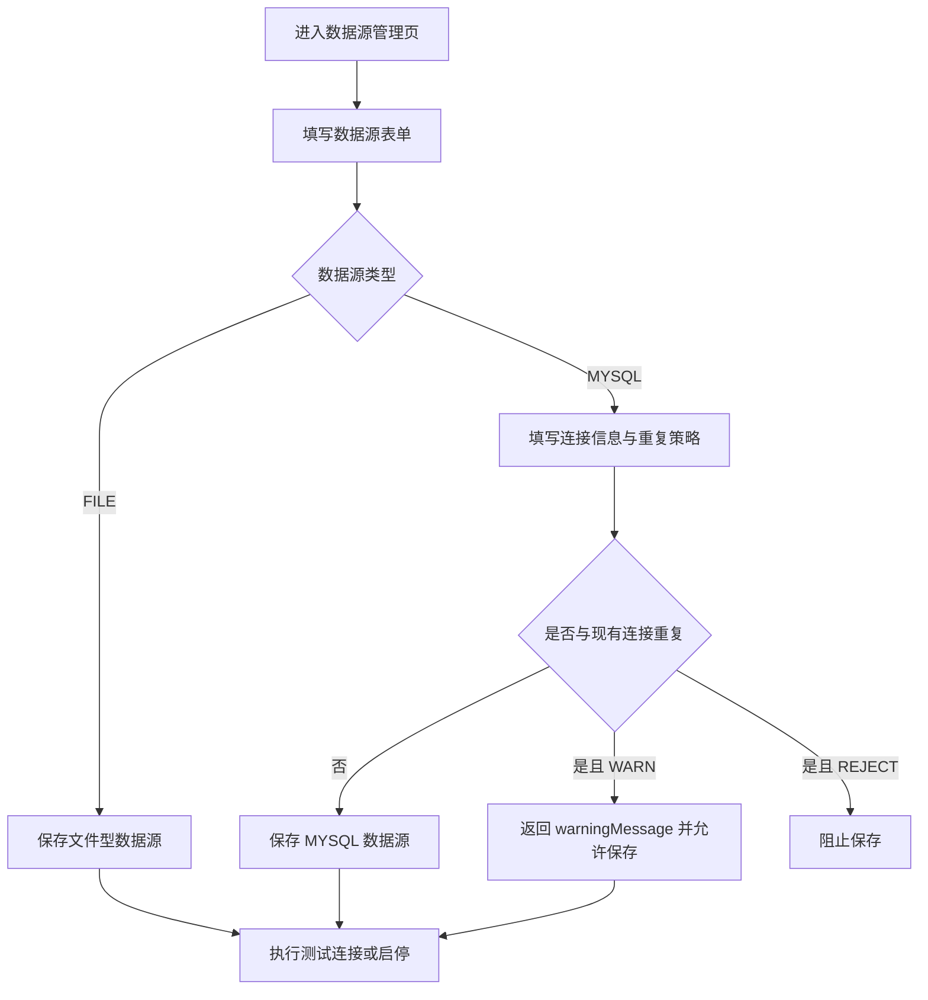

#### （2）业务步骤

1. 管理员进入“数据源管理”页。
2. 点击新增或编辑，填写数据源名称、类型和说明。
3. 若类型为 `MYSQL`，还需填写主机、端口、数据库、用户名、密码和重复连接处理策略。
4. 点击保存后，系统执行名称唯一性和连接策略校验。
5. 保存成功后，管理员可继续测试连接、启停切换或删除数据源。

#### （3）数据字典

| 数据项 | 含义 | 来源/去向 |
| --- | --- | --- |
| `sourceName` | 数据源名称 | 页面表单 |
| `sourceType` | 数据源类型 | `FILE / MYSQL` |
| `duplicateConnectionStrategy` | 同连接处理策略 | `ALLOW / WARN / REJECT` |
| `warningMessage` | 重复连接但允许保存时的提示信息 | 后端返回 |
| `status` | 数据源状态 | `ENABLED / DISABLED` |

### 3.3.3 关键业务规则

1. 当前仅支持 `FILE` 和 `MYSQL` 两类数据源。
2. 同名数据源不允许保存。
3. `MYSQL` 数据源支持 `ALLOW / WARN / REJECT` 三种重复连接处理策略。
4. 文件型数据源无需远程连接，测试连接以本地可用性为准。
5. 已被数据集引用的数据源不可删除。

## 3.4 数据接入

### 3.4.1 模块概述

数据接入模块负责将文件或数据库业务表导入为平台内部可管理的数据集，并同步生成导入历史、元数据和数据预览能力。

### 3.4.2 业务实施过程一：文件导入

#### （1）活动图

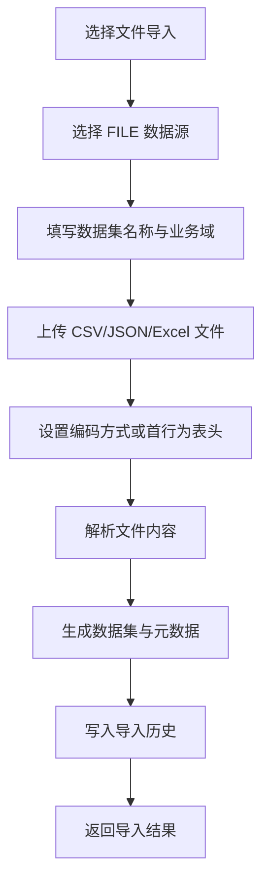

#### （2）业务步骤

1. 用户进入“电商数据接入”页，切换到文件导入区域。
2. 选择文件型数据源，填写数据集名称、业务域和说明。
3. 上传 `CSV / JSON / Excel` 文件。
4. 若为 `CSV` 或 `Excel`，可选择首行为表头；若为 `CSV`，可选择编码方式。
5. 系统解析文件、生成数据集、元数据和物理表记录。
6. 系统写入导入历史并返回导入结果。

#### （3）数据字典

| 数据项 | 含义 | 来源/去向 |
| --- | --- | --- |
| `sourceId` | 来源数据源 ID | 页面选择 |
| `datasetName` | 输出数据集名称 | 页面输入 |
| `businessDomain` | 业务域 | 页面输入 |
| `encoding` | 文件编码方式 | 仅文件导入使用 |
| `headerRow` | 是否首行为表头 | 文件导入参数 |
| `file` | 上传文件对象 | 页面上传 |
| `importId` | 导入记录 ID | 后端返回 |

### 3.4.3 业务实施过程二：数据库表导入

#### （1）活动图

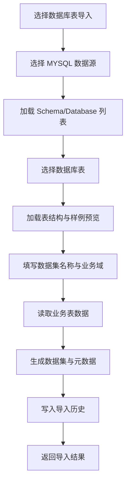

#### （2）业务步骤

1. 用户进入数据库表导入区域。
2. 选择一个 `MYSQL` 数据源。
3. 系统加载可用 `Schema / Database` 列表。
4. 用户选择具体表名后，系统展示表结构和样例预览。
5. 用户填写数据集名称、业务域和说明，点击导入。
6. 系统读取表数据、生成数据集、元数据和导入历史。

#### （3）数据字典

| 数据项 | 含义 | 来源/去向 |
| --- | --- | --- |
| `schemaName` | 数据库 Schema 名称 | 页面选择 |
| `tableName` | 数据库表名 | 页面选择 |
| `previewRows` | 样例预览记录 | 后端返回 |
| `formatType` | 导入类型 | `MYSQL_TABLE` |

### 3.4.4 关键业务规则

1. 文件导入当前支持 `CSV / JSON / Excel`。
2. 数据库表导入当前仅支持 `MYSQL + Schema / Database + 表`。
3. 当前不支持自定义 SQL 导入数据库表。
4. 导入完成后必须生成导入历史、数据集、元数据和数据预览。
5. 导入失败时需要保留失败原因，供导入详情与日志查看。

## 3.5 数据集管理

### 3.5.1 模块概述

数据集管理模块负责维护平台中的数据资产，支持查看数据集详情、元数据和分页预览，并负责数据集删除校验。

### 3.5.2 业务实施过程：查看数据集详情与预览

#### （1）活动图

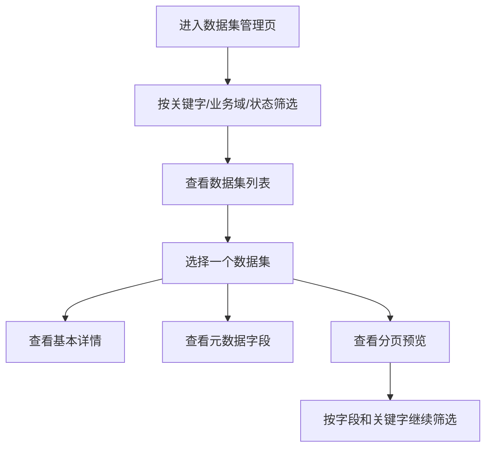

#### （2）业务步骤

1. 用户进入数据集管理页。
2. 按关键字、来源数据源、状态和业务域筛选数据集。
3. 查看数据集名称、记录数、字段数、来源和创建信息。
4. 进入详情区查看数据集基本信息。
5. 切换元数据区查看字段名、类型、可空性和样例值。
6. 切换预览区按页查看数据，并可按字段和关键字继续筛选。

#### （3）数据字典

| 数据项 | 含义 | 来源/去向 |
| --- | --- | --- |
| `datasetId` | 数据集 ID | 数据集主键 |
| `datasetName` | 数据集名称 | 数据集列表与详情 |
| `recordCount` | 记录数 | 数据集统计字段 |
| `fieldCount` | 字段数 | 数据集统计字段 |
| `metaField` | 元数据字段对象 | 元数据列表 |
| `previewRecords` | 分页预览记录 | 数据预览结果 |

### 3.5.3 关键业务规则

1. 数据集管理需要支持列表筛选、详情、元数据和分页预览。
2. 数据预览支持字段筛选与关键字匹配。
3. 管理员可删除未被引用的数据集。
4. 若数据集被治理流程、治理日志或导入记录引用，则不允许删除。

## 3.6 查询分析

### 3.6.1 模块概述

查询分析模块负责对已导入数据集执行条件查询、SQL 查询和电商指标分析，是平台进行业务分析和结果核查的主要入口。

### 3.6.2 业务实施过程一：条件查询

#### （1）活动图

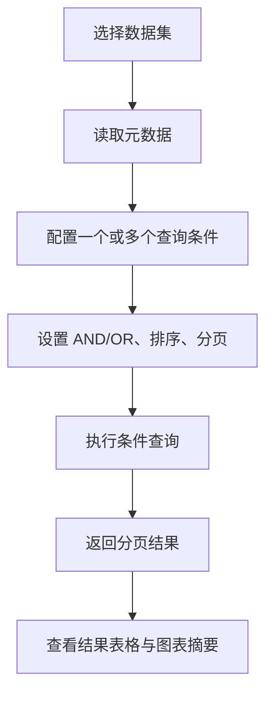

#### （2）业务步骤

1. 用户进入查询分析页，选择目标数据集。
2. 系统加载当前数据集元数据字段。
3. 用户配置一个或多个条件，可使用 `AND / OR` 组合。
4. 对时间字段可配置时间范围查询。
5. 用户设置排序字段、排序方向和分页信息，执行查询。
6. 系统返回分页结果和当前筛选条件对应的数据统计或图表摘要。

#### （3）数据字典

| 数据项 | 含义 | 来源/去向 |
| --- | --- | --- |
| `conditions` | 查询条件列表 | 页面输入 |
| `logic` | 条件组合逻辑 | `AND / OR` |
| `sortField` | 排序字段 | 页面输入 |
| `sortOrder` | 排序方向 | `ASC / DESC` |
| `pageNum` | 页码 | 页面输入 |
| `pageSize` | 每页条数 | 页面输入 |

### 3.6.3 业务实施过程二：SQL 查询与指标分析

#### （1）活动图

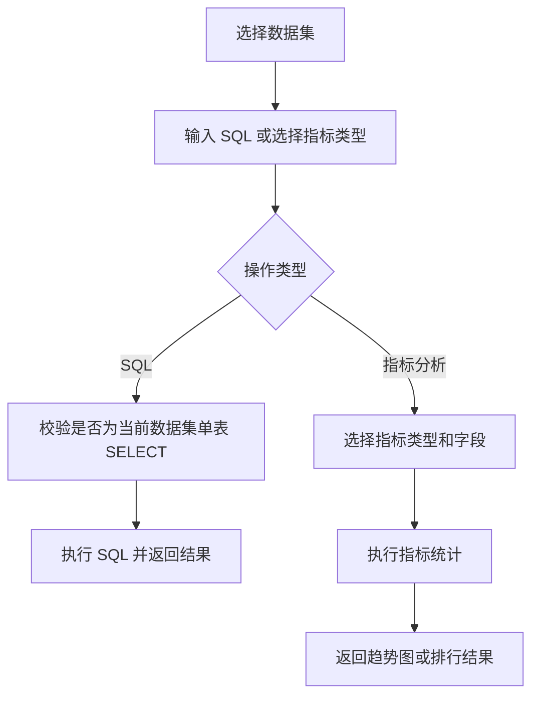

#### （2）业务步骤

1. 用户在 SQL 查询区域输入查询语句。
2. 系统校验语句是否为当前数据集单表 `SELECT`。
3. 校验通过后返回结果列表或分页结果。
4. 用户在指标分析区域选择指标类型，如订单量趋势、销售额趋势、热销商品、分类占比或库存预警。
5. 系统按当前数据集和筛选条件返回图表点位与表格结果。

#### （3）数据字典

| 数据项 | 含义 | 来源/去向 |
| --- | --- | --- |
| `sql` | SQL 语句 | 页面输入 |
| `metricType` | 指标类型 | 页面选择 |
| `chartPoints` | 图表点位列表 | 后端返回 |
| `tableResult` | 指标表格结果 | 后端返回 |

### 3.6.4 关键业务规则

1. 条件查询支持多条件、`AND / OR`、时间范围、排序与分页。
2. SQL 查询仅允许当前数据集对应单表 `SELECT`。
3. 电商指标分析仅覆盖当前真实指标：订单量趋势、销售额趋势、热销商品、分类占比、库存预警。
4. 查询结果支持后续导出，不仅限于当前页浏览。

## 3.7 数据集成

### 3.7.1 模块概述

数据集成用于对两个已有数据集执行基础关联或合并分析，当前作为查询分析页面中的子能力存在，而不是独立一级菜单。

### 3.7.2 业务实施过程：执行数据集成并保存结果

#### （1）活动图

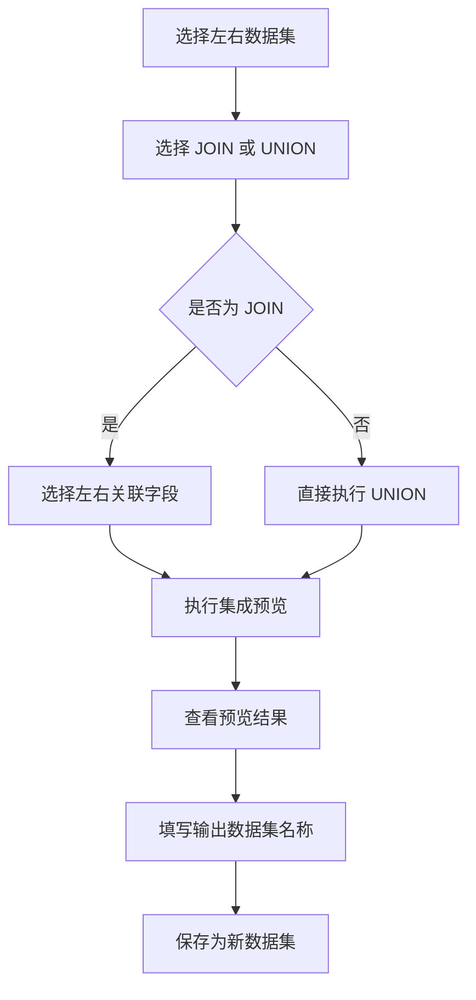

#### （2）业务步骤

1. 用户在查询分析页切换到“数据集成”子标签。
2. 选择左侧和右侧数据集。
3. 选择集成模式：`JOIN` 或 `UNION`。
4. 若为 `JOIN`，需选择左右关联字段。
5. 系统返回预览结果和字段列表。
6. 用户填写输出数据集名称和业务域后保存为新数据集。

#### （3）数据字典

| 数据项 | 含义 | 来源/去向 |
| --- | --- | --- |
| `leftDatasetId` | 左侧数据集 ID | 页面选择 |
| `rightDatasetId` | 右侧数据集 ID | 页面选择 |
| `mode` | 集成模式 | `JOIN / UNION` |
| `leftField` | 左关联字段 | `JOIN` 模式使用 |
| `rightField` | 右关联字段 | `JOIN` 模式使用 |
| `outputDatasetName` | 输出数据集名称 | 页面输入 |

### 3.7.3 关键业务规则

1. 数据集成当前是查询分析页子标签，不是独立菜单。
2. 当前仅支持 `JOIN / UNION` 两种模式。
3. `JOIN` 模式下必须选择左右关联字段。
4. 保存集成结果后会生成新的数据集和元数据。

## 3.8 数据治理

### 3.8.1 模块概述

数据治理模块负责对已有数据集执行基础清洗、去重、转换和标准化处理，并将治理结果保存为新的输出数据集。

### 3.8.2 业务实施过程：配置并执行治理流程

#### （1）活动图

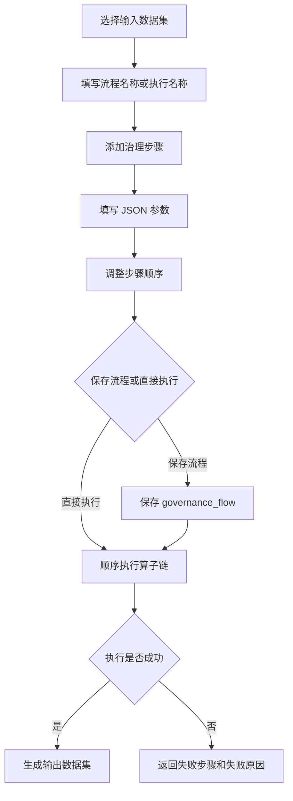

#### （2）业务步骤

1. 用户进入电商数据治理页，选择一个输入数据集。
2. 填写流程名称或执行名称。
3. 从算子列表中添加一个或多个治理步骤。
4. 通过 `JSON` 文本填写步骤参数，并支持上移、下移、删除步骤。
5. 用户可先保存流程模板，也可直接执行。
6. 执行成功后系统生成新数据集；执行失败时返回失败步骤与失败原因。

#### （3）数据字典

| 数据项 | 含义 | 来源/去向 |
| --- | --- | --- |
| `operatorKey` | 算子键值 | 页面选择 |
| `operatorChain` | 算子链配置 | 页面输入并提交 |
| `paramsText` | JSON 参数文本 | 页面输入 |
| `inputRecordCount` | 输入记录数 | 执行结果 |
| `outputRecordCount` | 输出记录数 | 执行结果 |
| `failureStep` | 失败步骤信息 | 执行失败时返回 |

### 3.8.3 关键业务规则

1. 当前系统内置 9 个治理算子：
   `NULL_FILL`、`DEDUPLICATE`、`FIELD_CONVERT`、`FILTER_KEEP`、`ORDER_DEDUP`、`AMOUNT_NORMALIZE`、`TIME_NORMALIZE`、`CATEGORY_NORMALIZE`、`STATUS_NORMALIZE`。
2. 算子参数当前通过 JSON 文本配置，不提供可视化字段映射向导。
3. 已停用算子不可用于新建流程或参与执行。
4. 治理按步骤顺序执行，执行结果固定输出为新数据集。

## 3.9 任务调度

### 3.9.1 模块概述

任务调度模块负责将导入记录和治理流程配置为可重复执行的任务，并提供手动触发与自动调度能力。

### 3.9.2 业务实施过程：创建并执行任务

#### （1）活动图

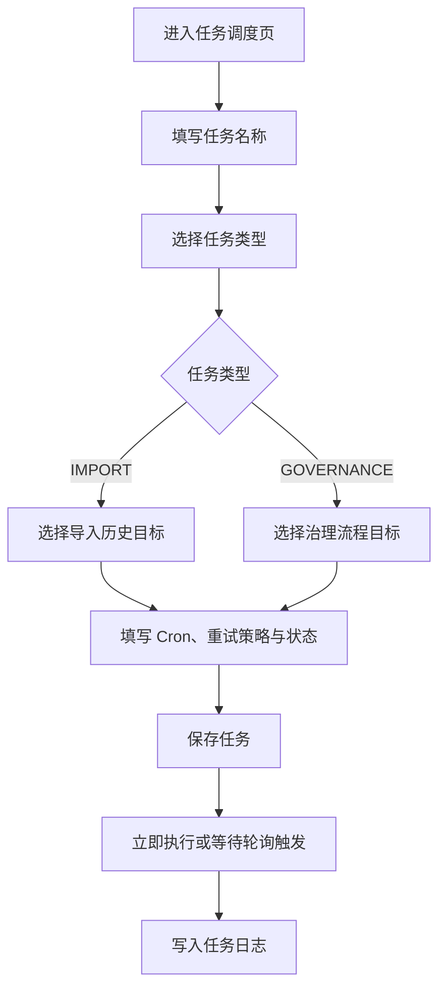

#### （2）业务步骤

1. 用户进入电商任务调度页。
2. 填写任务名称，选择任务类型。
3. 若为 `IMPORT`，选择一个已有导入历史记录作为目标；若为 `GOVERNANCE`，选择一个治理流程作为目标。
4. 填写 `Cron` 表达式、重试策略、任务描述和状态。
5. 保存任务后，可立即执行，也可等待调度器按轮询策略自动触发。
6. 每次任务执行后，系统写入任务日志。

#### （3）数据字典

| 数据项 | 含义 | 来源/去向 |
| --- | --- | --- |
| `taskName` | 任务名称 | 页面输入 |
| `taskType` | 任务类型 | `IMPORT / GOVERNANCE` |
| `targetId` | 任务目标对象 ID | 页面选择 |
| `cronExpr` | Cron 表达式 | 页面输入 |
| `retryPolicy` | 重试次数 | 页面输入 |
| `status` | 任务状态 | `ENABLED / PAUSED` |

### 3.9.3 关键业务规则

1. 当前任务类型仅支持 `IMPORT / GOVERNANCE`。
2. 暂停中的任务不会被自动轮询触发。
3. `Cron` 表达式必须合法，保存时会进行语法校验。
4. 当前调度为应用内轮询，不依赖 Quartz 或外部调度平台。
5. 每次任务执行都需要写入任务日志。

## 3.10 日志监控

### 3.10.1 模块概述

日志监控模块负责记录导入、治理和调度执行过程，支持日志筛选、详情查看、失败原因定位和失败回放。

### 3.10.2 业务实施过程：筛选日志并执行失败回放

#### （1）活动图

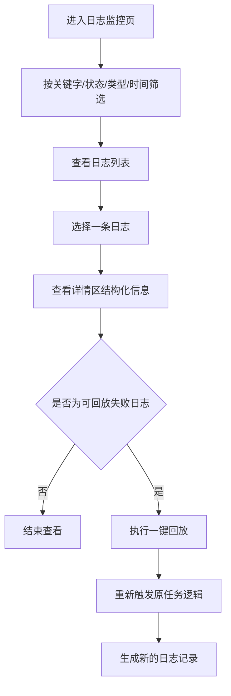

#### （2）业务步骤

1. 用户进入任务与日志监控页。
2. 按关键字、状态、任务类型、操作人和时间范围进行服务端筛选。
3. 查看列表中的任务名称、状态、开始时间、结束时间、耗时和执行摘要。
4. 选中一条日志后，在详情区查看输入参数、执行步骤、错误信息和失败原因对象。
5. 若日志为可回放的失败日志，且用户具备回放权限，可执行一键回放。
6. 回放后系统生成新的日志记录，供继续查看。

#### （3）数据字典

| 数据项 | 含义 | 来源/去向 |
| --- | --- | --- |
| `taskType` | 日志类型 | `IMPORT / GOVERNANCE` |
| `executionSummary` | 执行摘要 | 日志列表与详情 |
| `inputParams` | 输入参数 | 日志详情 |
| `executionSteps` | 执行步骤 | 日志详情 |
| `failureReason` | 结构化失败原因 | 日志详情 |
| `operatorUser` | 操作人 | 日志筛选与展示 |

### 3.10.3 关键业务规则

1. 日志支持服务端筛选：关键字、状态、任务类型、操作人、时间范围。
2. 日志详情需要展示输入参数、执行步骤、输出摘要、错误信息和失败原因对象。
3. 仅具备 `log.replay` 权限且满足回放条件的失败日志支持一键回放。
4. 非调度上下文产生的日志不支持回放。

## 3.11 用户与权限

### 3.11.1 模块概述

用户与权限模块用于维护用户账号、角色说明、菜单权限和操作权限，是系统权限收口和课程演示角色区分的管理基础。

### 3.11.2 业务实施过程：维护用户与角色权限

#### （1）活动图

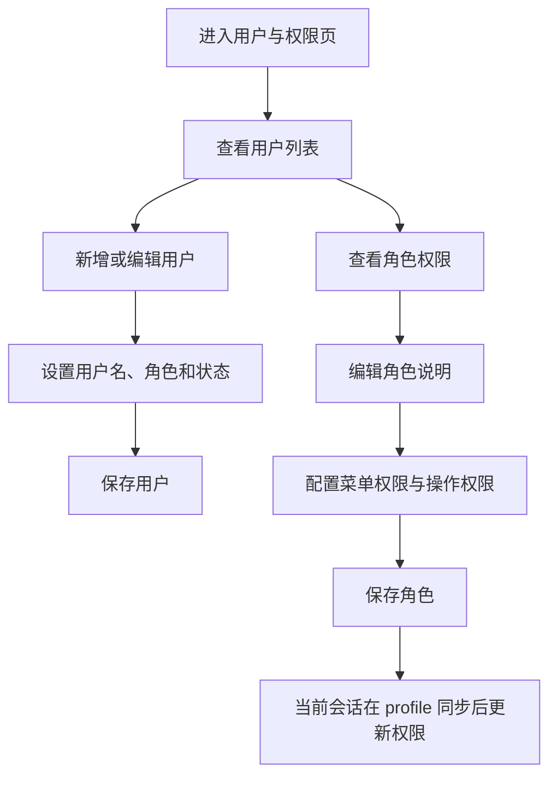

#### （2）业务步骤

1. 管理员进入“用户与权限”页。
2. 查看当前用户列表与角色列表。
3. 可新增、编辑、停用或删除用户。
4. 可编辑角色说明，并按分组树配置菜单权限和操作权限。
5. 保存后，相关用户在下一次 profile 同步后会自动感知权限变化。

#### （3）数据字典

| 数据项 | 含义 | 来源/去向 |
| --- | --- | --- |
| `username` | 用户名 | 用户表单 |
| `roleId` | 角色 ID | 用户表单 |
| `status` | 用户状态 | `ENABLED / DISABLED` |
| `menuPermissions` | 菜单权限串 | 角色配置 |
| `actionPermissions` | 操作权限串 | 角色配置 |

### 3.11.3 关键业务规则

1. 当前模块仅管理员可见。
2. 支持用户新增、编辑、停用、删除。
3. 支持角色说明、菜单权限和操作权限配置。
4. 当前会话会在 profile 同步后自动感知权限变化。

## 3.12 数据导出

### 3.12.1 模块概述

数据导出模块负责输出数据集、查询结果、治理结果和日志结果，满足课程项目中的结果核查、留档和演示需求。

### 3.12.2 业务实施过程：导出查询或数据集结果

#### （1）活动图

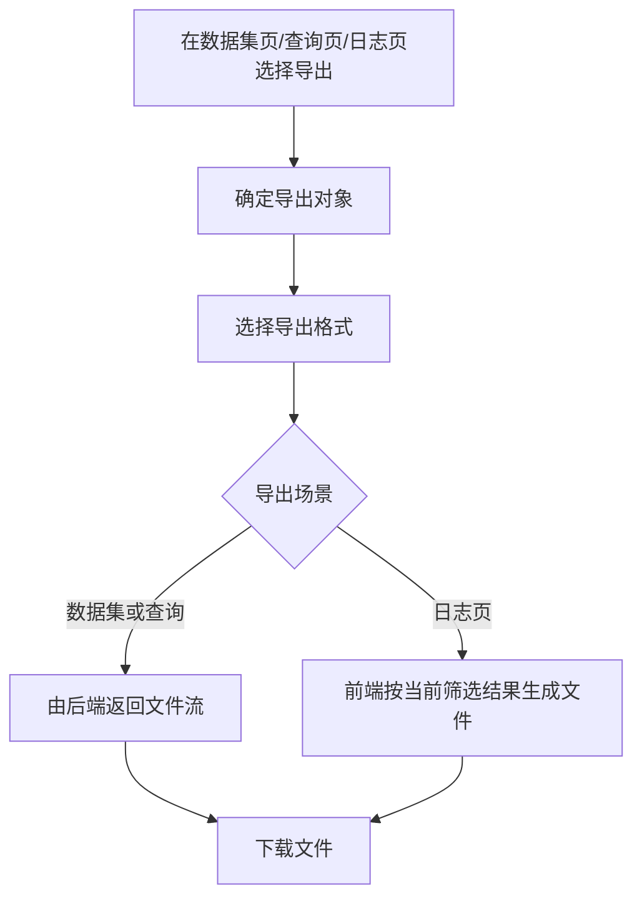

#### （2）业务步骤

1. 用户在数据集管理页、查询分析页或日志页触发导出操作。
2. 选择导出格式，如 `CSV / JSON / Excel`。
3. 数据集导出、条件查询导出和 SQL 导出由后端返回文件流。
4. 日志页导出由前端基于当前筛选结果生成 `CSV / JSON` 文件。
5. 文件名包含数据集名称或任务名称以及时间戳。

#### （3）数据字典

| 数据项 | 含义 | 来源/去向 |
| --- | --- | --- |
| `format` | 导出格式 | 页面选择 |
| `exportScope` | 导出范围 | `PAGE / ALL`，条件查询导出使用 |
| `Content-Disposition` | 下载文件名 | 后端响应头 |
| `filename` | 本地导出文件名 | 前端生成或响应头解析 |

### 3.12.3 关键业务规则

1. 数据集导出、条件查询导出、SQL 导出支持 `CSV / JSON / Excel`。
2. 日志页导出当前支持 `CSV / JSON`，且为前端本地导出。
3. 治理结果通过输出数据集复用数据集导出能力，不提供独立治理文件导出接口。

# 4 设计约束

在电商数据湖管理平台的设计与实现过程中，除保证功能闭环外，还需要保证平台边界清晰、课程文档统一、代码可维护和演示可复现。因此，本项目存在以下设计约束。

## 4.1 实现平台约束

1. 前端运行在标准浏览器环境中。
2. 后端要求 `JDK 17+`。
3. 数据库存储当前支持 `H2 / MySQL`。
4. 原始文件与运行时数据依赖本地 `storage/` 目录。
5. 若切换到 MySQL 环境，需要本机提供真实可用的数据库连接信息。

## 4.2 技术实现约束

1. 前端技术栈固定为 `Vue 3 + Element Plus + Pinia + ECharts + Vue Router`。
2. 后端技术栈固定为 `Spring Boot + Spring Security + JWT + JdbcTemplate`。
3. 数据库表导入当前仅支持 `MYSQL` 数据源。
4. 数据集成为查询分析页中的子能力，而不是独立模块。
5. 调度实现为应用内轮询，不依赖 Quartz。

## 4.3 程序注释约束

1. 当前代码需保持关键逻辑可读，复杂处理流程应有必要说明。
2. 重点逻辑包括权限同步、动态数据表、治理执行、任务调度和日志回放等，应保证代码表达清晰，便于课程项目维护与答辩说明。
3. 本项目不虚构固定注释比例指标，而以关键逻辑可理解、代码结构清晰为原则。

## 4.4 文档模板约束

1. 本课程项目所有正式交付文档均按教师提供模板整理。
2. 文档统一采用当前课程交付风格：标题、摘要、相关文档、修改记录、目录与章节化正文。
3. 文档内容必须与当前冻结代码实现保持一致，不把规划功能写成现状。

## 4.5 软件文档编写约束

1. 文档需与代码、接口、数据库结构、测试与冻结说明保持一致。
2. 流程图和活动图当前使用 Mermaid 表达，便于 Markdown 和课程文档统一维护。
3. 软件使用说明、测试文档和需求规约之间的术语必须保持一致。
4. 课程文档不应保留旧项目模板中的原始业务语义或无关示例。

## 4.6 时间约束

1. 本项目按当前 5 轮迭代完成开发与交付整理。
2. 当前课程提交口径以 `2026-04-04` 冻结版为准。
3. 冻结之后不再新增业务能力，主要完成文档、脚本、演示和答辩材料收口。

# 5 交付技术内容

当前课程项目最终交付技术内容包括：

1. 前端工程：包含登录、仪表盘、数据源管理、数据接入、数据集管理、查询分析、数据治理、任务调度、日志监控和用户权限等页面。
2. 后端工程：包含认证与权限、仪表盘、数据源与导入、数据集与查询、治理、任务与日志等 API 能力。
3. 数据库 schema：包括角色、用户、数据源、导入记录、数据集、元数据、治理流程、任务和日志等核心表。
4. 运行时文件存储目录说明：用于保存上传原文件和运行时数据资产。
5. 回归与演示脚本：用于冒烟验证、课程演示和冻结门禁。
6. 课程文档资产：用于设计说明、测试说明、使用说明和答辩支撑。

当前主要交付文档如下：

| 类别 | 交付内容 |
| --- | --- |
| 产品设计 | 《电商数据湖管理平台-产品功能设计文档-V3》 |
| 用户需求 | 《电商数据湖管理平台-用户故事文档-V2》 |
| 需求规约 | 《电商数据湖管理平台-软件需求规约》 |
| 模块设计 | 《电商数据湖管理平台-模块设计文档》 |
| 接口设计 | 《电商数据湖管理平台-接口设计》 |
| 数据库设计 | 《电商数据湖管理平台-数据库设计》 |
| 使用说明 | 《电商数据湖管理平台-软件使用说明》 |
| 测试文档 | 《白盒黑盒测试文档》、`docs/test-plan.md`、`docs/test-report.md` |
| 迭代总结 | 《电商数据湖管理平台-迭代总结》 |

# 6 时间安排

当前项目时间安排采用 5 轮迭代推进方式，阶段如下：

| 阶段 | 时间范围 | 主要内容 |
| --- | --- | --- |
| 第一阶段 | 2026-03-30 ~ 2026-04-12 | 系统基础与电商化骨架 |
| 第二阶段 | 2026-04-13 ~ 2026-04-26 | 数据接入与数据资产管理 |
| 第三阶段 | 2026-04-27 ~ 2026-05-10 | 查询分析与集成 |
| 第四阶段 | 2026-05-11 ~ 2026-05-24 | 治理与调度 |
| 第五阶段 | 2026-05-25 ~ 2026-06-07 | 日志、导出、联调与交付 |

补充说明如下：

1. 上述时间安排沿用课程项目迭代规划的阶段划分。
2. 当前课程提交版文档统一以 `2026-04-04` 冻结版实现为基准进行收口。
3. 冻结之后的主要工作不再是扩展功能，而是统一课程文档、演示路径、测试材料和交付资产。
