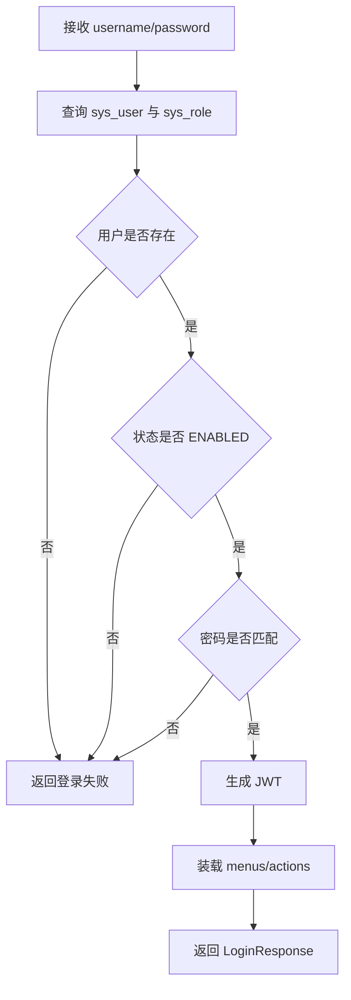
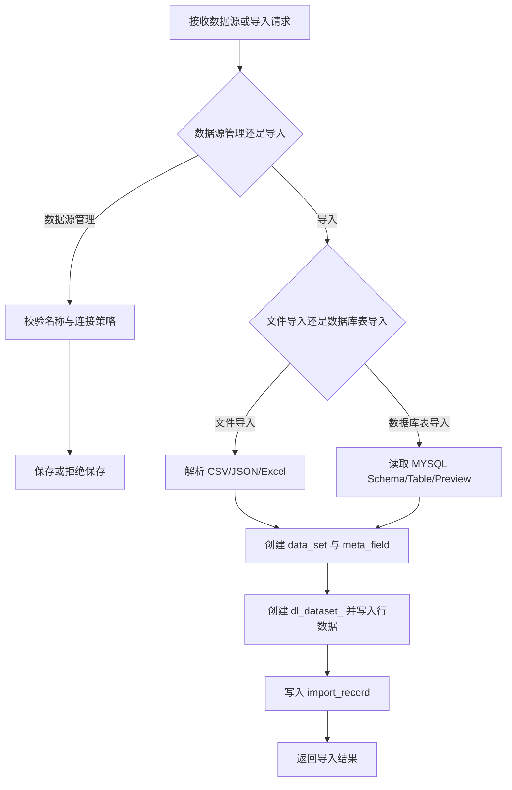
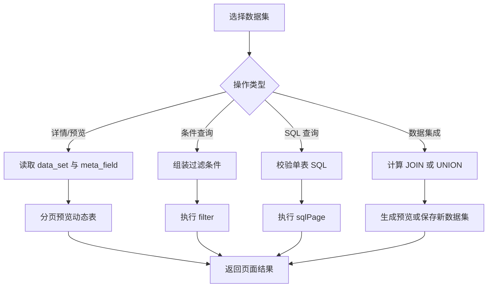
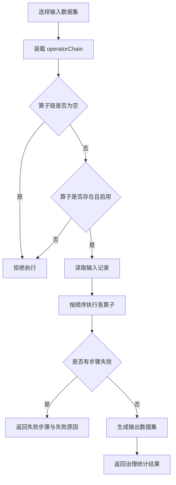
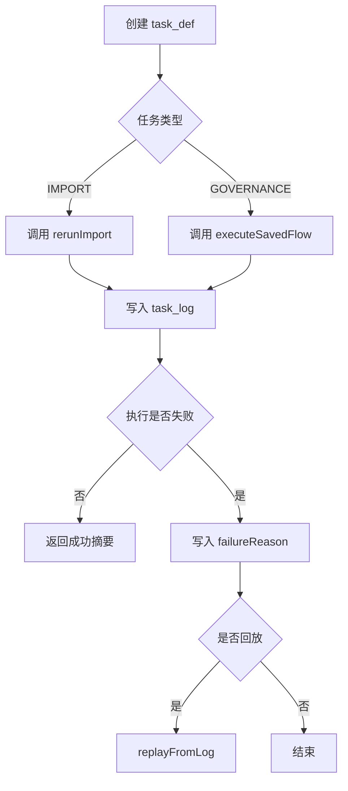
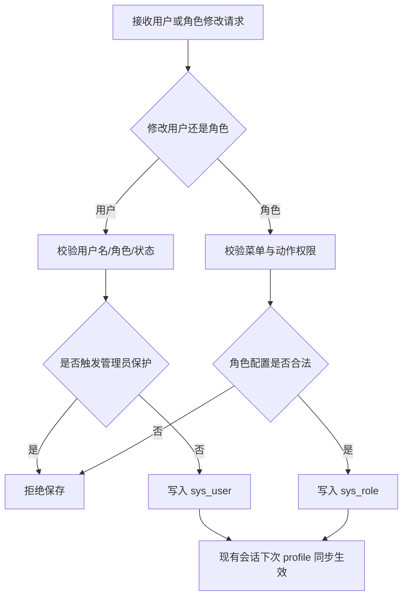

**电商数据湖管理平台**

**白盒黑盒测试文档**

White-box and Black-box Test Specification

项目名称：电商数据湖管理平台（Web 端）

摘要：本文档依据当前仓库冻结版本的实际实现，对电商数据湖管理平台关键模块的白盒测试与黑盒测试进行说明。文档采用课程项目测试文档的编写方式，以登录权限、数据接入、数据集管理、查询分析、数据治理、任务调度、日志监控、导出和用户权限同步等模块为对象，按“白盒测试 + 黑盒测试”展开，所有内容均以当前代码实现、回归脚本和浏览器检查结果为准，可直接作为课程交付材料使用。

相关文档：

1. 《电商数据湖管理平台-产品功能设计文档-V3》
2. 《电商数据湖管理平台-模块设计文档》
3. 《电商数据湖管理平台-接口设计文档》
4. 《电商数据湖管理平台-数据库设计文档》
5. 《电商数据湖管理平台-用户故事文档-V2》
6. `docs/course-doc-source-materials.md`
7. `docs/test-plan.md`
8. `docs/regression-coverage-matrix.md`
9. `docs/demo-runbook.md`
10. `docs/test-report.md`

版权所有：除特别允许外，仅供项目组内部教学、课程开发和课程报告使用。

**修改记录：**

| 日期 | 版本 | 说明 | 作者 |
| --- | --- | --- | --- |
| 2026/04/05 | V1.0 | 依据教师模板并结合当前冻结代码、脚本与浏览器检查结果新增白盒黑盒测试文档 | 肖溢丹 |

# 目录

| 章节 | 内容 |
| --- | --- |
| 第1章 | 简介 |
| 第2章 | 登录权限模块测试 |
| 第3章 | 数据接入模块测试 |
| 第4章 | 数据集管理、查询分析与导出模块测试 |
| 第5章 | 数据治理模块测试 |
| 第6章 | 任务调度与日志监控模块测试 |
| 第7章 | 用户与权限同步模块测试 |
| 第8章 | 测试执行情况与结论 |

# 1 简介

## 1.1 目的

本文档用于说明电商数据湖管理平台当前版本的白盒测试与黑盒测试方案，重点回答以下问题：

1. 当前课程项目应以哪些关键模块作为测试对象。
2. 后端关键服务类与关键分支如何开展白盒测试。
3. 用户可见功能、输入、输出和主流程闭环如何开展黑盒测试。
4. 现有自动化脚本与浏览器人工检查分别覆盖了哪些测试点。
5. 当前实现边界在哪里，哪些未实现能力不应写入测试结论。

## 1.2 测试范围

本文档覆盖以下模块：

1. 登录权限模块
2. 数据接入模块
3. 数据集管理、查询分析与导出模块
4. 数据治理模块
5. 任务调度与日志监控模块
6. 用户与权限同步模块

白盒测试主要依据后端关键服务类与关键方法展开，黑盒测试主要依据现有页面、接口、脚本与人工检查结果展开。

## 1.3 当前实现边界

为保证课程测试文档与代码实现一致，本文档明确以下边界：

1. 日志页导出为前端基于当前筛选结果生成文件，不存在独立后端日志导出 API。
2. 数据集成属于查询分析页子标签能力，不是独立菜单或独立任务类型。
3. 调度能力由应用内轮询实现，不是 Quartz 调度中心。
4. 当前没有注册、刷新 token、独立系统设置、治理流程删除接口等能力。
5. 当前仓库没有独立 `JaCoCo` 报表或成套单元测试文件，因此白盒部分不虚构覆盖率统计。

# 2 登录权限模块测试

## 2.1 白盒测试

### 2.1.1 程序流程说明

登录权限模块后端核心对象为 `AuthService.login`、`AuthService.authenticateSession` 和 `RoleMenuCatalog`。其简化流程如下：

### 2.1.2 关键判定点与独立路径

按课程测试口径，对该模块简化流图中的主要判定点归纳如下：

1. 用户是否存在
2. 用户状态是否启用
3. 密码是否匹配
4. 角色菜单和操作权限是否可正常装载

对应的主要独立路径如下：

| 路径编号 | 独立路径描述 |
| --- | --- |
| Path1 | 用户不存在，直接失败 |
| Path2 | 用户存在但状态为 `DISABLED`，登录失败 |
| Path3 | 用户存在、状态启用，但密码错误，登录失败 |
| Path4 | 用户存在、状态启用、密码正确，正常生成 token 并返回权限信息 |

### 2.1.3 条件组合覆盖测试用例

设条件组合为：

- `A`：用户存在
- `B`：用户状态为 `ENABLED`
- `C`：密码正确

则关键组合如下：

| 编号 | A | B | C | 预期 | 覆盖路径 |
| --- | --- | --- | --- | --- | --- |
| C1 | F | - | - | 登录失败 | Path1 |
| C2 | T | F | - | 登录失败 | Path2 |
| C3 | T | T | F | 登录失败 | Path3 |
| C4 | T | T | T | 登录成功 | Path4 |

### 2.1.4 白盒测试用例

| 测试编号 | 类与方法 | 测试目的 | 覆盖路径 | 预期结果 | 依据来源 |
| --- | --- | --- | --- | --- | --- |
| WB-LOGIN-01 | `AuthService.login` | 验证合法账号可正常登录 | Path4 | 返回 `token / username / role / menus / actions` | `AuthService`、`api-smoke-test.sh` |
| WB-LOGIN-02 | `AuthService.login` | 验证错误密码处理 | Path3 | 抛出登录失败，不生成 token | `AuthService`、`docs/test-plan.md` |
| WB-LOGIN-03 | `AuthService.authenticateSession` | 验证已停用账号会话校验 | Path2 | 返回“当前账号已被停用”或拒绝访问 | `AuthService` |
| WB-LOGIN-04 | `RoleMenuCatalog.validate / validateActions` | 验证角色权限装载与约束 | Path4 扩展 | 管理员和普通角色只能得到各自允许的菜单与动作 | `RoleMenuCatalog`、`browser-regression-checklist.md` |

## 2.2 黑盒测试

### 2.2.1 测试功能

登录权限模块主要负责账号密码登录、未登录拦截、菜单收口和按钮级权限控制，是整个系统的入口模块。

### 2.2.2 有效等价类划分

| 输入项 | 有效等价类 | 无效等价类 |
| --- | --- | --- |
| 用户名 | 已存在且启用的用户名，如 `admin`、`operator` | 不存在用户名、空用户名 |
| 密码 | 与用户名匹配的密码，如 `admin123` | 错误密码、空密码 |
| 角色权限 | 当前角色被允许的菜单和动作 | 当前角色不允许的菜单和动作 |

### 2.2.3 黑盒测试用例

| 测试编号 | 功能点 | 前置条件 | 输入或操作 | 期望结果 | 实际依据 |
| --- | --- | --- | --- | --- | --- |
| BB-LOGIN-01 | 登录成功 | 服务已启动 | 使用 `admin / admin123` 登录 | 成功进入首页并显示完整菜单 | `api-smoke-test.sh` |
| BB-LOGIN-02 | 登录失败 | 服务已启动 | 使用正确用户名 + 错误密码 | 返回明确错误提示，停留在登录页 | `docs/test-plan.md` |
| BB-LOGIN-03 | 未登录拦截 | 未登录 | 直接访问业务页 | 被拦截并跳回 `/login` | `docs/test-plan.md`、`router/index.ts` |
| BB-LOGIN-04 | 菜单权限收口 | 管理员与普通用户均可登录 | 分别使用 `admin` 与 `operator` 登录 | 普通用户菜单少于管理员，管理员独有菜单不显示给普通用户 | `browser-regression-checklist.md` |

# 3 数据接入模块测试

## 3.1 白盒测试

### 3.1.1 程序流程说明

数据接入模块核心后端对象为 `DataSourceService` 与 `DataImportService`。简化流程如下：

### 3.1.2 关键判定点与独立路径

主要判定点如下：

1. 数据源名称是否重复
2. `MYSQL` 连接是否重复，以及策略是否为 `ALLOW / WARN / REJECT`
3. 导入类型是文件导入还是数据库表导入
4. 文件或数据库表读取是否成功
5. 数据集与导入记录是否写入成功

主要独立路径如下：

| 路径编号 | 独立路径描述 |
| --- | --- |
| Path1 | 新增数据源，名称唯一，保存成功 |
| Path2 | 同名数据源，保存失败 |
| Path3 | 同连接 `MYSQL` 数据源，`WARN` 保存成功并返回提醒 |
| Path4 | 文件导入成功，生成数据集和导入记录 |
| Path5 | 数据库表导入成功，生成数据集和导入记录 |
| Path6 | 文件或数据库表解析失败，导入失败 |

### 3.1.3 条件组合覆盖测试用例

| 编号 | 条件组合 | 期望 | 覆盖路径 |
| --- | --- | --- | --- |
| C1 | 名称唯一 + 新连接 | 保存成功 | Path1 |
| C2 | 名称重复 | 拒绝保存 | Path2 |
| C3 | 连接重复 + `WARN` | 保存成功并返回 `warningMessage` | Path3 |
| C4 | 文件格式合法 + 解析成功 | 导入成功 | Path4 |
| C5 | `MYSQL` 表可访问 + 预览成功 | 导入成功 | Path5 |
| C6 | 解析失败或数据源不可用 | 导入失败 | Path6 |

### 3.1.4 白盒测试用例

| 测试编号 | 类与方法 | 测试目的 | 覆盖路径 | 预期结果 | 依据来源 |
| --- | --- | --- | --- | --- | --- |
| WB-IMPORT-01 | `DataSourceService.create / update` | 验证同名数据源拦截 | Path2 | 返回“数据源名称已存在” | `DataSourceService`、`regression-suite.sh extended` |
| WB-IMPORT-02 | `DataSourceService.create / update` | 验证重复连接 `WARN` 策略 | Path3 | 保存成功且返回 `warningMessage` | `DataSourceService`、`regression-suite.sh extended` |
| WB-IMPORT-03 | `DataSourceService.test` | 验证 `FILE / MYSQL` 连接测试分支 | Path1 扩展 | 返回对应类型的测试结果 | `DataSourceService` |
| WB-IMPORT-04 | `DataImportService.importFile` | 验证 `CSV / JSON / Excel` 文件导入 | Path4 | 生成数据集与导入记录 | `DataImportService`、`docs/test-plan.md` |
| WB-IMPORT-05 | `DataImportService.importDatabaseTable` | 验证 `MYSQL` 表导入 | Path5 | 生成 `MYSQL_TABLE` 导入记录与新数据集 | `DataImportService`、`browser-regression-checklist.md` |
| WB-IMPORT-06 | `DataImportService.rerunImport` | 验证导入重跑逻辑 | Path4 / Path5 | 根据历史记录重新执行文件导入或数据库表导入 | `DataImportService`、`TaskService` |

## 3.2 黑盒测试

### 3.2.1 测试功能

数据接入模块包括数据源管理、文件导入、数据库表导入、导入历史和导入详情，是平台形成数据资产的起点。

### 3.2.2 有效等价类划分

| 输入项 | 有效等价类 | 无效等价类 |
| --- | --- | --- |
| 数据源名称 | 未重复的合法名称 | 空名称、重复名称 |
| 重复连接策略 | `ALLOW / WARN / REJECT` | 其他非法值 |
| 文件格式 | `CSV / JSON / Excel` | 不支持的文件格式 |
| 数据库导入参数 | 已存在的 `MYSQL` 数据源 + 合法 `Schema / Table` | 不可用数据源、空表、无法预览的表 |

### 3.2.3 黑盒测试用例

| 测试编号 | 功能点 | 前置条件 | 输入或操作 | 期望结果 | 实际依据 |
| --- | --- | --- | --- | --- | --- |
| BB-IMPORT-01 | 新增文件数据源 | 管理员已登录 | 新增 `FILE` 数据源 | 保存成功并显示在列表中 | `api-smoke-test.sh` |
| BB-IMPORT-02 | 同名数据源校验 | 已存在同名数据源 | 再次保存相同名称 | 系统直接拒绝保存 | `regression-suite.sh extended` |
| BB-IMPORT-03 | 重复连接 `WARN` 策略 | 已存在同连接 `MYSQL` 数据源 | 使用 `WARN` 保存 | 保存成功并提示重复连接 | `regression-suite.sh extended` |
| BB-IMPORT-04 | 文件导入 | 存在可用 `FILE` 数据源 | 上传交易 `CSV` 文件 | 导入成功并生成数据集、导入历史 | `api-smoke-test.sh` |
| BB-IMPORT-05 | 数据库表导入 | 存在启用中的 `MYSQL` 数据源 | 选择 `Schema / Database`、表并导入 | 表预览成功，导入历史新增记录 | `browser-regression-checklist.md` |
| BB-IMPORT-06 | 文件解析参数联动 | 进入文件导入页 | 切换 `CSV / JSON / Excel` | “编码方式 / 首行为表头”按文件格式变化 | `browser-regression-checklist.md` |

# 4 数据集管理、查询分析与导出模块测试

## 4.1 白盒测试

### 4.1.1 程序流程说明

该模块核心后端对象为 `DatasetService`、`DatasetTableService` 与 `QueryAnalysisService`。简化流程如下：

### 4.1.2 关键判定点与独立路径

主要判定点如下：

1. 数据集是否存在
2. 删除时是否被引用
3. 查询条件是否为空或为组合条件
4. SQL 是否为合法单表 `SELECT`
5. 数据集成模式是否为 `JOIN / UNION`
6. 导出范围是否为当前页或全量

主要独立路径如下：

| 路径编号 | 独立路径描述 |
| --- | --- |
| Path1 | 查看详情和元数据成功 |
| Path2 | 预览分页成功 |
| Path3 | 条件查询成功 |
| Path4 | SQL 查询成功 |
| Path5 | 非法 SQL 被拦截 |
| Path6 | 数据集成预览与保存成功 |
| Path7 | 被引用数据集删除失败 |

### 4.1.3 条件组合覆盖测试用例

| 编号 | 条件组合 | 期望 | 覆盖路径 |
| --- | --- | --- | --- |
| C1 | 数据集存在 + 查看详情 | 返回详情与元数据 | Path1 |
| C2 | 数据集存在 + 分页参数合法 | 返回分页预览 | Path2 |
| C3 | 多条件 + `AND/OR` + 时间范围 | 返回过滤结果 | Path3 |
| C4 | SQL 为单表 `SELECT` | 返回 SQL 结果 | Path4 |
| C5 | SQL 非法或跨表 | 返回友好提示 | Path5 |
| C6 | `JOIN / UNION` 集成 + 输出数据集名合法 | 保存新数据集 | Path6 |
| C7 | 数据集被引用 | 删除失败 | Path7 |

### 4.1.4 白盒测试用例

| 测试编号 | 类与方法 | 测试目的 | 覆盖路径 | 预期结果 | 依据来源 |
| --- | --- | --- | --- | --- | --- |
| WB-DATASET-01 | `DatasetService.createDatasetFromRows` | 验证动态数据集和物理表创建 | Path1 前置 | 同时生成 `data_set / meta_field / dl_dataset_<datasetId>` | `DatasetService`、数据库设计文档 |
| WB-DATASET-02 | `DatasetService.delete / validateDelete` | 验证删除前引用校验 | Path7 | 被治理流程、日志或导入记录引用时拒绝删除 | `DatasetService`、`docs/test-plan.md` |
| WB-DATASET-03 | `DatasetTableService.preview / filter` | 验证分页、字段筛选、多条件过滤 | Path2 / Path3 | 返回分页结果且条件正确生效 | `DatasetTableService`、`api-smoke-test.sh` |
| WB-DATASET-04 | `QueryAnalysisService.sqlPage / normalizeSql` | 验证 SQL 合法性校验 | Path4 / Path5 | 仅允许当前数据集单表 `SELECT`，非法 SQL 被拦截 | `QueryAnalysisService` |
| WB-DATASET-05 | `QueryAnalysisService.integration / saveIntegrationResult` | 验证 `JOIN / UNION` 集成和保存 | Path6 | 可预览并保存为新数据集 | `QueryAnalysisService`、`ecommerce-demo-smoke.sh` |
| WB-DATASET-06 | `QueryAnalysisService.exportFilter / exportSql` | 验证导出分支 | Path3 / Path4 扩展 | 正确导出 `CSV / JSON / Excel` 文件 | `QueryAnalysisService`、`regression-suite.sh extended` |

## 4.2 黑盒测试

### 4.2.1 测试功能

该模块主要负责数据集列表、详情、元数据、预览、条件查询、SQL 查询、电商指标、数据集成与导出。

### 4.2.2 有效等价类划分

| 输入项 | 有效等价类 | 无效等价类 |
| --- | --- | --- |
| 数据集选择 | 已存在数据集 | 不存在的数据集 ID |
| 条件查询 | 合法字段 + 合法操作符 + 合法分页参数 | 字段不存在、参数为空、时间范围非法 |
| SQL 查询 | 单表 `SELECT` 语句 | 非 `SELECT`、多表 SQL、带注释或分号 |
| 数据集成 | `JOIN / UNION` + 合法左右数据集 | 不支持的模式、输出数据集名为空 |
| 导出格式 | `CSV / JSON / Excel` | 不支持的格式 |

### 4.2.3 黑盒测试用例

| 测试编号 | 功能点 | 前置条件 | 输入或操作 | 期望结果 | 实际依据 |
| --- | --- | --- | --- | --- | --- |
| BB-DATASET-01 | 数据集详情与元数据 | 已存在数据集 | 查看数据集详情 | 展示主信息、元数据和预览结果 | `regression-suite.sh extended` |
| BB-DATASET-02 | 条件查询 | 已存在交易数据集 | `product_name LIKE 鼠标` | 返回命中记录和分页结果 | `api-smoke-test.sh` |
| BB-DATASET-03 | 多条件与时间范围查询 | 已存在交易数据集 | `order_status = completed OR amount >= 200`；`category LIKE 3C AND order_time TIME_RANGE ...` | 返回符合条件的数据 | `api-smoke-test.sh` |
| BB-DATASET-04 | SQL 查询与排序分页 | 已存在交易数据集 | `SELECT * FROM dataset LIMIT 20`；`SELECT product_name,amount,order_status FROM dataset` + 排序 | 返回 SQL 结果、分页与排序结果 | `api-smoke-test.sh` |
| BB-DATASET-05 | 非法 SQL 拦截 | 已存在数据集 | 输入非 `SELECT` 或跨表 SQL | 返回友好错误提示 | `course-doc-source-materials.md` |
| BB-DATASET-06 | 数据集成保存 | 已存在左右数据集 | 执行 `JOIN / UNION` 并保存为新数据集 | 生成新的集成数据集 | `ecommerce-demo-smoke.sh` |
| BB-DATASET-07 | 数据导出 | 已存在数据集或查询结果 | 导出 `CSV / JSON / Excel` | 文件可下载，`xlsx` 可正常打开 | `regression-suite.sh extended`、`browser-regression-checklist.md` |

# 5 数据治理模块测试

## 5.1 白盒测试

### 5.1.1 程序流程说明

数据治理模块核心后端对象为 `GovernanceService`。简化流程如下：

### 5.1.2 关键判定点与独立路径

主要判定点如下：

1. 算子链是否为空
2. 算子是否存在
3. 算子是否启用
4. 多步骤执行中是否失败
5. 成功后是否生成新数据集

主要独立路径如下：

| 路径编号 | 独立路径描述 |
| --- | --- |
| Path1 | 算子链为空，拒绝保存或执行 |
| Path2 | 算子不存在或停用，拒绝保存或执行 |
| Path3 | 多步骤顺序执行成功，生成输出数据集 |
| Path4 | 中间步骤失败，返回失败步骤和失败原因 |

### 5.1.3 条件组合覆盖测试用例

| 编号 | 条件组合 | 期望 | 覆盖路径 |
| --- | --- | --- | --- |
| C1 | 算子链为空 | 拒绝执行 | Path1 |
| C2 | 算子存在但为 `DISABLED` | 拒绝执行 | Path2 |
| C3 | 算子链合法且执行成功 | 返回治理统计与新数据集 | Path3 |
| C4 | 算子链合法但中途失败 | 返回失败步骤和失败原因 | Path4 |

### 5.1.4 白盒测试用例

| 测试编号 | 类与方法 | 测试目的 | 覆盖路径 | 预期结果 | 依据来源 |
| --- | --- | --- | --- | --- | --- |
| WB-GOV-01 | `GovernanceService.validateOperatorChain` | 验证空算子链和非法算子校验 | Path1 / Path2 | 拒绝保存或执行 | `GovernanceService` |
| WB-GOV-02 | `GovernanceService.updateOperatorStatus` | 验证算子启停逻辑 | Path2 前置 | 状态切换成功并可恢复 | `GovernanceService`、`regression-suite.sh extended` |
| WB-GOV-03 | `GovernanceService.createFlow` | 验证流程保存逻辑 | Path3 前置 | 生成 `flowId` 并保存 `operator_chain` | `GovernanceService`、`api-smoke-test.sh` |
| WB-GOV-04 | `GovernanceService.execute` | 验证多算子顺序执行成功 | Path3 | 生成输出数据集并返回输入/输出统计 | `GovernanceService`、`ecommerce-demo-smoke.sh` |
| WB-GOV-05 | `GovernanceService.execute` | 验证失败步骤回传 | Path4 | 返回失败步骤和失败原因并写入日志 | `GovernanceService`、`ecommerce-demo-smoke.sh` |

## 5.2 黑盒测试

### 5.2.1 测试功能

数据治理模块主要负责治理算子启停、治理流程保存和治理执行，支持成功与失败两类结果反馈。

### 5.2.2 有效等价类划分

| 输入项 | 有效等价类 | 无效等价类 |
| --- | --- | --- |
| 输入数据集 | 已存在且可读取的数据集 | 不存在数据集 |
| 算子链 | 非空、算子存在、参数合法 | 空算子链、停用算子、非法参数 |
| 执行名称 | 合法字符串 | 空字符串或未按页面要求输入 |

### 5.2.3 黑盒测试用例

| 测试编号 | 功能点 | 前置条件 | 输入或操作 | 期望结果 | 实际依据 |
| --- | --- | --- | --- | --- | --- |
| BB-GOV-01 | 保存治理流程 | 已存在可治理数据集 | 保存 `ORDER_DEDUP + AMOUNT_NORMALIZE + TIME_NORMALIZE` 流程 | 返回 `flowId` 并在流程列表可见 | `api-smoke-test.sh` |
| BB-GOV-02 | 治理执行成功 | 已存在交易数据集 | 执行 `ORDER_DEDUP + AMOUNT_NORMALIZE + TIME_NORMALIZE` | 生成新输出数据集并返回治理统计 | `ecommerce-demo-smoke.sh` |
| BB-GOV-03 | 治理执行失败 | 已存在交易数据集 | 使用 `FIELD_CONVERT` + 非法参数 | 返回失败步骤和失败原因，并生成失败日志 | `ecommerce-demo-smoke.sh` |
| BB-GOV-04 | 禁用算子拦截 | 已停用某算子 | 使用停用算子执行流程 | 系统拒绝执行 | `regression-suite.sh extended` |

# 6 任务调度与日志监控模块测试

## 6.1 白盒测试

### 6.1.1 程序流程说明

任务调度与日志监控模块核心后端对象为 `TaskService`、`TaskDispatchScheduler` 和 `TaskLogService`。简化流程如下：

### 6.1.2 关键判定点与独立路径

主要判定点如下：

1. 任务类型是否为 `IMPORT / GOVERNANCE`
2. Cron 表达式是否合法
3. 任务状态是否为 `ENABLED / PAUSED`
4. 执行结果是否成功
5. 日志是否来自可回放的任务

主要独立路径如下：

| 路径编号 | 独立路径描述 |
| --- | --- |
| Path1 | 创建合法任务并触发成功 |
| Path2 | 非法任务类型或非法 Cron，被拒绝保存 |
| Path3 | 到期任务被轮询执行并写入成功日志 |
| Path4 | 任务执行失败并写入结构化失败原因 |
| Path5 | 合法失败日志回放成功 |
| Path6 | 不可回放日志被拒绝回放 |

### 6.1.3 条件组合覆盖测试用例

| 编号 | 条件组合 | 期望 | 覆盖路径 |
| --- | --- | --- | --- |
| C1 | 任务类型合法 + Cron 合法 | 任务保存成功 | Path1 |
| C2 | 任务类型非法或 Cron 非法 | 任务保存失败 | Path2 |
| C3 | 到期任务 + 状态启用 | 被轮询执行 | Path3 |
| C4 | 任务执行异常 | 写入失败日志与结构化失败原因 | Path4 |
| C5 | 失败日志来自调度任务 | 允许回放 | Path5 |
| C6 | 日志不是可回放的任务日志 | 拒绝回放 | Path6 |

### 6.1.4 白盒测试用例

| 测试编号 | 类与方法 | 测试目的 | 覆盖路径 | 预期结果 | 依据来源 |
| --- | --- | --- | --- | --- | --- |
| WB-TASK-01 | `TaskService.create / validateTask` | 验证任务类型和 Cron 合法性校验 | Path1 / Path2 | 合法任务保存成功，非法任务被拒绝 | `TaskService` |
| WB-TASK-02 | `TaskService.pause / resume` | 验证任务状态切换 | Path1 扩展 | `ENABLED / PAUSED` 切换正确 | `TaskService` |
| WB-TASK-03 | `TaskService.executeDueTasks` | 验证到期任务轮询逻辑 | Path3 | 仅执行到期且启用的任务 | `TaskService`、`TaskDispatchScheduler` |
| WB-TASK-04 | `TaskService.executeTask / TaskLogService.record` | 验证成功与失败日志记录 | Path3 / Path4 | 正确写入 `execution_summary / failure_reason` | `TaskService`、`TaskLogService` |
| WB-TASK-05 | `TaskService.replayFromLog` | 验证日志回放逻辑 | Path5 / Path6 | 可回放日志成功重放，不可回放日志被拒绝 | `TaskService`、`browser-regression-checklist.md` |
| WB-TASK-06 | `TaskLogService.list / detail / parseFailureReason` | 验证日志筛选、详情和 JSON 解析 | Path4 / Path5 | 支持服务端筛选并返回结构化详情 | `TaskLogService`、`regression-suite.sh extended` |

## 6.2 黑盒测试

### 6.2.1 测试功能

该模块主要负责任务创建、编辑、立即执行、暂停、恢复、日志筛选、日志详情、失败回放和前端日志导出。

### 6.2.2 有效等价类划分

| 输入项 | 有效等价类 | 无效等价类 |
| --- | --- | --- |
| 任务类型 | `IMPORT / GOVERNANCE` | 其他非法值 |
| Cron 表达式 | 合法 Cron | 非法 Cron |
| 日志筛选 | 合法类型、状态、操作人、时间范围 | 空时间格式、非法筛选值 |
| 回放对象 | 由任务生成的失败日志 | 手动日志或不存在日志 |

### 6.2.3 黑盒测试用例

| 测试编号 | 功能点 | 前置条件 | 输入或操作 | 期望结果 | 实际依据 |
| --- | --- | --- | --- | --- | --- |
| BB-TASK-01 | 创建导入任务 | 已存在导入记录 | 创建 `IMPORT` 任务 | 保存成功并显示在任务列表 | `api-smoke-test.sh` |
| BB-TASK-02 | 创建治理任务 | 已存在治理流程 | 创建 `GOVERNANCE` 任务 | 保存成功并显示在任务列表 | `api-smoke-test.sh` |
| BB-TASK-03 | 手动触发任务 | 已存在任务 | 点击“立即执行” | 执行成功并新增日志 | `api-smoke-test.sh` |
| BB-TASK-04 | 暂停与恢复任务 | 已存在启用任务 | 执行“暂停”后再“恢复” | 状态和下次执行时间变化正确 | `docs/test-plan.md` |
| BB-TASK-05 | 日志筛选 | 已存在任务日志 | 按类型、状态、操作人、时间范围筛选 | 返回服务端过滤后的日志列表 | `regression-suite.sh extended` |
| BB-TASK-06 | 日志详情结构化字段 | 已存在成功或失败日志 | 打开日志详情 | 展示 `inputParams / executionSteps / failureReason / operatorName` | `ecommerce-demo-smoke.sh`、`regression-suite.sh extended` |
| BB-TASK-07 | 失败日志回放 | 已存在由任务生成的失败日志 | 点击“一键回放” | 页面提示成功，日志条数增加 | `browser-regression-checklist.md` |
| BB-TASK-08 | 日志导出 | 日志页已有筛选结果 | 导出 `CSV / JSON` | 由前端本地生成文件，无独立后端日志导出接口 | `browser-regression-checklist.md`、`LogsView.vue` |

# 7 用户与权限同步模块测试

## 7.1 白盒测试

### 7.1.1 程序流程说明

该模块核心后端对象为 `AuthService.createUser / updateUser / deleteUser / updateRole` 与 `RoleMenuCatalog`。简化流程如下：

### 7.1.2 关键判定点与独立路径

主要判定点如下：

1. 用户名是否重复
2. 角色是否存在
3. 用户状态是否合法
4. 是否试图停用或删除当前登录用户
5. 是否试图删除最后一个启用中的管理员
6. 菜单权限和动作权限是否满足角色约束

主要独立路径如下：

| 路径编号 | 独立路径描述 |
| --- | --- |
| Path1 | 新增用户成功 |
| Path2 | 用户名重复，新增或修改失败 |
| Path3 | 停用当前登录用户，被拒绝 |
| Path4 | 删除最后一个启用管理员，被拒绝 |
| Path5 | 角色权限配置合法，保存成功 |
| Path6 | 角色权限配置非法，保存失败 |

### 7.1.3 条件组合覆盖测试用例

| 编号 | 条件组合 | 期望 | 覆盖路径 |
| --- | --- | --- | --- |
| C1 | 用户名唯一 + 角色存在 | 用户保存成功 | Path1 |
| C2 | 用户名重复 | 拒绝保存 | Path2 |
| C3 | 修改当前登录用户为停用 | 拒绝保存 | Path3 |
| C4 | 删除最后一个启用管理员 | 拒绝删除 | Path4 |
| C5 | 菜单与动作满足角色约束 | 角色保存成功 | Path5 |
| C6 | 普通角色分配管理员菜单或动作 | 拒绝保存 | Path6 |

### 7.1.4 白盒测试用例

| 测试编号 | 类与方法 | 测试目的 | 覆盖路径 | 预期结果 | 依据来源 |
| --- | --- | --- | --- | --- | --- |
| WB-USER-01 | `AuthService.createUser / updateUser` | 验证用户名重复与角色存在校验 | Path1 / Path2 | 合法用户保存成功，重复用户名被拒绝 | `AuthService` |
| WB-USER-02 | `AuthService.updateUser` | 验证不能停用当前登录用户 | Path3 | 拒绝停用当前用户 | `AuthService` |
| WB-USER-03 | `AuthService.deleteUser / ensureAtLeastOneAdmin` | 验证最后一个管理员保护 | Path4 | 删除最后一个启用管理员时被拒绝 | `AuthService` |
| WB-USER-04 | `AuthService.updateRole` | 验证角色菜单与动作保存 | Path5 | 角色描述、菜单和动作权限保存成功 | `AuthService`、`RoleMenuCatalog` |
| WB-USER-05 | `RoleMenuCatalog.validate / validateActions` | 验证普通角色不能分配管理员菜单与动作 | Path6 | 非法角色权限配置被拒绝 | `RoleMenuCatalog` |

## 7.2 黑盒测试

### 7.2.1 测试功能

该模块主要负责用户新增、编辑、停用、删除、角色权限配置以及现有会话权限实时同步。

### 7.2.2 有效等价类划分

| 输入项 | 有效等价类 | 无效等价类 |
| --- | --- | --- |
| 用户名 | 未重复且非空的用户名 | 重复用户名、空用户名 |
| 角色 | 已存在角色，如 `ADMIN / OPERATOR` | 不存在角色 |
| 用户状态 | `ENABLED / DISABLED` | 非法状态值 |
| 角色菜单与动作 | 符合角色约束的权限组合 | 普通角色分配管理员菜单或动作 |

### 7.2.3 黑盒测试用例

| 测试编号 | 功能点 | 前置条件 | 输入或操作 | 期望结果 | 实际依据 |
| --- | --- | --- | --- | --- | --- |
| BB-USER-01 | 用户新增 | 管理员已登录 | 新增用户并指定角色 | 用户保存成功并出现在列表中 | `docs/test-plan.md` |
| BB-USER-02 | 用户编辑与停用 | 已存在用户 | 编辑用户资料或停用账号 | 更新成功，状态同步变化 | `docs/test-plan.md` |
| BB-USER-03 | 用户删除 | 已存在普通用户 | 删除用户 | 删除成功，列表不再显示 | `docs/test-plan.md` |
| BB-USER-04 | 角色权限修改 | 已存在 `ADMIN / OPERATOR` | 调整菜单与操作权限 | 保存成功并立即影响后续 profile 返回 | `RoleController`、`browser-regression-checklist.md` |
| BB-USER-05 | 权限实时同步 | 浏览器 A 和 B 同时登录 | 管理员移除或恢复 `log.export / log.replay` | 普通用户会话无需重新登录即可感知按钮变化 | `browser-regression-checklist.md`、`test-report.md` |

# 8 测试执行情况与结论

## 8.1 自动化测试执行情况

| 资产 | 当前定位 | 已执行覆盖点 | 当前结论 |
| --- | --- | --- | --- |
| `api-smoke-test.sh` | API 主链路基线冒烟 | 登录、文件数据源、`CSV` 导入、条件查询、多条件查询、时间范围查询、SQL 查询、SQL 分页排序、治理流程保存、治理任务创建与触发、导入任务创建与触发、日志列表 | 已执行通过 |
| `ecommerce-demo-smoke.sh` | 演示数据与答辩闭环准备 | 首页指标、演示数据集准备、数据集成保存、治理成功、治理失败、失败任务日志、日志详情结构化字段 | 已执行通过 |
| `regression-suite.sh extended` | 冻结前扩展验收 | 数据源重复策略、数据集详情/元数据/预览/导出头、治理算子停用拦截与恢复、日志服务端筛选与详情字段 | 已执行通过 |
| `regression-suite.sh all / gate` | 冻结门禁 | 冒烟、演示、扩展场景与构建门禁 | 已执行通过 |

## 8.2 浏览器人工检查执行情况

| 检查项 | 检查内容 | 最近执行日期 | 执行结论 |
| --- | --- | --- | --- |
| 权限页实时同步 | 权限调整后现有会话自动感知 | `2026-04-04` | 通过 |
| 首页快捷入口与菜单收口 | 首页入口和菜单按角色自动收口 | `2026-04-04` | 通过 |
| 日志页按钮级授权 | `log.export / log.replay` 按权限展示 | `2026-04-04` | 通过 |
| 数据库表导入页面交互 | `Schema / Database` 自动识别、预览、导入 | `2026-04-04` | 通过 |
| `xlsx` 导出人工打开验证 | 数据集导出和查询结果导出文件可正常打开 | `2026-04-04` | 通过 |
| 日志回放页面反馈 | 回放后页面提示、日志增量与首页联动 | `2026-04-04` | 通过 |

## 8.3 测试结论

通过按模块对白盒测试与黑盒测试进行整理，可以确认当前电商数据湖管理平台已具备较完整的课程项目测试支撑：

1. 白盒层面，登录、接入、数据集、查询、治理、任务、日志、用户与权限等核心服务类均已识别出明确的关键分支与关键路径。
2. 黑盒层面，登录、数据接入、数据集管理、查询分析、治理执行、任务调度、日志监控、导出与权限同步等主链路已经具备可复用的测试输入、期望输出和验证证据。
3. 自动化层面，`api-smoke-test.sh`、`ecommerce-demo-smoke.sh` 和 `regression-suite.sh` 已覆盖冻结版本的主要回归风险点。
4. 人工层面，浏览器检查单已补齐数据库表导入交互、权限实时同步、日志回放反馈和 `xlsx` 打开验证等脚本难以完全覆盖的页面行为。

综合当前代码实现、脚本结果和人工复查记录，可以认为本项目的登录、接入、资产、查询、治理、调度、日志和权限主链路已经形成稳定闭环，能够支撑课程报告、教师审阅和答辩展示。当前剩余事项主要是课程报告排版、截图整理和答辩材料组织，不属于功能阻断问题。
