**电商数据湖管理平台白盒黑盒测试文档**

White-box and Black-box Test Specification

项目名称：电商数据湖管理平台

摘要：本文档依据当前冻结版本代码、自动化脚本、浏览器人工检查结果和课程交付文档，对电商数据湖管理平台各模块的白盒测试与黑盒测试进行说明。文档严格按照课程项目测试文档口径，围绕登录权限、数据源管理、数据接入、数据集管理、查询分析、数据治理、任务调度、日志监控、导出能力、用户与权限等模块展开，统一使用环形复杂度、独立路径、条件组合覆盖、有效等价类、无效等价类等术语，内容全部以当前项目真实实现为准。

相关文档：

1. 《电商数据湖管理平台-产品功能设计文档-V3》
2. 《电商数据湖管理平台-模块设计文档》
3. 《电商数据湖管理平台-接口设计文档》
4. 《电商数据湖管理平台-数据库设计文档》
5. 《电商数据湖管理平台-用户故事文档-V2》
6. `docs/course-doc-source-materials.md`
7. `docs/test-plan.md`
8. `docs/regression-coverage-matrix.md`
9. `docs/demo-runbook.md`
10. `docs/test-report.md`

版权所有：除特别允许否则只在项目组内部教学、课程开发和课程报告使用。

修改记录：

| 日期 | 版本 | 说明 | 作者 |
| --- | --- | --- | --- |
| 2026/04/05 | 1.0 | 依据教师模板并结合当前冻结代码实现生成课程提交版白盒黑盒测试文档 | 肖溢丹 |

# 目录

- 1 登录权限模块
  - 1.1 白盒测试
    - 1.1.1 程序流程图
    - 1.1.2 流图
    - 1.1.3 流图的环形复杂度
    - 1.1.4 独立路径的基本组合
    - 1.1.5 条件组合覆盖测试用例
    - 1.1.6 独立路径的实例
  - 1.2 黑盒测试
    - 1.2.1 测试功能
    - 1.2.2 有效等价类划分
    - 1.2.3 有效等价类测试用例
    - 1.2.4 无效等价类划分
    - 1.2.5 无效等价类测试用例
- 2 数据源管理模块
  - 2.1 白盒测试
    - 2.1.1 程序流程图
    - 2.1.2 流图
    - 2.1.3 流图的环形复杂度
    - 2.1.4 独立路径的基本组合
    - 2.1.5 条件组合覆盖测试用例
    - 2.1.6 独立路径的实例
  - 2.2 黑盒测试
    - 2.2.1 测试功能
    - 2.2.2 有效等价类划分
    - 2.2.3 有效等价类测试用例
    - 2.2.4 无效等价类划分
    - 2.2.5 无效等价类测试用例
- 3 数据接入模块
  - 3.1 白盒测试
    - 3.1.1 程序流程图
    - 3.1.2 流图
    - 3.1.3 流图的环形复杂度
    - 3.1.4 独立路径的基本组合
    - 3.1.5 条件组合覆盖测试用例
    - 3.1.6 独立路径的实例
  - 3.2 黑盒测试
    - 3.2.1 测试功能
    - 3.2.2 有效等价类划分
    - 3.2.3 有效等价类测试用例
    - 3.2.4 无效等价类划分
    - 3.2.5 无效等价类测试用例
- 4 数据集管理模块
  - 4.1 白盒测试
    - 4.1.1 程序流程图
    - 4.1.2 流图
    - 4.1.3 流图的环形复杂度
    - 4.1.4 独立路径的基本组合
    - 4.1.5 条件组合覆盖测试用例
    - 4.1.6 独立路径的实例
  - 4.2 黑盒测试
    - 4.2.1 测试功能
    - 4.2.2 有效等价类划分
    - 4.2.3 有效等价类测试用例
    - 4.2.4 无效等价类划分
    - 4.2.5 无效等价类测试用例
- 5 查询分析模块
  - 5.1 白盒测试
    - 5.1.1 程序流程图
    - 5.1.2 流图
    - 5.1.3 流图的环形复杂度
    - 5.1.4 独立路径的基本组合
    - 5.1.5 条件组合覆盖测试用例
    - 5.1.6 独立路径的实例
  - 5.2 黑盒测试
    - 5.2.1 测试功能
    - 5.2.2 有效等价类划分
    - 5.2.3 有效等价类测试用例
    - 5.2.4 无效等价类划分
    - 5.2.5 无效等价类测试用例
- 6 数据治理模块
  - 6.1 白盒测试
    - 6.1.1 程序流程图
    - 6.1.2 流图
    - 6.1.3 流图的环形复杂度
    - 6.1.4 独立路径的基本组合
    - 6.1.5 条件组合覆盖测试用例
    - 6.1.6 独立路径的实例
  - 6.2 黑盒测试
    - 6.2.1 测试功能
    - 6.2.2 有效等价类划分
    - 6.2.3 有效等价类测试用例
    - 6.2.4 无效等价类划分
    - 6.2.5 无效等价类测试用例
- 7 任务调度模块
  - 7.1 白盒测试
    - 7.1.1 程序流程图
    - 7.1.2 流图
    - 7.1.3 流图的环形复杂度
    - 7.1.4 独立路径的基本组合
    - 7.1.5 条件组合覆盖测试用例
    - 7.1.6 独立路径的实例
  - 7.2 黑盒测试
    - 7.2.1 测试功能
    - 7.2.2 有效等价类划分
    - 7.2.3 有效等价类测试用例
    - 7.2.4 无效等价类划分
    - 7.2.5 无效等价类测试用例
- 8 日志监控模块
  - 8.1 白盒测试
    - 8.1.1 程序流程图
    - 8.1.2 流图
    - 8.1.3 流图的环形复杂度
    - 8.1.4 独立路径的基本组合
    - 8.1.5 条件组合覆盖测试用例
    - 8.1.6 独立路径的实例
  - 8.2 黑盒测试
    - 8.2.1 测试功能
    - 8.2.2 有效等价类划分
    - 8.2.3 有效等价类测试用例
    - 8.2.4 无效等价类划分
    - 8.2.5 无效等价类测试用例
- 9 导出能力模块
  - 9.1 白盒测试
    - 9.1.1 程序流程图
    - 9.1.2 流图
    - 9.1.3 流图的环形复杂度
    - 9.1.4 独立路径的基本组合
    - 9.1.5 条件组合覆盖测试用例
    - 9.1.6 独立路径的实例
  - 9.2 黑盒测试
    - 9.2.1 测试功能
    - 9.2.2 有效等价类划分
    - 9.2.3 有效等价类测试用例
    - 9.2.4 无效等价类划分
    - 9.2.5 无效等价类测试用例
- 10 用户与权限模块
  - 10.1 白盒测试
    - 10.1.1 程序流程图
    - 10.1.2 流图
    - 10.1.3 流图的环形复杂度
    - 10.1.4 独立路径的基本组合
    - 10.1.5 条件组合覆盖测试用例
    - 10.1.6 独立路径的实例
  - 10.2 黑盒测试
    - 10.2.1 测试功能
    - 10.2.2 有效等价类划分
    - 10.2.3 有效等价类测试用例
    - 10.2.4 无效等价类划分
    - 10.2.5 无效等价类测试用例

# 1 登录权限模块

## 1.1 白盒测试

### 1.1.1 程序流程图

登录权限模块白盒测试对象为 `AuthService.login`、`AuthService.authenticateSession` 与 `RoleMenuCatalog`。程序流程图如下：

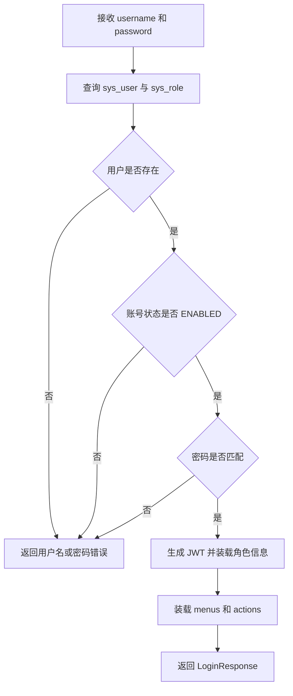
```mermaid
flowchart TD
    A[接收 username 和 password] --> B[查询 sys_user 与 sys_role]
    B --> C{用户是否存在}
    C -->|否| H[返回用户名或密码错误]
    C -->|是| D{账号状态是否 ENABLED}
    D -->|否| H
    D -->|是| E{密码是否匹配}
    E -->|否| H
    E -->|是| F[生成 JWT 并装载角色信息]
    F --> G[装载 menus 和 actions]
    G --> I[返回 LoginResponse]
```

### 1.1.2 流图

简化后流图如下：

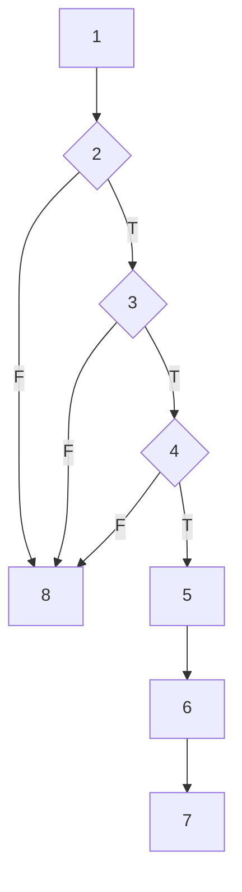
```mermaid
flowchart TD
    N1[1] --> N2{2}
    N2 -->|F| N8[8]
    N2 -->|T| N3{3}
    N3 -->|F| N8
    N3 -->|T| N4{4}
    N4 -->|F| N8
    N4 -->|T| N5[5]
    N5 --> N6[6]
    N6 --> N7[7]
```

### 1.1.3 流图的环形复杂度

流图中的区域数等于环形复杂度，区域数为4，故环形复杂度为4。

### 1.1.4 独立路径的基本组合

Path1：1-2-8  
Path2：1-2-3-8  
Path3：1-2-3-4-8  
Path4：1-2-3-4-5-6-7

### 1.1.5 条件组合覆盖测试用例

S = 用户存在 && 账号启用 && 密码正确

| 路径 | 用户存在 | 账号启用 | 密码正确 | S |
| --- | --- | --- | --- | --- |
| Path1 | F | - | - | F |
| Path2 | T | F | - | F |
| Path3 | T | T | F | F |
| Path4 | T | T | T | T |

### 1.1.6 独立路径的实例

测试登录失败路径一

用例名称  
测试不存在账号登录失败

测试目的  
验证用户不存在时系统直接返回登录失败

覆盖路径  
Path1

测试预置条件：  
1) 前后端服务已启动。  
2) 登录页可正常访问。

测试步聚：  
1) 进入登录页。  
2) 输入不存在的用户名 `ghost_user` 和任意密码。  
3) 点击【登录】按钮。

期望结果:  
1) 系统返回“用户名或密码错误”。  
2) 不生成 token。  
3) 页面停留在登录页。

实际结果:  
1) 静态核对通过，与当前代码实现一致。

说明:  
对应 `AuthService.login` 中用户不存在分支。

测试登录失败路径二

用例名称  
测试停用账号登录失败

测试目的  
验证停用账号不能通过登录校验

覆盖路径  
Path2

测试预置条件：  
1) 存在一个状态为 `DISABLED` 的用户账号。  
2) 登录页可正常访问。

测试步聚：  
1) 输入停用账号用户名和正确密码。  
2) 点击【登录】按钮。

期望结果:  
1) 系统返回登录失败。  
2) 不进入业务页面。

实际结果:  
1) 静态核对通过，与当前代码实现一致。

说明:  
对应 `AuthService.login` 中 `status != ENABLED` 分支。

测试登录失败路径三

用例名称  
测试错误密码登录失败

测试目的  
验证密码不匹配时的失败处理

覆盖路径  
Path3

测试预置条件：  
1) `admin` 账号存在且状态为 `ENABLED`。  
2) 登录页可正常访问。

测试步聚：  
1) 输入用户名 `admin`。  
2) 输入错误密码 `wrong123`。  
3) 点击【登录】按钮。

期望结果:  
1) 系统返回“用户名或密码错误”。  
2) 不生成 token。

实际结果:  
1) 静态核对通过，与当前代码实现一致。

说明:  
对应 `PasswordEncoder.matches` 判定失败分支。

测试登录成功路径

用例名称  
测试管理员合法登录成功

测试目的  
验证登录主路径能够生成 token 并装载菜单和操作权限

覆盖路径  
Path4

测试预置条件：  
1) 前后端服务已启动。  
2) 存在管理员账号 `admin / admin123`。

测试步聚：  
1) 输入用户名 `admin`。  
2) 输入密码 `admin123`。  
3) 点击【登录】按钮。

期望结果:  
1) 系统返回 token。  
2) 返回 `menus` 与 `actions`。  
3) 页面跳转到首页。

实际结果:  
1) 已通过（api-smoke / 浏览器人工复查）。

说明:  
同时覆盖 `RoleMenuCatalog` 菜单与操作权限装载逻辑。

## 1.2 黑盒测试

### 1.2.1 测试功能

登录权限模块主要负责账号密码登录、未登录拦截、菜单收口、按钮级权限控制和权限同步。

### 1.2.2 有效等价类划分

| 输入等价类 | 有效等价类 |
| --- | --- |
| 用户名与密码 | 已存在且启用的管理员账号 `admin / admin123`（1） |
| 用户名与密码 | 已存在且启用的普通账号 `operator / operator123`（2） |
| 菜单权限 | 当前角色拥有对应菜单权限，登录后可看到目标菜单（3） |
| 操作权限 | 当前角色拥有对应操作权限，页面按钮可见或可点（4） |

### 1.2.3 有效等价类测试用例

对1.2.2表中编号为(1)的有效等价类，用一个测试用例覆盖：

用例名称  
测试管理员账号登录成功

测试目的  
验证管理员账号作为有效等价类时能够进入系统

覆盖范围  
等价类1

测试预置条件：  
1) 前后端服务已启动。  
2) 管理员账号已初始化。

测试步聚：  
1) 打开 `/login`。  
2) 输入 `admin / admin123`。  
3) 点击【登录】按钮。

期望结果:  
1) 登录成功。  
2) 显示完整菜单。  
3) 顶部栏显示当前用户信息。

实际结果:  
1) 已通过（api-smoke / 浏览器人工复查）。

说明:  
对应管理员完整权限场景。

对1.2.2表中编号为(2)的有效等价类，用一个测试用例覆盖：

用例名称  
测试普通账号登录成功

测试目的  
验证普通账号能够正常登录并获得受限菜单

覆盖范围  
等价类2

测试预置条件：  
1) 前后端服务已启动。  
2) 普通账号已初始化。

测试步聚：  
1) 打开 `/login`。  
2) 输入 `operator / operator123`。  
3) 点击【登录】按钮。

期望结果:  
1) 登录成功。  
2) 页面展示普通角色允许的菜单。  
3) 不展示管理员专属菜单。

实际结果:  
1) 已通过（浏览器人工复查）。

说明:  
覆盖角色菜单收口。

### 1.2.4 无效等价类划分

| 输入等价类 | 无效等价类 |
| --- | --- |
| 用户名与密码 | 用户名不存在（1） |
| 用户名与密码 | 密码错误（2） |
| 会话状态 | 未登录直接访问业务页（3） |
| 权限状态 | 当前角色不拥有目标菜单或按钮权限（4） |

### 1.2.5 无效等价类测试用例

对1.2.4表中编号为(1)的无效等价类，用一个测试用例覆盖：

用例名称  
测试不存在账号登录失败

测试目的  
验证不存在账号这一无效等价类的处理

覆盖范围  
等价类1

测试预置条件：  
1) 登录页可访问。

测试步聚：  
1) 输入 `ghost_user / any123`。  
2) 点击【登录】按钮。

期望结果:  
1) 页面提示用户名或密码错误。  
2) 不进入系统。

实际结果:  
1) 静态核对通过，与当前代码实现一致。

说明:  
对应后端用户不存在分支。

对1.2.4表中编号为(3)的无效等价类，用一个测试用例覆盖：

用例名称  
测试未登录直接访问业务页被拦截

测试目的  
验证未登录访问业务页时的拦截行为

覆盖范围  
等价类3

测试预置条件：  
1) 当前浏览器未保存 token。

测试步聚：  
1) 直接访问 `/dashboard`。  
2) 观察页面跳转。

期望结果:  
1) 系统自动跳回 `/login`。  
2) 不显示业务数据。

实际结果:  
1) 已通过（浏览器人工复查）。

说明:  
对应前端路由守卫的未登录拦截。

# 2 数据源管理模块

## 2.1 白盒测试

### 2.1.1 程序流程图

数据源管理模块白盒测试对象为 `DataSourceService.create`、`update`、`test`、`delete`。程序流程图如下：

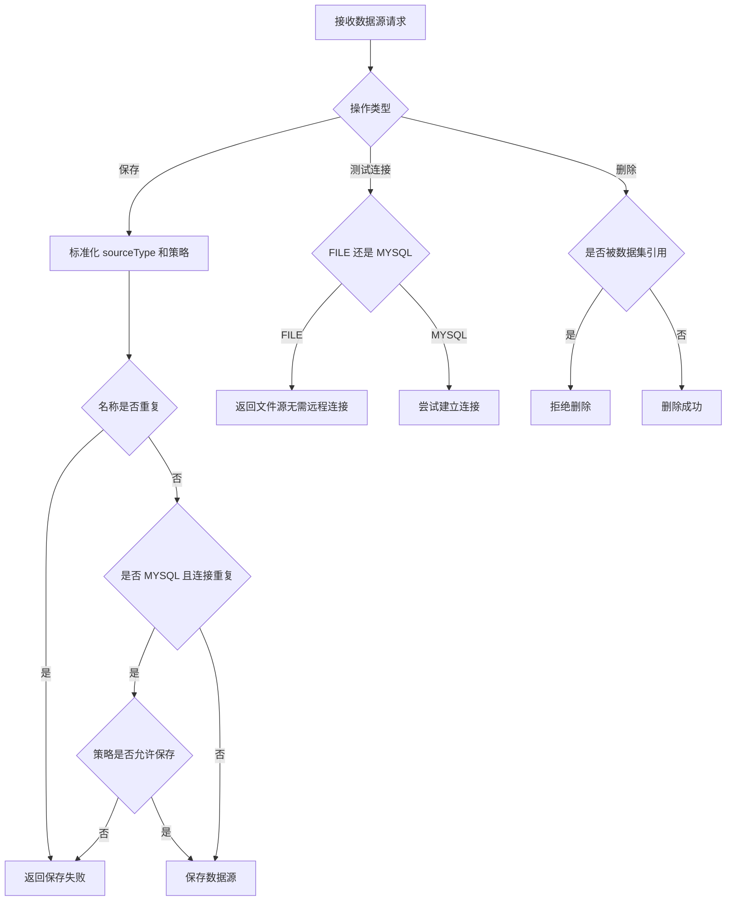
```mermaid
flowchart TD
    A[接收数据源请求] --> B{操作类型}
    B -->|保存| C[标准化 sourceType 和策略]
    C --> D{名称是否重复}
    D -->|是| X[返回保存失败]
    D -->|否| E{是否 MYSQL 且连接重复}
    E -->|是| F{策略是否允许保存}
    F -->|否| X
    F -->|是| G[保存数据源]
    E -->|否| G
    B -->|测试连接| H{FILE 还是 MYSQL}
    H -->|FILE| I[返回文件源无需远程连接]
    H -->|MYSQL| J[尝试建立连接]
    B -->|删除| K{是否被数据集引用}
    K -->|是| Y[拒绝删除]
    K -->|否| Z[删除成功]
```

### 2.1.2 流图

简化后流图如下：

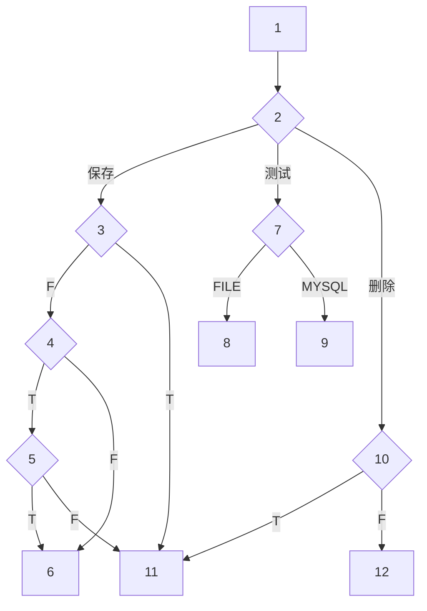
```mermaid
flowchart TD
    N1[1] --> N2{2}
    N2 -->|保存| N3{3}
    N3 -->|F| N4{4}
    N3 -->|T| N11[11]
    N4 -->|T| N5{5}
    N4 -->|F| N6[6]
    N5 -->|T| N6
    N5 -->|F| N11
    N2 -->|测试| N7{7}
    N7 -->|FILE| N8[8]
    N7 -->|MYSQL| N9[9]
    N2 -->|删除| N10{10}
    N10 -->|T| N11
    N10 -->|F| N12[12]
```

### 2.1.3 流图的环形复杂度

流图中的区域数等于环形复杂度，区域数为5，故环形复杂度为5。

### 2.1.4 独立路径的基本组合

Path1：1-2-3-11  
Path2：1-2-3-4-5-11  
Path3：1-2-3-4-5-6  
Path4：1-2-7-8  
Path5：1-2-10-12

### 2.1.5 条件组合覆盖测试用例

S = (保存操作 && 名称不重复 && (非MYSQL重复连接 || 策略允许)) || (测试操作 && 连接可用) || (删除操作 && 未被引用)

| 路径 | 保存操作且名称不重复 | 策略允许 | 测试操作且连接可用 | 删除操作且未被引用 | S |
| --- | --- | --- | --- | --- | --- |
| Path1 | F | - | - | - | F |
| Path2 | T | F | - | - | F |
| Path3 | T | T | - | - | T |
| Path4 | - | - | T | - | T |
| Path5 | - | - | - | T | T |

### 2.1.6 独立路径的实例

测试数据源保存失败路径一

用例名称  
测试同名数据源保存失败

测试目的  
验证数据源名称重复时保存失败

覆盖路径  
Path1

测试预置条件：  
1) 系统中已存在名称为 `file_source_course` 的数据源。  
2) 当前用户为管理员。

测试步聚：  
1) 进入数据源管理页。  
2) 新建数据源并输入重复名称 `file_source_course`。  
3) 点击【保存】。

期望结果:  
1) 系统拒绝保存。  
2) 返回名称重复提示。

实际结果:  
1) 静态核对通过，与当前代码实现一致。

说明:  
对应 `validateSourceNameUnique` 分支。

测试数据源保存失败路径二

用例名称  
测试重复MYSQL连接在 REJECT 策略下失败

测试目的  
验证重复连接且策略拒绝时不能保存

覆盖路径  
Path2

测试预置条件：  
1) 已存在一个 `MYSQL` 数据源。  
2) 当前保存请求使用相同 `host/port/db_name/username`。  
3) 策略为 `REJECT`。

测试步聚：  
1) 新建 `MYSQL` 数据源。  
2) 输入与已有连接完全相同的连接信息。  
3) 设置重复连接策略为 `REJECT`。  
4) 点击【保存】。

期望结果:  
1) 保存失败。  
2) 页面显示阻断提示。

实际结果:  
1) 已通过（regression-suite / extended）。

说明:  
覆盖 `evaluateDuplicateConnectionStrategy` 的拒绝分支。

测试数据源保存成功路径

用例名称  
测试重复MYSQL连接在 WARN 策略下保存成功

测试目的  
验证重复连接且策略为 `WARN` 时允许保存并返回提醒

覆盖路径  
Path3

测试预置条件：  
1) 已存在一个可用 `MYSQL` 数据源。  
2) 当前保存请求使用相同连接信息。  
3) 策略为 `WARN`。

测试步聚：  
1) 新建 `MYSQL` 数据源。  
2) 输入重复连接信息。  
3) 设置策略为 `WARN`。  
4) 点击【保存】。

期望结果:  
1) 数据源保存成功。  
2) 返回 `warningMessage`。

实际结果:  
1) 已通过（regression-suite / extended）。

说明:  
该路径同时证明保存成功分支可工作。

测试数据源连接测试路径

用例名称  
测试FILE数据源连接测试成功

测试目的  
验证 FILE 数据源测试连接时直接返回成功信息

覆盖路径  
Path4

测试预置条件：  
1) 已存在 `FILE` 类型数据源。

测试步聚：  
1) 在列表中选择该数据源。  
2) 点击【测试连接】。

期望结果:  
1) 返回“文件数据源无需远程连接，状态正常”。

实际结果:  
1) 静态核对通过，与当前代码实现一致。

说明:  
对应 `test` 方法中 `FILE` 分支。

测试数据源删除路径

用例名称  
测试未被引用数据源删除成功

测试目的  
验证数据源未被数据集引用时可删除

覆盖路径  
Path5

测试预置条件：  
1) 存在一个未生成任何数据集的数据源。  
2) 当前用户为管理员。

测试步聚：  
1) 在数据源列表中找到该数据源。  
2) 点击【删除】。

期望结果:  
1) 删除成功。  
2) 列表中不再显示该数据源。

实际结果:  
1) 静态核对通过，与当前代码实现一致。

说明:  
被引用数据源删除失败在黑盒无效等价类中补充验证。

## 2.2 黑盒测试

### 2.2.1 测试功能

数据源管理模块主要负责 `FILE / MYSQL` 两类数据源的新增、编辑、测试连接、启停以及删除校验。

### 2.2.2 有效等价类划分

| 输入等价类 | 有效等价类 |
| --- | --- |
| source_name | 唯一且符合命名习惯的数据源名称，如 `file_source_course`（1） |
| source_type | 合法类型 `FILE` 或 `MYSQL`（2） |
| duplicateConnectionStrategy | 合法策略 `ALLOW / WARN / REJECT`（3） |
| 连接测试 | `MYSQL` 连接信息正确或 `FILE` 数据源（4） |

### 2.2.3 有效等价类测试用例

对2.2.2表中编号为(1)的有效等价类，用一个测试用例覆盖：

用例名称  
测试唯一名称FILE数据源新增成功

测试目的  
验证唯一名称作为有效等价类时可成功新增 FILE 数据源

覆盖范围  
等价类1

测试预置条件：  
1) 当前用户为管理员。  
2) 系统中不存在名称为 `file_source_course` 的数据源。

测试步聚：  
1) 进入数据源管理页。  
2) 点击【新增】。  
3) 输入名称 `file_source_course`，类型选择 `FILE`。  
4) 点击【保存】。

期望结果:  
1) 保存成功。  
2) 列表新增一条 `FILE` 数据源。

实际结果:  
1) 已通过（api-smoke）。

说明:  
覆盖最基础数据源新增路径。

对2.2.2表中编号为(4)的有效等价类，用一个测试用例覆盖：

用例名称  
测试MYSQL数据源连接成功

测试目的  
验证合法连接信息作为有效等价类时连接测试成功

覆盖范围  
等价类4

测试预置条件：  
1) 已存在启用中的 `MYSQL` 数据源。  
2) 数据库服务可达。

测试步聚：  
1) 在列表中找到该 `MYSQL` 数据源。  
2) 点击【测试连接】。

期望结果:  
1) 页面显示连接成功。  
2) 数据源状态保持正常。

实际结果:  
1) 已通过（regression-suite / mysql-regression）。

说明:  
覆盖数据库连通性正向场景。

### 2.2.4 无效等价类划分

| 输入等价类 | 无效等价类 |
| --- | --- |
| source_name | 与现有数据源名称重复（1） |
| duplicateConnectionStrategy | 重复连接且策略为 `REJECT`（2） |
| 连接测试 | `MYSQL` 主机、端口或账号密码错误（3） |
| 删除操作 | 数据源已被数据集引用（4） |

### 2.2.5 无效等价类测试用例

对2.2.4表中编号为(1)的无效等价类，用一个测试用例覆盖：

用例名称  
测试重复名称数据源新增失败

测试目的  
验证重复名称这一无效等价类的处理

覆盖范围  
等价类1

测试预置条件：  
1) 系统中已存在名称为 `file_source_course` 的数据源。

测试步聚：  
1) 再次创建名称为 `file_source_course` 的数据源。  
2) 点击【保存】。

期望结果:  
1) 页面提示名称重复。  
2) 保存失败。

实际结果:  
1) 静态核对通过，与当前代码实现一致。

说明:  
对应同名友好查重规则。

对2.2.4表中编号为(4)的无效等价类，用一个测试用例覆盖：

用例名称  
测试已被引用数据源删除失败

测试目的  
验证已被数据集引用的数据源不能删除

覆盖范围  
等价类4

测试预置条件：  
1) 数据源下已存在导入生成的数据集。  
2) 当前用户为管理员。

测试步聚：  
1) 在列表中找到已被引用的数据源。  
2) 点击【删除】。

期望结果:  
1) 系统阻止删除。  
2) 返回“该数据源下已有数据集，不能删除”。

实际结果:  
1) 静态核对通过，与当前代码实现一致。

说明:  
该规则已纳入测试计划与课程材料。

# 3 数据接入模块

## 3.1 白盒测试

### 3.1.1 程序流程图

数据接入模块白盒测试对象为 `DataImportService.importFile`、`importDatabaseTable`、`rerunImport`、`detail`。程序流程图如下：

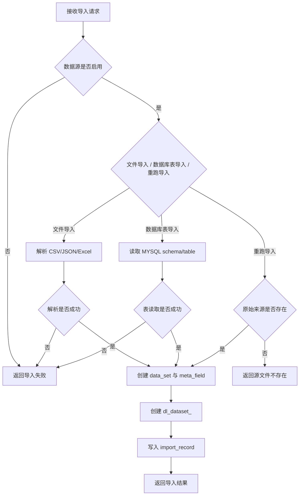
```mermaid
flowchart TD
    A[接收导入请求] --> B{数据源是否启用}
    B -->|否| X[返回导入失败]
    B -->|是| C{文件导入 / 数据库表导入 / 重跑导入}
    C -->|文件导入| D[解析 CSV/JSON/Excel]
    C -->|数据库表导入| E[读取 MYSQL schema/table]
    C -->|重跑导入| F{原始来源是否存在}
    D --> G{解析是否成功}
    G -->|否| X
    G -->|是| H[创建 data_set 与 meta_field]
    E --> I{表读取是否成功}
    I -->|否| X
    I -->|是| H
    F -->|否| Y[返回源文件不存在]
    F -->|是| H
    H --> J[创建 dl_dataset_<datasetId>]
    J --> K[写入 import_record]
    K --> L[返回导入结果]
```

### 3.1.2 流图

简化后流图如下：

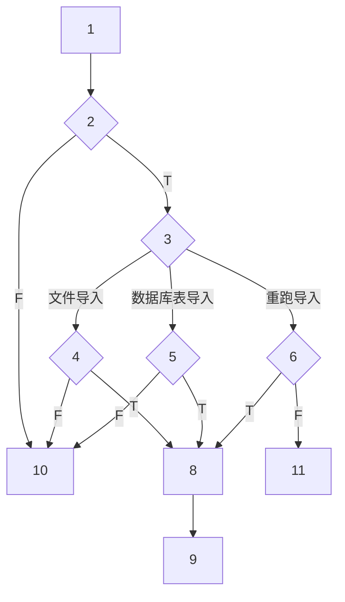
```mermaid
flowchart TD
    N1[1] --> N2{2}
    N2 -->|F| N10[10]
    N2 -->|T| N3{3}
    N3 -->|文件导入| N4{4}
    N4 -->|F| N10
    N4 -->|T| N8[8]
    N3 -->|数据库表导入| N5{5}
    N5 -->|F| N10
    N5 -->|T| N8
    N3 -->|重跑导入| N6{6}
    N6 -->|F| N11[11]
    N6 -->|T| N8
    N8 --> N9[9]
```

### 3.1.3 流图的环形复杂度

流图中的区域数等于环形复杂度，区域数为5，故环形复杂度为5。

### 3.1.4 独立路径的基本组合

Path1：1-2-10  
Path2：1-2-3-4-10  
Path3：1-2-3-4-8-9  
Path4：1-2-3-5-8-9  
Path5：1-2-3-6-11

### 3.1.5 条件组合覆盖测试用例

S = 数据源可用 && ((文件导入 && 解析成功) || (数据库表导入 && 表可读) || (重跑导入 && 源文件存在))

| 路径 | 数据源可用 | 文件解析成功 | 数据库表可读 | 重跑源文件存在 | S |
| --- | --- | --- | --- | --- | --- |
| Path1 | F | - | - | - | F |
| Path2 | T | F | - | - | F |
| Path3 | T | T | - | - | T |
| Path4 | T | - | T | - | T |
| Path5 | T | - | - | F | F |

### 3.1.6 独立路径的实例

测试数据接入失败路径一

用例名称  
测试停用数据源下导入失败

测试目的  
验证数据源不可用时导入被阻止

覆盖路径  
Path1

测试预置条件：  
1) 已存在一个状态为停用的数据源。  
2) 当前用户具有导入权限。

测试步聚：  
1) 在电商数据接入页选择停用数据源。  
2) 上传合法文件并点击【导入】。

期望结果:  
1) 导入失败。  
2) 返回数据源不可用提示。

实际结果:  
1) 静态核对通过，与当前代码实现一致。

说明:  
对应 `ensureSourceEnabled` 分支。

测试数据接入失败路径二

用例名称  
测试文件解析失败

测试目的  
验证文件格式或内容异常时导入失败

覆盖路径  
Path2

测试预置条件：  
1) 已存在启用中的 `FILE` 数据源。  
2) 准备一份非法文件。

测试步聚：  
1) 选择数据源。  
2) 上传非法文件。  
3) 点击【导入】。

期望结果:  
1) 导入失败。  
2) 导入历史记录为 `FAILED`。  
3) 显示失败原因。

实际结果:  
1) 静态核对通过，与当前代码实现一致。

说明:  
失败时会写入失败导入记录。

测试数据接入成功路径一

用例名称  
测试CSV文件导入成功

测试目的  
验证文件导入主路径能够生成数据集和导入记录

覆盖路径  
Path3

测试预置条件：  
1) 已存在启用中的 `FILE` 数据源。  
2) 准备交易样例 CSV 文件。

测试步聚：  
1) 进入文件导入子页。  
2) 选择数据源。  
3) 输入数据集名称和业务域。  
4) 上传 CSV 文件并点击【导入】。

期望结果:  
1) 生成新的数据集。  
2) 导入历史新增成功记录。  
3) 记录显示导入条数。

实际结果:  
1) 已通过（api-smoke）。

说明:  
同时覆盖 `createDatasetFromRows` 调用链。

测试数据接入成功路径二

用例名称  
测试MYSQL数据库表导入成功

测试目的  
验证数据库表导入路径能够生成 `MYSQL_TABLE` 类型导入记录

覆盖路径  
Path4

测试预置条件：  
1) 已存在启用中的 `MYSQL` 数据源。  
2) 数据库连接可用，且存在可读表。

测试步聚：  
1) 进入数据库表导入子页。  
2) 选择数据源、Schema 和数据表。  
3) 点击【预览数据】。  
4) 输入数据集名称并点击【导入为数据集】。

期望结果:  
1) 生成新的数据集。  
2) 导入历史新增 `MYSQL_TABLE` 成功记录。

实际结果:  
1) 已通过（浏览器人工复查 / mysql-regression）。

说明:  
数据库表导入是冻结版重点演示场景。

测试数据接入失败路径三

用例名称  
测试重跑导入时源文件不存在

测试目的  
验证重跑导入时丢失源文件会被识别并返回错误

覆盖路径  
Path5

测试预置条件：  
1) 已存在一条文件导入历史。  
2) 原始文件已被移动或删除。

测试步聚：  
1) 通过任务调度或重跑逻辑触发该导入记录。  
2) 观察返回结果。

期望结果:  
1) 返回“导入源文件不存在”。  
2) 不生成新的成功导入记录。

实际结果:  
1) 静态核对通过，与当前代码实现一致。

说明:  
对应 `rerunImport` 中源文件校验分支。

## 3.2 黑盒测试

### 3.2.1 测试功能

数据接入模块主要负责文件导入、数据库表导入、导入历史查看和导入详情追踪。

### 3.2.2 有效等价类划分

| 输入等价类 | 有效等价类 |
| --- | --- |
| 文件格式 | 合法文件格式 `CSV / JSON / Excel`（1） |
| 数据库来源 | 已启用的 `MYSQL` 数据源 + 已选择 Schema/Table（2） |
| 导入参数 | 合法的数据集名称、业务域、编码方式、首行为表头（3） |
| 历史记录 | 已存在的导入记录编号（4） |

### 3.2.3 有效等价类测试用例

对3.2.2表中编号为(1)的有效等价类，用一个测试用例覆盖：

用例名称  
测试CSV文件导入成功

测试目的  
验证合法 CSV 文件作为有效等价类时能成功导入

覆盖范围  
等价类1

测试预置条件：  
1) 已存在启用中的 `FILE` 数据源。  
2) 已准备交易样例 CSV 文件。

测试步聚：  
1) 进入电商数据接入页。  
2) 选择文件导入。  
3) 选择数据源、数据集名称、业务域。  
4) 上传 CSV 文件并点击【导入】。

期望结果:  
1) 生成新数据集。  
2) 导入历史新增成功记录。

实际结果:  
1) 已通过（api-smoke）。

说明:  
当前 `CSV` 是主冒烟样本格式。

对3.2.2表中编号为(2)的有效等价类，用一个测试用例覆盖：

用例名称  
测试MYSQL数据库表导入成功

测试目的  
验证已启用 `MYSQL` 数据源加已选表这一有效等价类

覆盖范围  
等价类2

测试预置条件：  
1) 已存在启用中的 `MYSQL` 数据源。  
2) MySQL 数据库可达。

测试步聚：  
1) 切换到数据库表导入子页。  
2) 选择数据源、Schema 和表。  
3) 预览后点击【导入为数据集】。

期望结果:  
1) 导入成功。  
2) 导入历史可查看详情。

实际结果:  
1) 已通过（浏览器人工复查 / mysql-regression）。

说明:  
覆盖 Schema 自动识别与表预览交互。

### 3.2.4 无效等价类划分

| 输入等价类 | 无效等价类 |
| --- | --- |
| 文件格式 | 不支持的文件格式或非法文件内容（1） |
| 数据源状态 | 停用的数据源（2） |
| 数据库来源 | 选择非 `MYSQL` 数据源进行数据库表导入（3） |
| 导入历史 | 不存在的导入记录编号（4） |

### 3.2.5 无效等价类测试用例

对3.2.4表中编号为(1)的无效等价类，用一个测试用例覆盖：

用例名称  
测试非法文件导入失败

测试目的  
验证非法文件内容这一无效等价类的处理

覆盖范围  
等价类1

测试预置条件：  
1) 已存在启用中的 `FILE` 数据源。

测试步聚：  
1) 上传非法文件。  
2) 点击【导入】。

期望结果:  
1) 导入失败。  
2) 页面展示失败原因。  
3) 历史记录状态为失败。

实际结果:  
1) 静态核对通过，与当前代码实现一致。

说明:  
覆盖解析失败场景。

对3.2.4表中编号为(2)的无效等价类，用一个测试用例覆盖：

用例名称  
测试停用数据源下导入失败

测试目的  
验证停用数据源这一无效等价类的处理

覆盖范围  
等价类2

测试预置条件：  
1) 已存在状态为停用的数据源。

测试步聚：  
1) 在导入页选择停用数据源。  
2) 提交导入请求。

期望结果:  
1) 导入失败。  
2) 不生成成功数据集。

实际结果:  
1) 静态核对通过，与当前代码实现一致。

说明:  
对应数据源可用性校验。

# 4 数据集管理模块

## 4.1 白盒测试

### 4.1.1 程序流程图

数据集管理模块白盒测试对象为 `DatasetService.createDatasetFromRows`、`list`、`detail`、`delete`、`validateDelete` 与 `DatasetTableService.preview`。程序流程图如下：

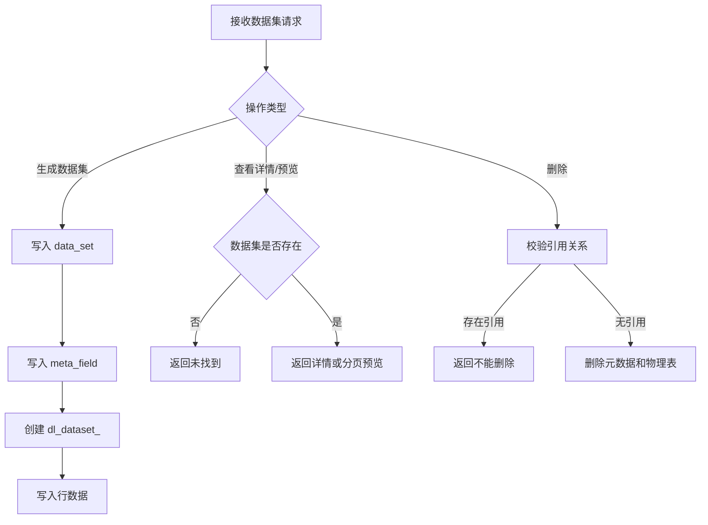
```mermaid
flowchart TD
    A[接收数据集请求] --> B{操作类型}
    B -->|生成数据集| C[写入 data_set]
    C --> D[写入 meta_field]
    D --> E[创建 dl_dataset_<datasetId>]
    E --> F[写入行数据]
    B -->|查看详情/预览| G{数据集是否存在}
    G -->|否| X[返回未找到]
    G -->|是| H[返回详情或分页预览]
    B -->|删除| I[校验引用关系]
    I -->|存在引用| Y[返回不能删除]
    I -->|无引用| Z[删除元数据和物理表]
```

### 4.1.2 流图

简化后流图如下：

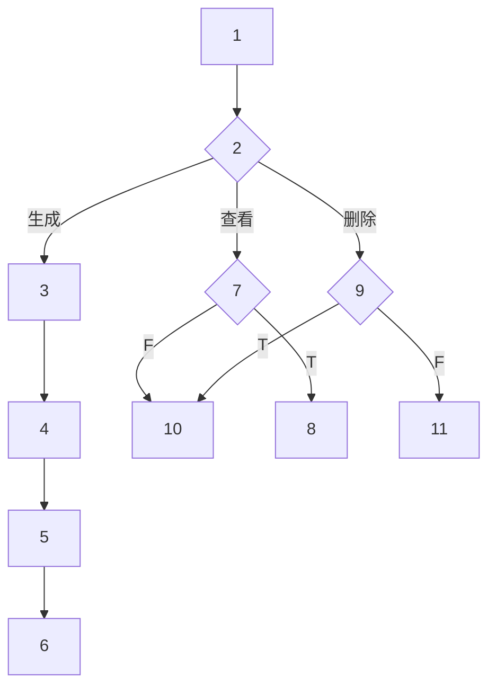
```mermaid
flowchart TD
    N1[1] --> N2{2}
    N2 -->|生成| N3[3]
    N3 --> N4[4]
    N4 --> N5[5]
    N5 --> N6[6]
    N2 -->|查看| N7{7}
    N7 -->|F| N10[10]
    N7 -->|T| N8[8]
    N2 -->|删除| N9{9}
    N9 -->|T| N10
    N9 -->|F| N11[11]
```

### 4.1.3 流图的环形复杂度

流图中的区域数等于环形复杂度，区域数为4，故环形复杂度为4。

### 4.1.4 独立路径的基本组合

Path1：1-2-3-4-5-6  
Path2：1-2-7-10  
Path3：1-2-7-8  
Path4：1-2-9-11

### 4.1.5 条件组合覆盖测试用例

S = 生成成功 || (数据集存在 && 查看成功) || (删除操作 && 未被引用)

| 路径 | 生成成功 | 数据集存在且查看成功 | 删除且未被引用 | S |
| --- | --- | --- | --- | --- |
| Path1 | T | - | - | T |
| Path2 | - | F | - | F |
| Path3 | - | T | - | T |
| Path4 | - | - | T | T |

### 4.1.6 独立路径的实例

测试数据集生成路径

用例名称  
测试导入后动态数据集创建成功

测试目的  
验证 `data_set`、`meta_field` 和动态表能够完整创建

覆盖路径  
Path1

测试预置条件：  
1) 已准备好合法导入数据。  
2) 数据接入流程可正常触发。

测试步聚：  
1) 发起一次成功导入。  
2) 查看生成后的数据集记录。  
3) 检查元数据和预览结果。

期望结果:  
1) 新数据集生成成功。  
2) 元数据和预览均可查看。

实际结果:  
1) 已通过（api-smoke / demo-smoke）。

说明:  
该路径由导入、集成、治理输出共同复用。

测试数据集详情失败路径

用例名称  
测试不存在数据集详情查询失败

测试目的  
验证数据集不存在时返回未找到

覆盖路径  
Path2

测试预置条件：  
1) 系统中不存在 `datasetId=999999`。

测试步聚：  
1) 调用数据集详情接口或在页面中选择不存在的数据集编号。

期望结果:  
1) 返回数据集不存在或未找到。

实际结果:  
1) 静态核对通过，与当前代码实现一致。

说明:  
对应 `detail` 方法未命中分支。

测试数据集详情成功路径

用例名称  
测试数据集详情与预览成功

测试目的  
验证数据集存在时可查看详情、元数据和分页预览

覆盖路径  
Path3

测试预置条件：  
1) 已存在至少一个数据集。

测试步聚：  
1) 进入数据集管理页。  
2) 选择一个数据集。  
3) 查看详情、元数据和预览。

期望结果:  
1) 详情正常显示。  
2) 元数据和预览正常返回。

实际结果:  
1) 已通过（regression-suite / extended）。

说明:  
同时覆盖 `preview` 分页路径。

测试数据集删除成功路径

用例名称  
测试未被引用数据集删除成功

测试目的  
验证未被引用数据集可正常删除

覆盖路径  
Path4

测试预置条件：  
1) 存在一个未被治理流程、日志或导入记录引用的数据集。  
2) 当前用户具有删除权限。

测试步聚：  
1) 在数据集管理页选择该数据集。  
2) 点击【删除】。

期望结果:  
1) 删除成功。  
2) 动态物理表被删除。  
3) 列表中不再显示该数据集。

实际结果:  
1) 静态核对通过，与当前代码实现一致。

说明:  
被引用数据集删除失败在无效等价类中补充验证。

## 4.2 黑盒测试

### 4.2.1 测试功能

数据集管理模块主要负责数据集列表筛选、详情查看、元数据展示、分页预览和删除校验。

### 4.2.2 有效等价类划分

| 输入等价类 | 有效等价类 |
| --- | --- |
| 数据集选择 | 选择已存在的数据集（1） |
| 列表筛选 | 合法关键字、业务域、状态、来源组合（2） |
| 预览筛选 | 合法字段名与关键字组合（3） |
| 删除操作 | 选择未被引用的数据集（4） |

### 4.2.3 有效等价类测试用例

对4.2.2表中编号为(1)的有效等价类，用一个测试用例覆盖：

用例名称  
测试数据集详情查看成功

测试目的  
验证选择已存在数据集时可正常查看详情

覆盖范围  
等价类1

测试预置条件：  
1) 已存在至少一个导入成功的数据集。

测试步聚：  
1) 进入数据集管理页。  
2) 在列表中选择一个数据集。

期望结果:  
1) 右侧展示详情、元数据、预览。  
2) 记录数和字段数显示正常。

实际结果:  
1) 已通过（regression-suite / extended）。

说明:  
覆盖列表到详情的主操作流。

对4.2.2表中编号为(3)的有效等价类，用一个测试用例覆盖：

用例名称  
测试预览关键字筛选成功

测试目的  
验证预览区的字段和关键字筛选功能

覆盖范围  
等价类3

测试预置条件：  
1) 已存在可预览的数据集。

测试步聚：  
1) 在预览区选择字段。  
2) 输入关键字。  
3) 点击【查询】或分页刷新。

期望结果:  
1) 预览区返回过滤后的记录。  
2) 分页总数同步更新。

实际结果:  
1) 已通过（regression-suite / extended）。

说明:  
覆盖预览分页与字段过滤。

### 4.2.4 无效等价类划分

| 输入等价类 | 无效等价类 |
| --- | --- |
| 数据集选择 | 选择不存在的数据集编号（1） |
| 删除操作 | 选择已被引用的数据集（2） |
| 预览请求 | 预览时使用不存在的字段名（3） |
| 权限状态 | 当前用户无 `dataset.delete` 权限时尝试删除（4） |

### 4.2.5 无效等价类测试用例

对4.2.4表中编号为(1)的无效等价类，用一个测试用例覆盖：

用例名称  
测试不存在数据集详情失败

测试目的  
验证不存在数据集这一无效等价类的处理

覆盖范围  
等价类1

测试预置条件：  
1) 系统中不存在目标 `datasetId`。

测试步聚：  
1) 调用详情接口或访问对应详情逻辑。

期望结果:  
1) 返回未找到。  
2) 页面不显示错误数据。

实际结果:  
1) 静态核对通过，与当前代码实现一致。

说明:  
对应服务端 `detail` 校验。

对4.2.4表中编号为(2)的无效等价类，用一个测试用例覆盖：

用例名称  
测试已被引用数据集删除失败

测试目的  
验证被治理流程、日志或导入记录引用的数据集不能删除

覆盖范围  
等价类2

测试预置条件：  
1) 已存在被引用的数据集。  
2) 当前用户为管理员。

测试步聚：  
1) 在数据集管理页选择该数据集。  
2) 点击【删除】。

期望结果:  
1) 系统阻止删除。  
2) 页面提示该数据集已被引用不能删除。

实际结果:  
1) 静态核对通过，与当前代码实现一致。

说明:  
删除保护是当前课程项目的重要边界。

# 5 查询分析模块

## 5.1 白盒测试

### 5.1.1 程序流程图

查询分析模块白盒测试对象为 `DatasetTableService.filter`、`executeSqlWithColumns`、`QueryAnalysisService.filter`、`sqlPage`、`normalizeSql`、`integration`、`saveIntegrationResult`。程序流程图如下：

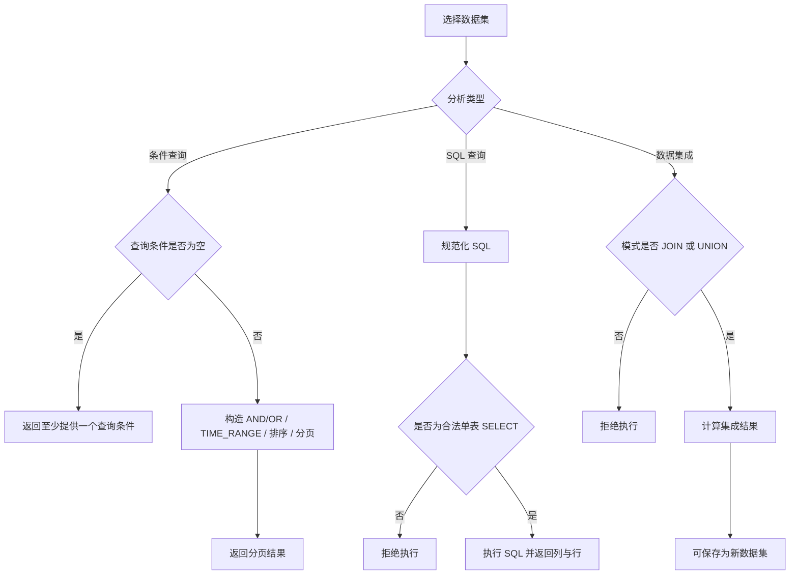
```mermaid
flowchart TD
    A[选择数据集] --> B{分析类型}
    B -->|条件查询| C{查询条件是否为空}
    C -->|是| X[返回至少提供一个查询条件]
    C -->|否| D[构造 AND/OR / TIME_RANGE / 排序 / 分页]
    D --> E[返回分页结果]
    B -->|SQL 查询| F[规范化 SQL]
    F --> G{是否为合法单表 SELECT}
    G -->|否| Y[拒绝执行]
    G -->|是| H[执行 SQL 并返回列与行]
    B -->|数据集成| I{模式是否 JOIN 或 UNION}
    I -->|否| Z[拒绝执行]
    I -->|是| J[计算集成结果]
    J --> K[可保存为新数据集]
```

### 5.1.2 流图

简化后流图如下：

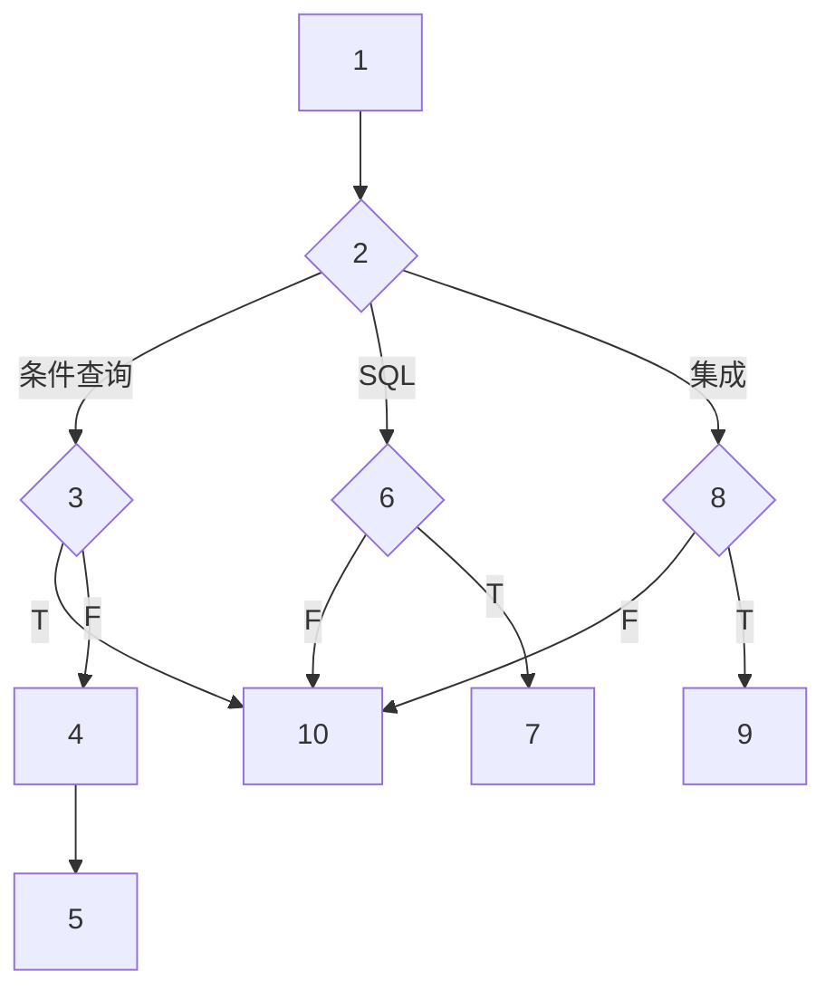
```mermaid
flowchart TD
    N1[1] --> N2{2}
    N2 -->|条件查询| N3{3}
    N3 -->|T| N10[10]
    N3 -->|F| N4[4]
    N4 --> N5[5]
    N2 -->|SQL| N6{6}
    N6 -->|F| N10
    N6 -->|T| N7[7]
    N2 -->|集成| N8{8}
    N8 -->|F| N10
    N8 -->|T| N9[9]
```

### 5.1.3 流图的环形复杂度

流图中的区域数等于环形复杂度，区域数为4，故环形复杂度为4。

### 5.1.4 独立路径的基本组合

Path1：1-2-3-10  
Path2：1-2-3-4-5  
Path3：1-2-6-7  
Path4：1-2-8-9

### 5.1.5 条件组合覆盖测试用例

S = 数据集存在 && ((条件合法) || (SQL 合法) || (集成参数合法))

| 路径 | 条件合法 | SQL 合法 | 集成参数合法 | S |
| --- | --- | --- | --- | --- |
| Path1 | F | - | - | F |
| Path2 | T | - | - | T |
| Path3 | - | T | - | T |
| Path4 | - | - | T | T |

### 5.1.6 独立路径的实例

测试查询分析失败路径

用例名称  
测试空条件查询失败

测试目的  
验证条件查询未提供任何有效条件时返回错误

覆盖路径  
Path1

测试预置条件：  
1) 已选择一个存在的数据集。

测试步聚：  
1) 在条件查询区域不填写任何条件。  
2) 点击【查询】。

期望结果:  
1) 返回“请至少提供一个查询条件”。  
2) 不返回结果表。

实际结果:  
1) 静态核对通过，与当前代码实现一致。

说明:  
对应 `QueryAnalysisService.filter` 的空条件分支。

测试查询分析成功路径一

用例名称  
测试多条件查询成功

测试目的  
验证 `AND / OR`、时间范围、排序、分页主路径

覆盖路径  
Path2

测试预置条件：  
1) 已存在可分析数据集。  
2) 数据集中包含订单状态、金额、时间字段。

测试步聚：  
1) 选择数据集。  
2) 输入条件 `order_status = completed OR amount >= 200`。  
3) 设置分页与排序并点击【查询】。

期望结果:  
1) 返回分页结果。  
2) 排序与总数正确。

实际结果:  
1) 已通过（api-smoke）。

说明:  
多条件和时间范围已纳入接口冒烟。

测试查询分析成功路径二

用例名称  
测试合法单表SQL查询成功

测试目的  
验证合法单表 `SELECT` 可被执行并返回列与行

覆盖路径  
Path3

测试预置条件：  
1) 已存在可查询数据集。

测试步聚：  
1) 输入 `SELECT * FROM dataset LIMIT 20`。  
2) 点击【执行 SQL】。

期望结果:  
1) 查询成功。  
2) 返回字段列和记录集。

实际结果:  
1) 已通过（api-smoke）。

说明:  
`normalizeSql` 会将 `dataset` 替换为当前物理表。

测试查询分析成功路径三

用例名称  
测试JOIN集成保存成功

测试目的  
验证数据集成能够预览并保存为新数据集

覆盖路径  
Path4

测试预置条件：  
1) 已存在左右两个可集成数据集。  
2) 当前用户具有查询和导出权限。

测试步聚：  
1) 进入数据集成子标签。  
2) 选择 `JOIN` 模式和关联字段。  
3) 点击【预览】。  
4) 点击【保存为新数据集】。

期望结果:  
1) 返回集成预览结果。  
2) 成功生成新的集成数据集。

实际结果:  
1) 已通过（demo-smoke）。

说明:  
冻结版已真实验证集成保存链路。

## 5.2 黑盒测试

### 5.2.1 测试功能

查询分析模块主要负责条件查询、单表 SQL 查询、电商指标分析和数据集成。

### 5.2.2 有效等价类划分

| 输入等价类 | 有效等价类 |
| --- | --- |
| 条件查询 | 合法单条件或多条件，支持 `AND / OR`（1） |
| 时间范围 | 合法 `TIME_RANGE 2026-03-01 00:00:00 ~ 2026-03-31 23:59:59`（2） |
| SQL | 合法单表 `SELECT` 语句（3） |
| 数据集成 | 合法 `JOIN / UNION` 模式和关联字段（4） |

### 5.2.3 有效等价类测试用例

对5.2.2表中编号为(1)的有效等价类，用一个测试用例覆盖：

用例名称  
测试多条件查询成功

测试目的  
验证合法多条件组合作为有效等价类时可正确返回数据

覆盖范围  
等价类1

测试预置条件：  
1) 已存在订单类数据集。

测试步聚：  
1) 选择数据集。  
2) 输入条件 `order_status = completed OR amount >= 200`。  
3) 点击【查询】。

期望结果:  
1) 返回符合条件的记录。  
2) 分页结果正常。

实际结果:  
1) 已通过（api-smoke）。

说明:  
覆盖 `AND / OR` 组合。

对5.2.2表中编号为(3)的有效等价类，用一个测试用例覆盖：

用例名称  
测试单表SQL分页排序成功

测试目的  
验证合法单表 `SELECT` 语句可正常执行分页和排序

覆盖范围  
等价类3

测试预置条件：  
1) 已存在可查询数据集。

测试步聚：  
1) 输入 `SELECT product_name,amount,order_status FROM dataset`。  
2) 设置分页和排序。  
3) 点击【执行 SQL】。

期望结果:  
1) 返回 SQL 结果。  
2) 列头正确。  
3) 分页排序生效。

实际结果:  
1) 已通过（api-smoke）。

说明:  
SQL 分页排序是冻结版保留能力。

### 5.2.4 无效等价类划分

| 输入等价类 | 无效等价类 |
| --- | --- |
| 条件查询 | 未提供任何有效查询条件（1） |
| 时间范围 | 时间范围格式非法或缺少端点（2） |
| SQL | 非 `SELECT`、带 `;`、带注释、跨表查询（3） |
| 数据集成 | 模式非法或缺少关联字段/结果名称（4） |

### 5.2.5 无效等价类测试用例

对5.2.4表中编号为(2)的无效等价类，用一个测试用例覆盖：

用例名称  
测试非法时间范围查询失败

测试目的  
验证时间范围格式非法时的处理

覆盖范围  
等价类2

测试预置条件：  
1) 已选择存在的数据集。

测试步聚：  
1) 输入 `order_time TIME_RANGE 2026/03/01 ~ 2026/03/31`。  
2) 点击【查询】。

期望结果:  
1) 返回时间格式错误提示。  
2) 不返回结果数据。

实际结果:  
1) 静态核对通过，与当前代码实现一致。

说明:  
时间解析规则由后端统一校验。

对5.2.4表中编号为(3)的无效等价类，用一个测试用例覆盖：

用例名称  
测试非法SQL被拦截

测试目的  
验证非 `SELECT` 或带危险符号的 SQL 不能执行

覆盖范围  
等价类3

测试预置条件：  
1) 已选择存在的数据集。

测试步聚：  
1) 输入 `DELETE FROM dataset` 或 `SELECT * FROM dataset;`。  
2) 点击【执行 SQL】。

期望结果:  
1) 页面提示 SQL 非法。  
2) 不执行查询。

实际结果:  
1) 静态核对通过，与当前代码实现一致。

说明:  
对应 `normalizeSql` 的安全限制。

# 6 数据治理模块

## 6.1 白盒测试

### 6.1.1 程序流程图

数据治理模块白盒测试对象为 `GovernanceService.operators`、`updateOperatorStatus`、`createFlow`、`execute`、`executeSavedFlow`、`validateOperatorChain`。程序流程图如下：

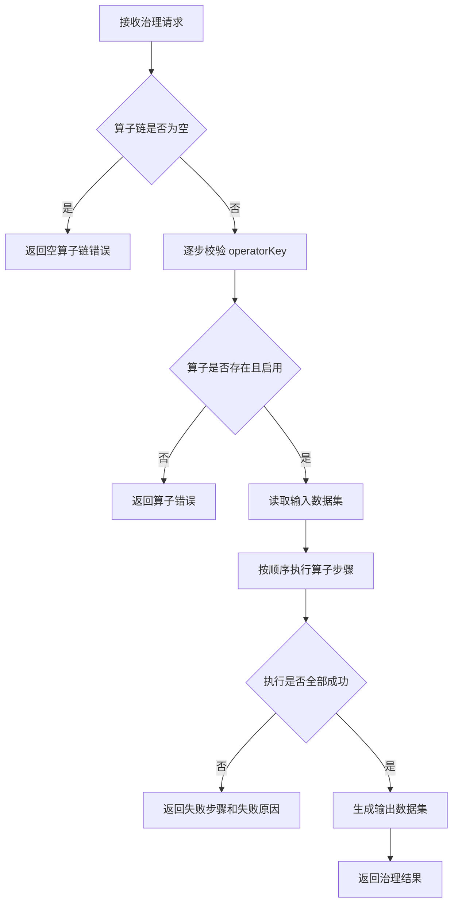
```mermaid
flowchart TD
    A[接收治理请求] --> B{算子链是否为空}
    B -->|是| X[返回空算子链错误]
    B -->|否| C[逐步校验 operatorKey]
    C --> D{算子是否存在且启用}
    D -->|否| Y[返回算子错误]
    D -->|是| E[读取输入数据集]
    E --> F[按顺序执行算子步骤]
    F --> G{执行是否全部成功}
    G -->|否| Z[返回失败步骤和失败原因]
    G -->|是| H[生成输出数据集]
    H --> I[返回治理结果]
```

### 6.1.2 流图

简化后流图如下：

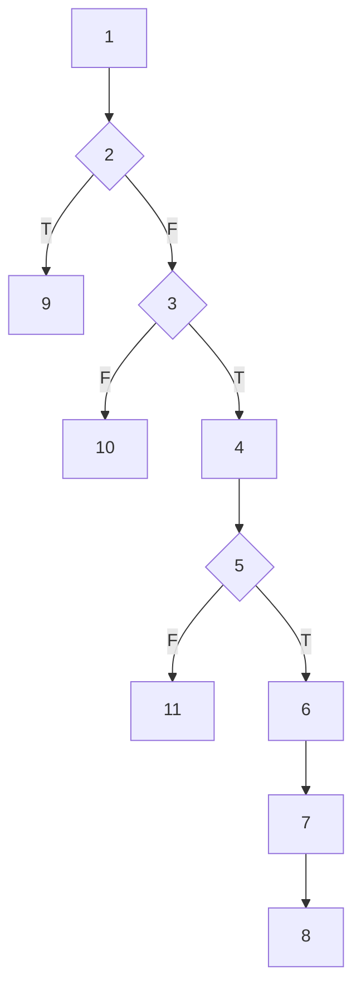
```mermaid
flowchart TD
    N1[1] --> N2{2}
    N2 -->|T| N9[9]
    N2 -->|F| N3{3}
    N3 -->|F| N10[10]
    N3 -->|T| N4[4]
    N4 --> N5{5}
    N5 -->|F| N11[11]
    N5 -->|T| N6[6]
    N6 --> N7[7]
    N7 --> N8[8]
```

### 6.1.3 流图的环形复杂度

流图中的区域数等于环形复杂度，区域数为4，故环形复杂度为4。

### 6.1.4 独立路径的基本组合

Path1：1-2-9  
Path2：1-2-3-10  
Path3：1-2-3-4-5-11  
Path4：1-2-3-4-5-6-7-8

### 6.1.5 条件组合覆盖测试用例

S = 算子链非空 && 算子存在且启用 && 执行无失败步骤

| 路径 | 算子链非空 | 算子存在且启用 | 执行无失败步骤 | S |
| --- | --- | --- | --- | --- |
| Path1 | F | - | - | F |
| Path2 | T | F | - | F |
| Path3 | T | T | F | F |
| Path4 | T | T | T | T |

### 6.1.6 独立路径的实例

测试治理失败路径一

用例名称  
测试空算子链执行失败

测试目的  
验证未配置任何算子步骤时不能执行治理

覆盖路径  
Path1

测试预置条件：  
1) 已选择存在的数据集。

测试步聚：  
1) 在治理页不添加任何步骤。  
2) 点击【执行治理】。

期望结果:  
1) 系统提示算子链不能为空。  
2) 不生成输出数据集。

实际结果:  
1) 静态核对通过，与当前代码实现一致。

说明:  
对应 `validateOperatorChain` 首个分支。

测试治理失败路径二

用例名称  
测试停用算子执行失败

测试目的  
验证算子停用后不能被执行

覆盖路径  
Path2

测试预置条件：  
1) 存在一个已停用算子。  
2) 当前治理链使用该算子。

测试步聚：  
1) 在治理页编排包含停用算子的步骤。  
2) 点击【执行治理】。

期望结果:  
1) 执行失败。  
2) 提示算子不存在或未启用。

实际结果:  
1) 已通过（regression-suite / extended）。

说明:  
冻结版专门补充了算子停用拦截验证。

测试治理失败路径三

用例名称  
测试治理步骤中途失败

测试目的  
验证步骤执行失败时会返回失败步骤和失败原因

覆盖路径  
Path3

测试预置条件：  
1) 已存在可治理数据集。  
2) 使用含非法参数的 `FIELD_CONVERT` 步骤。

测试步聚：  
1) 在治理页配置 `FIELD_CONVERT` 非法参数。  
2) 点击【执行治理】。

期望结果:  
1) 执行失败。  
2) 返回失败步骤编号和失败原因。  
3) 不生成成功输出数据集。

实际结果:  
1) 已通过（demo-smoke）。

说明:  
该场景也会进入失败日志。

测试治理成功路径

用例名称  
测试治理链顺序执行成功

测试目的  
验证治理主路径可生成新的输出数据集

覆盖路径  
Path4

测试预置条件：  
1) 已存在可治理数据集。  
2) 配置 `ORDER_DEDUP + AMOUNT_NORMALIZE + TIME_NORMALIZE` 算子链。

测试步聚：  
1) 进入治理页。  
2) 选择输入数据集。  
3) 配置三步治理链。  
4) 点击【执行治理】。

期望结果:  
1) 成功生成新的输出数据集。  
2) 返回输入条数、输出条数和异常处理条数。

实际结果:  
1) 已通过（demo-smoke）。

说明:  
成功与失败两类治理链均已被实际回归覆盖。

## 6.2 黑盒测试

### 6.2.1 测试功能

数据治理模块主要负责治理算子查看与启停、治理流程保存、治理执行以及治理失败反馈。

### 6.2.2 有效等价类划分

| 输入等价类 | 有效等价类 |
| --- | --- |
| 算子链 | 至少一个合法且启用中的算子步骤（1） |
| 流程保存 | 合法 `flowName` + 合法 `operatorChain`（2） |
| 执行参数 | 合法 `datasetId` + 合法 `executionName`（3） |
| 模板使用 | 使用内置电商治理模板并保持参数合法（4） |

### 6.2.3 有效等价类测试用例

对6.2.2表中编号为(2)的有效等价类，用一个测试用例覆盖：

用例名称  
测试治理流程保存成功

测试目的  
验证合法流程名和合法算子链能够保存流程

覆盖范围  
等价类2

测试预置条件：  
1) 已存在可治理数据集。  
2) 当前用户具有治理权限。

测试步聚：  
1) 进入治理页。  
2) 选择数据集并编排算子链。  
3) 输入流程名称。  
4) 点击【保存流程】。

期望结果:  
1) 流程保存成功。  
2) 流程列表新增记录。

实际结果:  
1) 已通过（api-smoke）。

说明:  
流程保存是任务调度创建治理任务的前置条件。

对6.2.2表中编号为(3)的有效等价类，用一个测试用例覆盖：

用例名称  
测试治理执行成功

测试目的  
验证合法数据集和执行名这一有效等价类时能完成治理

覆盖范围  
等价类3

测试预置条件：  
1) 已存在可治理数据集。  
2) 算子链合法且启用。

测试步聚：  
1) 选择数据集。  
2) 配置合法治理链。  
3) 输入执行名称。  
4) 点击【执行治理】。

期望结果:  
1) 治理成功。  
2) 输出新数据集。  
3) 展示治理统计信息。

实际结果:  
1) 已通过（demo-smoke）。

说明:  
对应课程演示主路径。

### 6.2.4 无效等价类划分

| 输入等价类 | 无效等价类 |
| --- | --- |
| 算子链 | 空算子链（1） |
| 算子状态 | 使用已停用算子（2） |
| 算子参数 | `FIELD_CONVERT` 等步骤参数非法（3） |
| 流程名称 | 流程名重复或为空（4） |

### 6.2.5 无效等价类测试用例

对6.2.4表中编号为(2)的无效等价类，用一个测试用例覆盖：

用例名称  
测试停用算子执行失败

测试目的  
验证停用算子这一无效等价类的处理

覆盖范围  
等价类2

测试预置条件：  
1) 已将某个治理算子切换为停用状态。

测试步聚：  
1) 在治理页选择该算子。  
2) 点击【执行治理】。

期望结果:  
1) 执行失败。  
2) 页面提示算子未启用。

实际结果:  
1) 已通过（regression-suite / extended）。

说明:  
当前版本已明确支持算子启停。

对6.2.4表中编号为(3)的无效等价类，用一个测试用例覆盖：

用例名称  
测试非法治理参数导致执行失败

测试目的  
验证非法参数这一无效等价类的处理

覆盖范围  
等价类3

测试预置条件：  
1) 已存在可治理数据集。

测试步聚：  
1) 配置含非法参数的 `FIELD_CONVERT`。  
2) 点击【执行治理】。

期望结果:  
1) 执行失败。  
2) 页面展示失败步骤和失败原因。

实际结果:  
1) 已通过（demo-smoke）。

说明:  
冻结版已留存失败治理日志作为证据。

# 7 任务调度模块

## 7.1 白盒测试

### 7.1.1 程序流程图

任务调度模块白盒测试对象为 `TaskService.create`、`update`、`pause`、`resume`、`trigger`、`executeDueTasks`、`validateTask`。程序流程图如下：

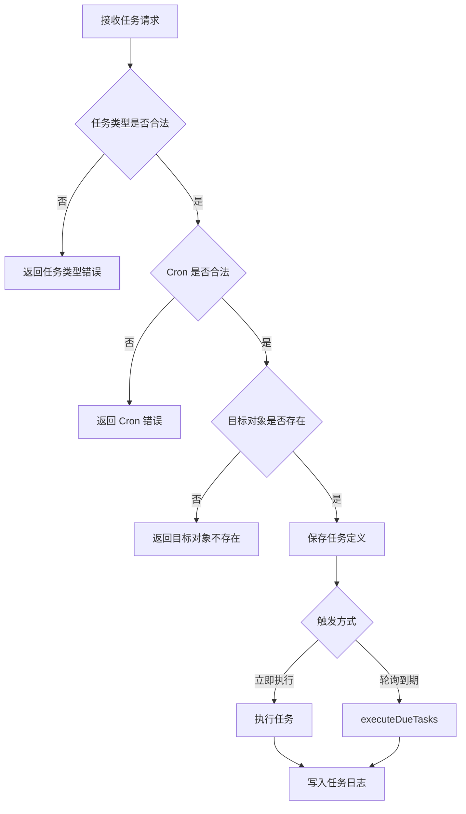
```mermaid
flowchart TD
    A[接收任务请求] --> B{任务类型是否合法}
    B -->|否| X[返回任务类型错误]
    B -->|是| C{Cron 是否合法}
    C -->|否| Y[返回 Cron 错误]
    C -->|是| D{目标对象是否存在}
    D -->|否| Z[返回目标对象不存在]
    D -->|是| E[保存任务定义]
    E --> F{触发方式}
    F -->|立即执行| G[执行任务]
    F -->|轮询到期| H[executeDueTasks]
    G --> I[写入任务日志]
    H --> I
```

### 7.1.2 流图

简化后流图如下：

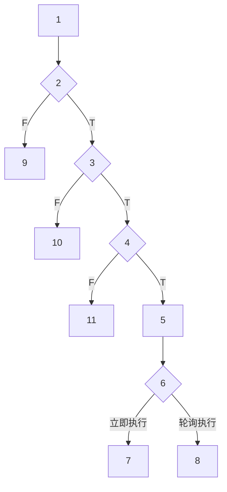
```mermaid
flowchart TD
    N1[1] --> N2{2}
    N2 -->|F| N9[9]
    N2 -->|T| N3{3}
    N3 -->|F| N10[10]
    N3 -->|T| N4{4}
    N4 -->|F| N11[11]
    N4 -->|T| N5[5]
    N5 --> N6{6}
    N6 -->|立即执行| N7[7]
    N6 -->|轮询执行| N8[8]
```

### 7.1.3 流图的环形复杂度

流图中的区域数等于环形复杂度，区域数为4，故环形复杂度为4。

### 7.1.4 独立路径的基本组合

Path1：1-2-9  
Path2：1-2-3-10  
Path3：1-2-3-4-11  
Path4：1-2-3-4-5-6-7

### 7.1.5 条件组合覆盖测试用例

S = 任务类型合法 && Cron 合法 && 目标对象存在

| 路径 | 任务类型合法 | Cron 合法 | 目标对象存在 | S |
| --- | --- | --- | --- | --- |
| Path1 | F | - | - | F |
| Path2 | T | F | - | F |
| Path3 | T | T | F | F |
| Path4 | T | T | T | T |

### 7.1.6 独立路径的实例

测试任务失败路径一

用例名称  
测试非法任务类型创建失败

测试目的  
验证不支持的任务类型不能被保存

覆盖路径  
Path1

测试预置条件：  
1) 当前用户具有任务管理权限。

测试步聚：  
1) 构造一个非 `IMPORT / GOVERNANCE` 的任务请求。  
2) 提交保存。

期望结果:  
1) 返回任务类型错误。  
2) 不生成任务记录。

实际结果:  
1) 静态核对通过，与当前代码实现一致。

说明:  
当前版本只支持两类任务。

测试任务失败路径二

用例名称  
测试非法Cron表达式创建失败

测试目的  
验证 Cron 非法时不能保存任务

覆盖路径  
Path2

测试预置条件：  
1) 当前用户为管理员。

测试步聚：  
1) 进入任务页新建任务。  
2) 输入非法 Cron 表达式。  
3) 点击【保存】。

期望结果:  
1) 保存失败。  
2) 页面提示 Cron 非法。

实际结果:  
1) 静态核对通过，与当前代码实现一致。

说明:  
对应 `validateTask` 中 Cron 校验。

测试任务失败路径三

用例名称  
测试目标对象不存在时创建失败

测试目的  
验证目标对象不存在时不能创建任务

覆盖路径  
Path3

测试预置条件：  
1) 当前用户为管理员。

测试步聚：  
1) 新建任务。  
2) 选择不存在的 `targetId`。  
3) 点击【保存】。

期望结果:  
1) 保存失败。  
2) 提示目标对象不存在。

实际结果:  
1) 静态核对通过，与当前代码实现一致。

说明:  
导入任务和治理任务都会做目标对象存在性校验。

测试任务成功路径

用例名称  
测试治理任务创建并立即执行成功

测试目的  
验证任务主路径能够完成保存、触发执行和日志记录

覆盖路径  
Path4

测试预置条件：  
1) 已存在治理流程。  
2) 当前用户具有任务管理权限。

测试步聚：  
1) 进入任务页。  
2) 新建 `GOVERNANCE` 任务。  
3) 点击【保存】。  
4) 点击【立即执行】。

期望结果:  
1) 任务保存成功。  
2) 立即执行成功。  
3) 生成对应日志记录。

实际结果:  
1) 已通过（api-smoke / demo-smoke）。

说明:  
同时覆盖 `trigger` 与 `executeTask` 调用链。

## 7.2 黑盒测试

### 7.2.1 测试功能

任务调度模块主要负责 `IMPORT / GOVERNANCE` 两类任务的创建、编辑、暂停、恢复、立即执行和状态维护。

### 7.2.2 有效等价类划分

| 输入等价类 | 有效等价类 |
| --- | --- |
| task_type | 合法任务类型 `IMPORT / GOVERNANCE`（1） |
| cron_expr | 合法 Cron 表达式（2） |
| target_id | 指向存在的导入记录或治理流程（3） |
| status | 合法状态 `ENABLED / PAUSED`（4） |

### 7.2.3 有效等价类测试用例

对7.2.2表中编号为(1)的有效等价类，用一个测试用例覆盖：

用例名称  
测试导入任务创建并执行成功

测试目的  
验证 `IMPORT` 任务作为有效等价类时可正常执行

覆盖范围  
等价类1

测试预置条件：  
1) 已存在一条可重跑的导入记录。  
2) 当前用户为管理员。

测试步聚：  
1) 进入任务调度页。  
2) 新建 `IMPORT` 任务。  
3) 点击【保存】并【立即执行】。

期望结果:  
1) 任务创建成功。  
2) 执行成功。  
3) 任务日志新增记录。

实际结果:  
1) 已通过（api-smoke）。

说明:  
覆盖导入任务主链路。

对7.2.2表中编号为(4)的有效等价类，用一个测试用例覆盖：

用例名称  
测试任务暂停与恢复成功

测试目的  
验证合法状态切换这一有效等价类的处理

覆盖范围  
等价类4

测试预置条件：  
1) 已存在一个启用中的任务。

测试步聚：  
1) 点击【暂停】。  
2) 再点击【恢复】。

期望结果:  
1) 任务状态先变为 `PAUSED`。  
2) 再恢复为 `ENABLED`。

实际结果:  
1) 静态核对通过，与当前代码实现一致。

说明:  
状态切换当前主要通过页面和服务端共同控制。

### 7.2.4 无效等价类划分

| 输入等价类 | 无效等价类 |
| --- | --- |
| task_type | 非法任务类型（1） |
| cron_expr | 非法 Cron 表达式（2） |
| target_id | 指向不存在目标对象（3） |
| 运行状态 | 对运行中的任务重复触发（4） |

### 7.2.5 无效等价类测试用例

对7.2.4表中编号为(2)的无效等价类，用一个测试用例覆盖：

用例名称  
测试非法Cron任务保存失败

测试目的  
验证非法 Cron 表达式这一无效等价类的处理

覆盖范围  
等价类2

测试预置条件：  
1) 当前用户具有任务管理权限。

测试步聚：  
1) 新建任务。  
2) 输入非法 Cron。  
3) 点击【保存】。

期望结果:  
1) 保存失败。  
2) 页面提示 Cron 非法。

实际结果:  
1) 静态核对通过，与当前代码实现一致。

说明:  
Cron 校验属于任务定义的核心约束。

对7.2.4表中编号为(4)的无效等价类，用一个测试用例覆盖：

用例名称  
测试运行中任务重复触发被阻止

测试目的  
验证任务正在执行时不能重复进入运行状态

覆盖范围  
等价类4

测试预置条件：  
1) 已存在一个正在执行中的任务。

测试步聚：  
1) 在任务运行期间再次点击【立即执行】。

期望结果:  
1) 系统阻止重复触发或返回友好提示。  
2) 不产生冲突执行。

实际结果:  
1) 静态核对通过，与当前代码实现一致。

说明:  
对应 `runningTasks` 并发保护逻辑。

# 8 日志监控模块

## 8.1 白盒测试

### 8.1.1 程序流程图

日志监控模块白盒测试对象为 `TaskLogService.list`、`detail`、`record`、`parseInputParams`、`parseExecutionSteps`、`parseFailureReason` 以及 `TaskService.replayFromLog`。程序流程图如下：

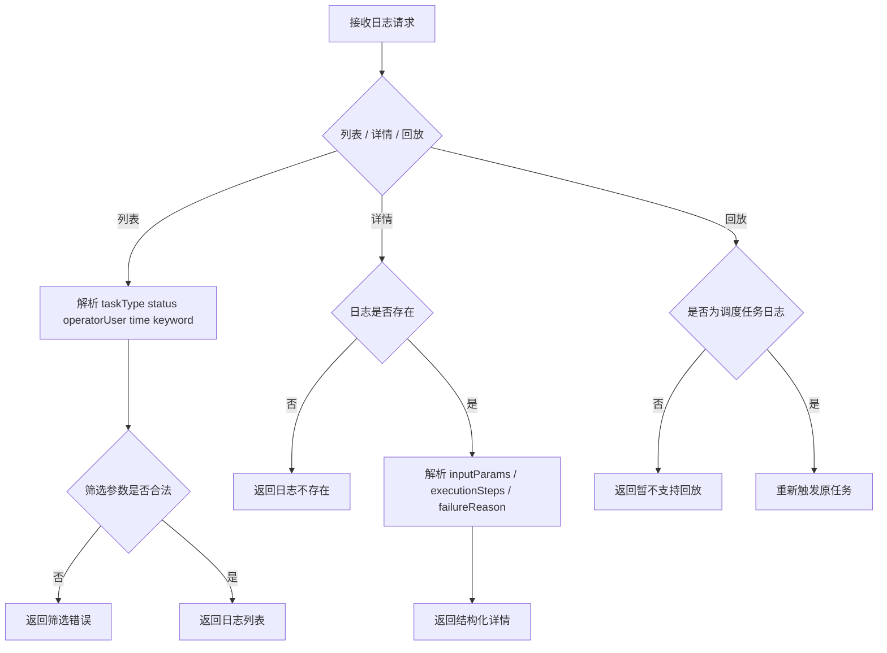
```mermaid
flowchart TD
    A[接收日志请求] --> B{列表 / 详情 / 回放}
    B -->|列表| C[解析 taskType status operatorUser time keyword]
    C --> D{筛选参数是否合法}
    D -->|否| X[返回筛选错误]
    D -->|是| E[返回日志列表]
    B -->|详情| F{日志是否存在}
    F -->|否| Y[返回日志不存在]
    F -->|是| G[解析 inputParams / executionSteps / failureReason]
    G --> H[返回结构化详情]
    B -->|回放| I{是否为调度任务日志}
    I -->|否| Z[返回暂不支持回放]
    I -->|是| J[重新触发原任务]
```

### 8.1.2 流图

简化后流图如下：

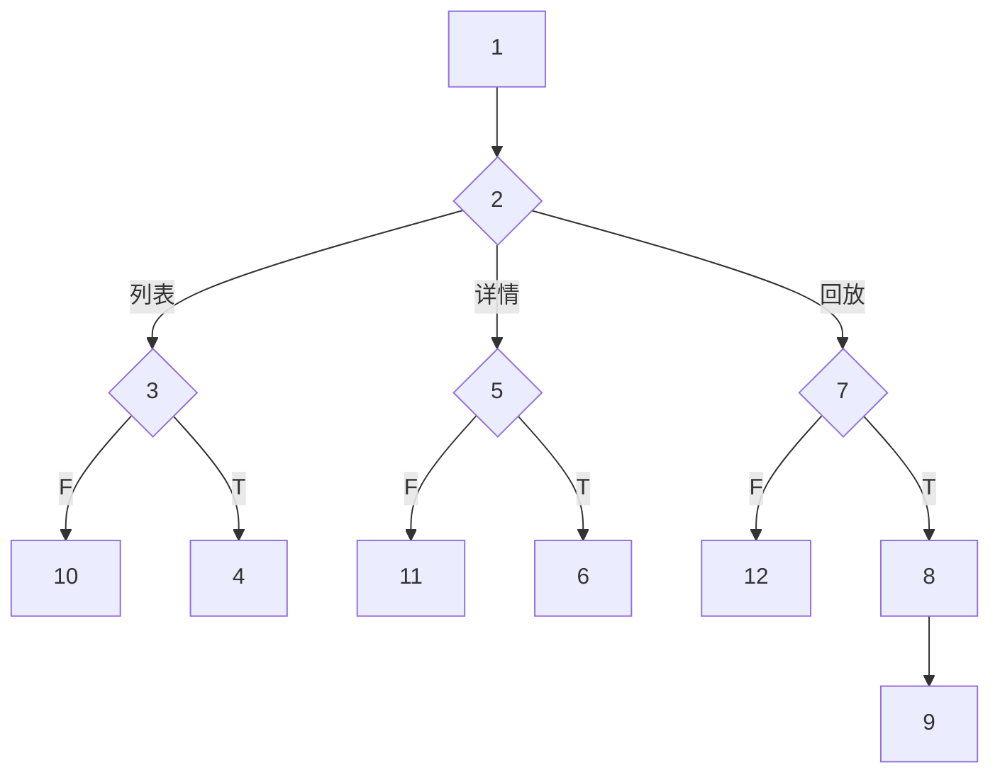
```mermaid
flowchart TD
    N1[1] --> N2{2}
    N2 -->|列表| N3{3}
    N3 -->|F| N10[10]
    N3 -->|T| N4[4]
    N2 -->|详情| N5{5}
    N5 -->|F| N11[11]
    N5 -->|T| N6[6]
    N2 -->|回放| N7{7}
    N7 -->|F| N12[12]
    N7 -->|T| N8[8]
    N8 --> N9[9]
```

### 8.1.3 流图的环形复杂度

流图中的区域数等于环形复杂度，区域数为4，故环形复杂度为4。

### 8.1.4 独立路径的基本组合

Path1：1-2-3-10  
Path2：1-2-5-11  
Path3：1-2-5-6  
Path4：1-2-7-8-9

### 8.1.5 条件组合覆盖测试用例

S = (列表筛选参数合法) || (日志存在并可查看详情) || (日志为调度任务且可回放)

| 路径 | 列表筛选参数合法 | 日志存在并可查看详情 | 为调度任务且可回放 | S |
| --- | --- | --- | --- | --- |
| Path1 | F | - | - | F |
| Path2 | - | F | - | F |
| Path3 | - | T | - | T |
| Path4 | - | - | T | T |

### 8.1.6 独立路径的实例

测试日志失败路径一

用例名称  
测试非法时间筛选失败

测试目的  
验证列表筛选时间格式非法时不能查询

覆盖路径  
Path1

测试预置条件：  
1) 已存在任务日志数据。

测试步聚：  
1) 在日志页输入非法时间范围。  
2) 点击【查询】。

期望结果:  
1) 返回时间格式错误。  
2) 不返回错误数据。

实际结果:  
1) 静态核对通过，与当前代码实现一致。

说明:  
对应 `TaskLogService.list` 时间解析分支。

测试日志失败路径二

用例名称  
测试不存在日志详情失败

测试目的  
验证日志不存在时详情接口返回失败

覆盖路径  
Path2

测试预置条件：  
1) 系统中不存在目标 `logId`。

测试步聚：  
1) 调用日志详情接口。  
2) 传入不存在的 `logId`。

期望结果:  
1) 返回“任务日志不存在”。

实际结果:  
1) 静态核对通过，与当前代码实现一致。

说明:  
对应 `detail` 未命中分支。

测试日志详情成功路径

用例名称  
测试结构化日志详情查看成功

测试目的  
验证日志详情可返回输入参数、执行步骤和失败原因

覆盖路径  
Path3

测试预置条件：  
1) 已存在由任务执行产生的日志记录。

测试步聚：  
1) 进入日志页。  
2) 点击某条日志的【详情】。

期望结果:  
1) 返回 `inputParams`、`executionSteps`、`failureReason`。  
2) 页面显示结构化详情。

实际结果:  
1) 已通过（demo-smoke / regression-suite）。

说明:  
冻结版专门补齐了结构化详情检查。

测试日志回放成功路径

用例名称  
测试失败日志回放成功

测试目的  
验证由调度任务生成的日志可一键回放

覆盖路径  
Path4

测试预置条件：  
1) 已存在一条由调度任务产生的失败日志。  
2) 当前用户具有 `log.replay` 权限。

测试步聚：  
1) 进入日志页。  
2) 选择失败日志。  
3) 点击【回放】。

期望结果:  
1) 页面给出回放成功反馈。  
2) 日志列表条数增加。

实际结果:  
1) 已通过（浏览器人工复查 / mysql-regression）。

说明:  
手动治理日志不可回放在无效等价类中补充说明。

## 8.2 黑盒测试

### 8.2.1 测试功能

日志监控模块主要负责日志列表筛选、日志详情查看、结构化失败原因展示和失败日志回放。

### 8.2.2 有效等价类划分

| 输入等价类 | 有效等价类 |
| --- | --- |
| 列表筛选 | 合法 `taskType / status / operatorUser / startTime / endTime / keyword` 组合（1） |
| 日志详情 | 选择已存在的日志记录（2） |
| 回放条件 | 选择由调度任务产生的日志记录（3） |
| 按钮权限 | 当前角色拥有 `log.replay` 或 `log.export`（4） |

### 8.2.3 有效等价类测试用例

对8.2.2表中编号为(1)的有效等价类，用一个测试用例覆盖：

用例名称  
测试日志列表筛选成功

测试目的  
验证合法筛选组合时日志列表可正确返回

覆盖范围  
等价类1

测试预置条件：  
1) 系统中已存在多条任务日志。

测试步聚：  
1) 进入日志页。  
2) 设置 `taskType=GOVERNANCE`、`status=FAILED`。  
3) 点击【查询】。

期望结果:  
1) 列表仅显示满足条件的日志。  
2) 统计信息同步更新。

实际结果:  
1) 已通过（regression-suite / extended）。

说明:  
服务端筛选是冻结版重点检查点。

对8.2.2表中编号为(3)的有效等价类，用一个测试用例覆盖：

用例名称  
测试失败日志回放成功

测试目的  
验证调度任务日志作为有效等价类时可以回放

覆盖范围  
等价类3

测试预置条件：  
1) 已存在一条失败的调度任务日志。

测试步聚：  
1) 在日志页点击【回放】。  
2) 观察列表和反馈信息。

期望结果:  
1) 回放成功。  
2) 新增一条执行日志。

实际结果:  
1) 已通过（浏览器人工复查 / mysql-regression）。

说明:  
对应日志回放主路径。

### 8.2.4 无效等价类划分

| 输入等价类 | 无效等价类 |
| --- | --- |
| 时间筛选 | 非法时间格式（1） |
| 日志详情 | 日志编号不存在（2） |
| 回放条件 | 选择手动执行产生的非调度日志（3） |
| 按钮权限 | 当前角色无 `log.replay` 权限（4） |

### 8.2.5 无效等价类测试用例

对8.2.4表中编号为(3)的无效等价类，用一个测试用例覆盖：

用例名称  
测试非调度日志回放失败

测试目的  
验证手动日志这一无效等价类时不支持一键回放

覆盖范围  
等价类3

测试预置条件：  
1) 已存在一条 `taskId` 为空的手动治理日志。

测试步聚：  
1) 调用回放接口或在页面尝试回放该日志。

期望结果:  
1) 返回“该日志不是调度任务生成的记录，暂不支持一键回放”。

实际结果:  
1) 静态核对通过，与当前代码实现一致。

说明:  
对应 `replayFromLog` 的防误回放逻辑。

对8.2.4表中编号为(4)的无效等价类，用一个测试用例覆盖：

用例名称  
测试无回放权限时按钮收口

测试目的  
验证当前角色无 `log.replay` 权限时不能回放

覆盖范围  
等价类4

测试预置条件：  
1) 浏览器 A 登录管理员。  
2) 浏览器 B 登录普通用户。  
3) 管理员已移除普通用户的 `log.replay` 权限。

测试步聚：  
1) 在浏览器 B 刷新日志页。  
2) 观察回放按钮。

期望结果:  
1) 回放按钮消失或不可点。

实际结果:  
1) 已通过（浏览器人工复查）。

说明:  
日志页按钮级授权是人工回归重点。

# 9 导出能力模块

## 9.1 白盒测试

### 9.1.1 程序流程图

导出能力模块白盒测试对象为 `DatasetController` 导出接口、`QueryAnalysisService.exportFilter`、`exportSql` 与 `TabularExportService`。程序流程图如下：

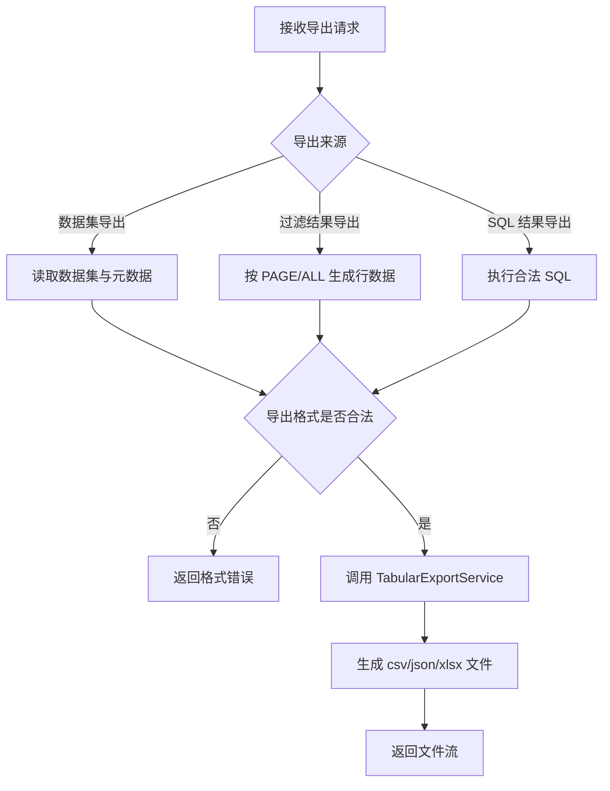
```mermaid
flowchart TD
    A[接收导出请求] --> B{导出来源}
    B -->|数据集导出| C[读取数据集与元数据]
    B -->|过滤结果导出| D[按 PAGE/ALL 生成行数据]
    B -->|SQL 结果导出| E[执行合法 SQL]
    C --> F{导出格式是否合法}
    D --> F
    E --> F
    F -->|否| X[返回格式错误]
    F -->|是| G[调用 TabularExportService]
    G --> H[生成 csv/json/xlsx 文件]
    H --> I[返回文件流]
```

### 9.1.2 流图

简化后流图如下：

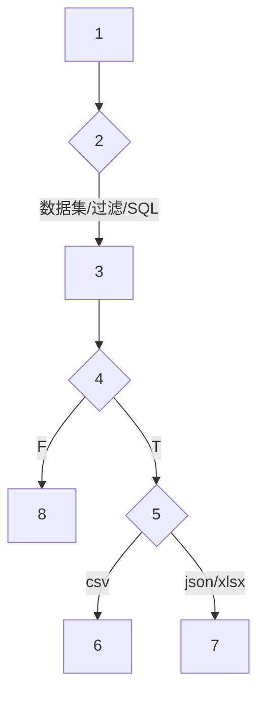
```mermaid
flowchart TD
    N1[1] --> N2{2}
    N2 -->|数据集/过滤/SQL| N3[3]
    N3 --> N4{4}
    N4 -->|F| N8[8]
    N4 -->|T| N5{5}
    N5 -->|csv| N6[6]
    N5 -->|json/xlsx| N7[7]
```

### 9.1.3 流图的环形复杂度

流图中的区域数等于环形复杂度，区域数为4，故环形复杂度为4。

### 9.1.4 独立路径的基本组合

Path1：1-2-3-4-8  
Path2：1-2-3-4-5-6  
Path3：1-2-3-4-5-7  
Path4：1-2-3-4-5-7

### 9.1.5 条件组合覆盖测试用例

S = 数据存在 && 导出格式合法 && 当前角色有导出权限

| 路径 | 数据存在 | 导出格式合法 | 具有导出权限 | S |
| --- | --- | --- | --- | --- |
| Path1 | T | F | T | F |
| Path2 | T | T | T | T |
| Path3 | T | T | T | T |
| Path4 | T | T | T | T |

### 9.1.6 独立路径的实例

测试导出失败路径

用例名称  
测试非法导出格式失败

测试目的  
验证不支持的格式不能导出

覆盖路径  
Path1

测试预置条件：  
1) 已存在可导出的数据集。

测试步聚：  
1) 构造 `format=xml` 的导出请求。

期望结果:  
1) 返回“仅支持导出 csv、json 或 xlsx”。

实际结果:  
1) 静态核对通过，与当前代码实现一致。

说明:  
对应 `TabularExportService` 格式限制。

测试导出成功路径一

用例名称  
测试数据集CSV导出成功

测试目的  
验证数据集导出为 CSV 成功

覆盖路径  
Path2

测试预置条件：  
1) 已存在可导出的数据集。  
2) 当前用户具有 `dataset.export` 权限。

测试步聚：  
1) 进入数据集管理页。  
2) 选择一个数据集。  
3) 点击【导出 CSV】。

期望结果:  
1) 浏览器下载 CSV 文件。  
2) 文件名包含数据集名和时间戳。

实际结果:  
1) 已通过（regression-suite / extended）。

说明:  
CSV 导出属于后端文件流导出。

测试导出成功路径二

用例名称  
测试过滤结果JSON导出成功

测试目的  
验证条件查询结果导出为 JSON 成功

覆盖路径  
Path3

测试预置条件：  
1) 已完成一次条件查询。  
2) 当前用户具有 `query.export` 权限。

测试步聚：  
1) 在查询页执行条件查询。  
2) 点击【导出 JSON】。

期望结果:  
1) 浏览器下载 JSON 文件。  
2) 文件内容为当前筛选结果。

实际结果:  
1) 静态核对通过，与当前代码实现一致。

说明:  
脚本主要验证 `xlsx`，JSON 导出按代码静态核对。

测试导出成功路径三

用例名称  
测试Excel导出并打开成功

测试目的  
验证 xlsx 文件可正确生成并能被 Excel/WPS 打开

覆盖路径  
Path4

测试预置条件：  
1) 已存在可导出数据集或 SQL 查询结果。  
2) 当前用户拥有导出权限。

测试步聚：  
1) 执行数据集导出或 SQL 结果导出。  
2) 选择 `xlsx` 格式。  
3) 用 Excel 或 WPS 打开文件。

期望结果:  
1) 文件可正常打开。  
2) 表头完整。  
3) 中文内容不乱码。

实际结果:  
1) 已通过（浏览器人工复查 / mysql-regression）。

说明:  
`xlsx` 人工打开验证是冻结版专项检查点。

## 9.2 黑盒测试

### 9.2.1 测试功能

导出能力模块主要负责数据集导出、条件查询结果导出、SQL 查询结果导出，以及日志页当前筛选结果的前端本地导出。

### 9.2.2 有效等价类划分

| 输入等价类 | 有效等价类 |
| --- | --- |
| 导出格式 | 合法格式 `csv / json / xlsx`（1） |
| 数据来源 | 已存在的数据集或查询结果（2） |
| 导出权限 | 当前角色拥有 `dataset.export` 或 `query.export` 或 `log.export`（3） |
| 导出范围 | 过滤结果使用 `PAGE / ALL` 合法范围（4） |

### 9.2.3 有效等价类测试用例

对9.2.2表中编号为(1)的有效等价类，用一个测试用例覆盖：

用例名称  
测试数据集Excel导出成功

测试目的  
验证合法 `xlsx` 格式作为有效等价类时导出成功

覆盖范围  
等价类1

测试预置条件：  
1) 已存在可导出数据集。  
2) 当前用户拥有 `dataset.export` 权限。

测试步聚：  
1) 进入数据集管理页。  
2) 选择数据集。  
3) 点击【导出 Excel】。

期望结果:  
1) 成功下载 xlsx 文件。  
2) 文件名包含时间戳。

实际结果:  
1) 已通过（regression-suite / 浏览器人工复查）。

说明:  
同时覆盖后端 xlsx 生成链路。

对9.2.2表中编号为(3)的有效等价类，用一个测试用例覆盖：

用例名称  
测试日志页本地导出成功

测试目的  
验证拥有 `log.export` 权限时日志页可导出当前筛选结果

覆盖范围  
等价类3

测试预置条件：  
1) 当前用户拥有 `log.export` 权限。  
2) 日志列表已有可见结果。

测试步聚：  
1) 进入日志页。  
2) 进行一次筛选。  
3) 点击【导出】。

期望结果:  
1) 当前筛选结果被导出为本地文件。  
2) 不调用独立后端日志导出接口。

实际结果:  
1) 已通过（浏览器人工复查）。

说明:  
这是当前实现边界之一。

### 9.2.4 无效等价类划分

| 输入等价类 | 无效等价类 |
| --- | --- |
| 导出格式 | 不支持的格式，如 `xml`（1） |
| 数据来源 | 未选择数据集或无结果数据时发起导出（2） |
| 导出权限 | 当前角色无对应导出权限（3） |
| 导出范围 | 非法 `exportScope`（4） |

### 9.2.5 无效等价类测试用例

对9.2.4表中编号为(3)的无效等价类，用一个测试用例覆盖：

用例名称  
测试无日志导出权限时按钮收口

测试目的  
验证无 `log.export` 权限时不能导出日志

覆盖范围  
等价类3

测试预置条件：  
1) 当前角色已被移除 `log.export` 权限。

测试步聚：  
1) 刷新日志页。  
2) 观察导出按钮。

期望结果:  
1) 导出按钮消失或不可点。  
2) 不可执行导出。

实际结果:  
1) 已通过（浏览器人工复查）。

说明:  
权限实时同步已在浏览器回归中验证。

对9.2.4表中编号为(1)的无效等价类，用一个测试用例覆盖：

用例名称  
测试非法导出格式失败

测试目的  
验证非法格式这一无效等价类的处理

覆盖范围  
等价类1

测试预置条件：  
1) 已存在可导出数据。

测试步聚：  
1) 发送 `format=xml` 的导出请求。

期望结果:  
1) 系统拒绝导出并返回格式错误。

实际结果:  
1) 静态核对通过，与当前代码实现一致。

说明:  
对应后端格式校验。

# 10 用户与权限模块

## 10.1 白盒测试

### 10.1.1 程序流程图

用户与权限模块白盒测试对象为 `AuthService.createUser`、`updateUser`、`deleteUser`、`updateRole` 与 `RoleMenuCatalog.validate / validateActions`。程序流程图如下：

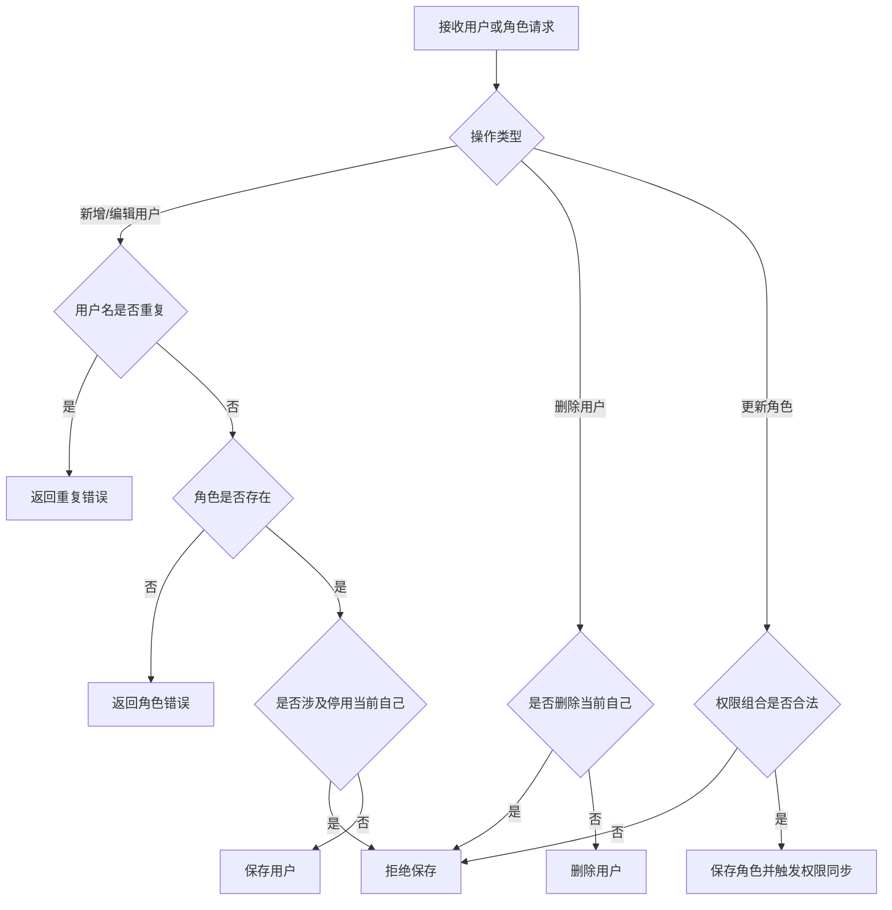
```mermaid
flowchart TD
    A[接收用户或角色请求] --> B{操作类型}
    B -->|新增/编辑用户| C{用户名是否重复}
    C -->|是| X[返回重复错误]
    C -->|否| D{角色是否存在}
    D -->|否| Y[返回角色错误]
    D -->|是| E{是否涉及停用当前自己}
    E -->|是| Z[拒绝保存]
    E -->|否| F[保存用户]
    B -->|删除用户| G{是否删除当前自己}
    G -->|是| Z
    G -->|否| H[删除用户]
    B -->|更新角色| I{权限组合是否合法}
    I -->|否| Z
    I -->|是| J[保存角色并触发权限同步]
```

### 10.1.2 流图

简化后流图如下：

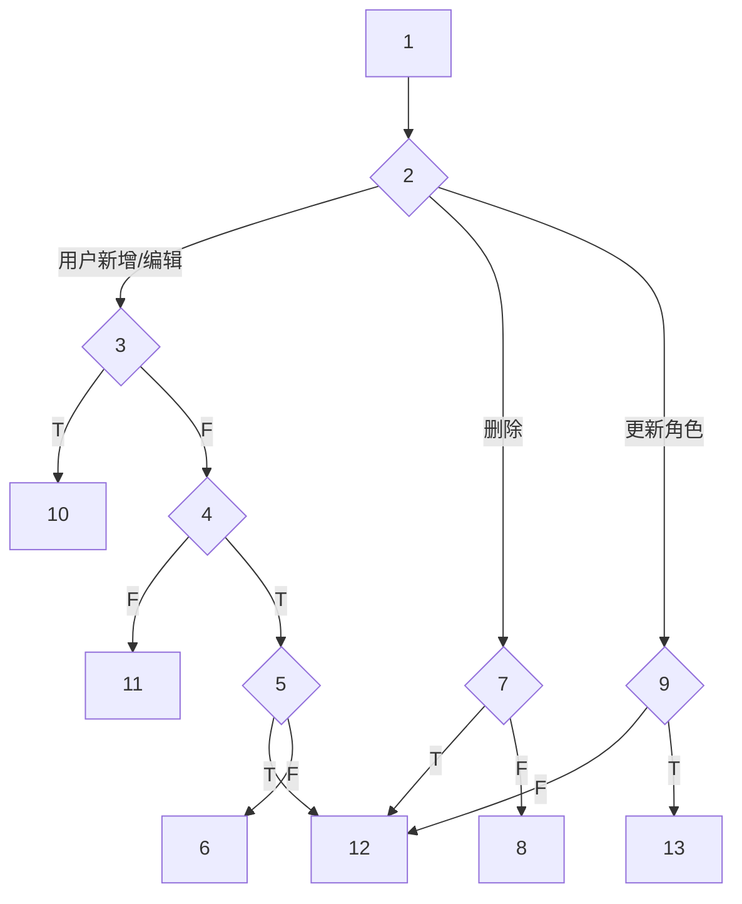
```mermaid
flowchart TD
    N1[1] --> N2{2}
    N2 -->|用户新增/编辑| N3{3}
    N3 -->|T| N10[10]
    N3 -->|F| N4{4}
    N4 -->|F| N11[11]
    N4 -->|T| N5{5}
    N5 -->|T| N12[12]
    N5 -->|F| N6[6]
    N2 -->|删除| N7{7}
    N7 -->|T| N12
    N7 -->|F| N8[8]
    N2 -->|更新角色| N9{9}
    N9 -->|F| N12
    N9 -->|T| N13[13]
```

### 10.1.3 流图的环形复杂度

流图中的区域数等于环形复杂度，区域数为4，故环形复杂度为4。

### 10.1.4 独立路径的基本组合

Path1：1-2-3-10  
Path2：1-2-3-4-5-12  
Path3：1-2-7-12  
Path4：1-2-9-13

### 10.1.5 条件组合覆盖测试用例

S = 用户或角色输入合法 && 不违反管理员保护 && 权限组合合法

| 路径 | 输入合法 | 不违反管理员保护 | 权限组合合法 | S |
| --- | --- | --- | --- | --- |
| Path1 | F | - | - | F |
| Path2 | T | F | - | F |
| Path3 | T | F | - | F |
| Path4 | T | T | T | T |

### 10.1.6 独立路径的实例

测试用户失败路径一

用例名称  
测试重复用户名保存失败

测试目的  
验证用户名重复时新增或编辑用户失败

覆盖路径  
Path1

测试预置条件：  
1) 系统中已存在用户名 `operator`。

测试步聚：  
1) 进入用户与权限页。  
2) 新增用户并输入重复用户名 `operator`。  
3) 点击【保存】。

期望结果:  
1) 保存失败。  
2) 页面提示用户名重复。

实际结果:  
1) 静态核对通过，与当前代码实现一致。

说明:  
对应用户名唯一性校验。

测试用户失败路径二

用例名称  
测试当前用户停用自己失败

测试目的  
验证当前登录用户不能把自己停用

覆盖路径  
Path2

测试预置条件：  
1) 当前使用管理员账号登录。  
2) 用户列表中已选中当前管理员账号。

测试步聚：  
1) 编辑当前登录用户。  
2) 将状态改为停用。  
3) 点击【保存】。

期望结果:  
1) 保存失败。  
2) 系统提示不能停用当前登录用户。

实际结果:  
1) 静态核对通过，与当前代码实现一致。

说明:  
对应用户自保护逻辑。

测试用户失败路径三

用例名称  
测试当前用户删除自己失败

测试目的  
验证当前登录用户不能删除自己

覆盖路径  
Path3

测试预置条件：  
1) 当前使用管理员账号登录。

测试步聚：  
1) 在用户列表中选择当前登录用户。  
2) 点击【删除】。

期望结果:  
1) 删除失败。  
2) 系统提示不能删除当前登录用户。

实际结果:  
1) 静态核对通过，与当前代码实现一致。

说明:  
当前系统避免管理员误删自身。

测试权限同步成功路径

用例名称  
测试角色权限更新并实时同步成功

测试目的  
验证角色权限修改后现有会话可实时感知

覆盖路径  
Path4

测试预置条件：  
1) 浏览器 A 登录管理员。  
2) 浏览器 B 登录普通用户。

测试步聚：  
1) 在浏览器 A 修改 `OPERATOR` 角色的某个操作权限。  
2) 在浏览器 B 保持登录并等待自动同步或手动刷新。

期望结果:  
1) 浏览器 B 页面按钮权限发生变化。  
2) 不需要重新登录。

实际结果:  
1) 已通过（浏览器人工复查 / test-report）。

说明:  
权限实时同步是当前课程项目的重要亮点。

## 10.2 黑盒测试

### 10.2.1 测试功能

用户与权限模块主要负责用户新增、编辑、停用、删除，以及角色菜单权限和操作权限维护。

### 10.2.2 有效等价类划分

| 输入等价类 | 有效等价类 |
| --- | --- |
| 用户名 | 唯一合法用户名，如 `student_a`（1） |
| 角色配置 | 合法角色、合法菜单集合、合法操作权限集合（2） |
| 用户状态 | 合法状态 `ENABLED / DISABLED`（3） |
| 权限同步 | 修改目标角色后存在活跃会话（4） |

### 10.2.3 有效等价类测试用例

对10.2.2表中编号为(1)的有效等价类，用一个测试用例覆盖：

用例名称  
测试新用户创建成功

测试目的  
验证唯一用户名作为有效等价类时可成功新增用户

覆盖范围  
等价类1

测试预置条件：  
1) 当前登录账号为管理员。  
2) 系统中不存在用户名 `student_a`。

测试步聚：  
1) 进入用户与权限页。  
2) 点击【新增用户】。  
3) 输入 `student_a` 和合法密码，选择角色。  
4) 点击【保存】。

期望结果:  
1) 用户创建成功。  
2) 用户列表新增一条记录。

实际结果:  
1) 静态核对通过，与当前代码实现一致。

说明:  
当前回归主要通过代码和角色接口静态核对该场景。

对10.2.2表中编号为(4)的有效等价类，用一个测试用例覆盖：

用例名称  
测试角色权限修改后实时同步成功

测试目的  
验证活跃会话在权限修改后可自动同步

覆盖范围  
等价类4

测试预置条件：  
1) 浏览器 A 登录管理员。  
2) 浏览器 B 登录普通用户。

测试步聚：  
1) 在浏览器 A 修改 `OPERATOR` 角色权限。  
2) 观察浏览器 B 菜单或按钮变化。

期望结果:  
1) 浏览器 B 无需重新登录即可感知权限变化。

实际结果:  
1) 已通过（浏览器人工复查 / test-report）。

说明:  
该场景也是冻结版浏览器检查单的核心条目。

### 10.2.4 无效等价类划分

| 输入等价类 | 无效等价类 |
| --- | --- |
| 用户名 | 与现有用户名重复（1） |
| 用户操作 | 停用当前登录用户（2） |
| 用户操作 | 删除当前登录用户（3） |
| 角色配置 | 管理员角色缺失关键菜单或关键操作权限（4） |

### 10.2.5 无效等价类测试用例

对10.2.4表中编号为(1)的无效等价类，用一个测试用例覆盖：

用例名称  
测试重复用户名新增失败

测试目的  
验证重复用户名这一无效等价类的处理

覆盖范围  
等价类1

测试预置条件：  
1) 系统中已存在用户名 `operator`。

测试步聚：  
1) 新增用户。  
2) 再次输入用户名 `operator`。  
3) 点击【保存】。

期望结果:  
1) 保存失败。  
2) 返回用户名重复提示。

实际结果:  
1) 静态核对通过，与当前代码实现一致。

说明:  
对应用户名唯一约束。

对10.2.4表中编号为(4)的无效等价类，用一个测试用例覆盖：

用例名称  
测试管理员关键权限被移除时保存失败

测试目的  
验证管理员角色不能丢失关键菜单和关键操作权限

覆盖范围  
等价类4

测试预置条件：  
1) 当前登录账号为管理员。  
2) 正在编辑 `ADMIN` 角色。

测试步聚：  
1) 取消 `users` 菜单或 `user.manage` / `role.manage` 操作权限。  
2) 点击【保存】。

期望结果:  
1) 保存失败。  
2) 页面提示管理员角色必须保留关键权限。

实际结果:  
1) 静态核对通过，与当前代码实现一致。

说明:  
对应 `RoleMenuCatalog.validate` 与 `validateActions` 限制。
